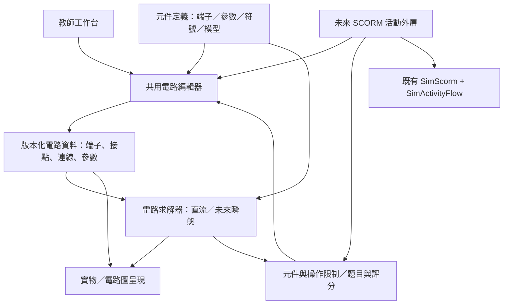

# 電路工作台：設計與開發計劃

- 日期：2026-10-02。
- 專用分支：`codex/circuit-simulator`。
- 狀態：**A–D 的直流工作台已實作；本地驗證與實際限制記錄在第 21–27 節。** E 動態元件與 F SCORM 活動是後續階段，未宣稱完成。規格清單與完成證據分開列示。
- 依據：[共用產品與樣式規範](00-shared-platform-and-style.md)、[實作與驗證契約](../docs/simulation-scorm-production-guide.md)及使用者此次指示。本文件由[新活動計劃範本](NEW-SIMULATION-PLAN-TEMPLATE.md)建立。
- 本次定位：教師課堂用的完整電路工作台，同時成為未來電路教學活動的基礎。**沒有關卡、作答流程或評分面板；畫布優先。**

## 1. 可行性與設計判斷

可以實現。串並聯、電壓／電流／功率計算，以及實物圖與電路圖切換，都能用靜態網頁完成。真正的難點在於把以下三件事同時做好：

1. **容易畫，也容易改。** 第一次使用就能接線；移動、旋轉、分支與刪除不會破壞其他部分，手機上也不需要精準拖到幾個像素的小點。
2. **物理結果可信。** 除正常串並聯外，必須正確處理短路、斷路、浮接、反接、多電源、非線性燈泡，以及理想模型無法確定答案的情況。
3. **新元件可沿用既有操作。** 電路資料、求解、繪圖、互動和活動規則分離；新增四端繼電器或有歷史狀態的電容，不應迫使整個編輯器重寫。

| 工作 | 難度判斷 | 主要風險 |
|---|---|---|
| 基本元件、旋轉、選取、外觀切換 | 中 | 縮放後的標籤與觸控目標重疊 |
| 好用的接線與自動布線 | 高 | 誤接、交叉歧義、路線跳動、導線遮擋元件 |
| 任意直流網絡、內阻與儀表 | 中至高 | 只會算預設串並聯，遇到一般網絡便失效 |
| 變阻燈泡與非線性元件 | 高 | 模型校準、迭代不收斂、顯示不合理結果 |
| 電容、電感、繼電器的動態行為 | 高 | 初始條件、時間步長、切換事件與數值穩定 |
| 跨電腦、平板、手機的可靠操作 | 高 | 手勢與捲動衝突、手指遮擋、短視窗空間不足 |

建議先完成一套可獨立用於課堂的直流工作台，再擴充動態元件；兩者共用同一套資料和操作。分期是驗證順序，不把未完成的功能宣稱為已支援。

## 2. 範圍（Scope）

### 2.1 首個完整直流版本

| 類別 | 必須具備的功能 |
|---|---|
| 搭建 | 新增、移動、旋轉、複製、刪除元件；連線、分支、接點、修改線路走向；復原／重做 |
| 元件 | 直流電源、電阻、可調電阻、開關、恆阻白熾燈、變阻白熾燈、接點 |
| 電源 | 可調電動勢及內阻；內阻可設為 0；可同時放置多個電源 |
| 負載 | 可調電阻；燈泡可選恆阻或熱效應模型，並調整額定參數 |
| 量測 | 電流表、電壓表、四端電功率表；數字式／指針式切換；端點電勢、兩點電壓與支路電流探測 |
| 呈現 | 實物式插畫／標準電路符號切換；電流方向／導線中電子方向；電勢顏色與升高方向；燈泡亮度 |
| 教學 | 自由搭建、固定元件只接線；顯示或隱藏數值；課堂範例；暫停方向動畫 |
| 文件 | 儲存／開啟電路檔、另存接線模板、匯出電路圖；無自動跨重新整理保存 |
| 操作環境 | 大畫布、窄且可收起的工具欄、縮放／平移／適合畫面、共用全螢幕、鍵盤替代操作 |

「可調電阻」首版是二端變阻器（歷史版本）；2026-10-04 使用者同意第 36 節擴充，預設四柱、可選三柱／兩柱，同時支援限流與分壓。

### 2.2 後續擴充，架構現在便預留

- 二極管、LED：方向、非線性導通與反向截止。
- 電容：充放電、初始電壓、時間演變。
- 電感：電流建立、初始電流、切斷後的能量與電壓。
- 電磁繼電器：線圈與接點電氣隔離、吸合／釋放門檻、磁滯及常開／常閉接點。
- 視教學需求加入交流源、時間圖、示波器等；不列為首個直流版本的必要條件。
- SCORM 活動：沿用工作台的畫圖、元件與計算，在外層加入題目、限制、答案及評分。

### 2.3 與既有專案規則的關係

本工具屬形成性教學與教師演示，不是評量。使用者明確要求沒有關卡，因此目前的評分規準、最終檢查／提交、已評分鎖定與 Moodle attempt 流程均 **N/A**。保留既有共用樣式、全螢幕、手機手勢、測試與資產管理規範。

首版以獨立靜態網頁交付，不初始化 LMS、不寫入成績。未來 SCORM 活動另外接入 `SimScorm` 與 `SimActivityFlow`，並完整遵守原有生命週期契約。教師檔案的匯入匯出不能取代 Moodle 作答恢復。

## 3. 最重要的設計：接線與編輯

### 3.1 主要操作：從端子畫一條導線

2026-10-02 使用者試用後修訂；原先以點兩端、自動直角布線為主的設計是歷史版本，已被以下要求取代。

1. 按住端子，沿自己想要的路徑畫線；線跟隨滑鼠／手指，接近終點才顯示吸附。
2. 放手時只有終點端子或明確選中的既有導線接點會提交接線；途經其他端子、交叉與回圈不會暗中導通。
3. 預設「自動修整」去除小抖動，近乎直的筆劃整理成直線，彎曲筆劃整理成順滑曲線，保留有意的繞路。「保留筆跡」只做有限簡化；「直角布線」是另外可選的工具。
4. 未接上的筆劃保留可見預覽，可從空白處續畫或點終點完成；畫布上的「取消接線」一直可見，Escape 亦取消。取消不增加歷史或改變電路。
5. 點兩端與 Tab／Enter／Space 保留作精準及鍵盤替代；沒有手畫路徑時使用避開元件的路線，再依修整選項呈現。
6. 選線後直接拖線身改形狀，也可拖局部把手或重畫整條線；畫布上直接提供「刪除導線」及重畫。一次完整手勢只提交一步復原。

線形只是呈現資料，電氣連接仍由端點 ID 決定。重畫保持原端點、分支及電流計算；無效／取消的重畫保留原線。

### 3.2 分支、交叉與接點

- 從端子或既有接點接出新線，直接形成分支。
- 要接到某條導線，可選該線並用「在這裏分支」，或在接線中選中該線；提交時明確新增實心接點。
- 兩條線只是在畫面上相交，**不會自動導通**；用跨線橋或斷開的小視覺間隙區分。
- 相交處附近選線時，預覽清楚指出被選的是哪一條；不能無提示地接到另一條。
- 同一端子可有多條導線；端子仍是一個電氣節點，不因畫法改變電位。
- 不允許重複建立完全相同的連線；存在迴路不等於重複線，合法電路迴路必須保留。

### 3.3 修改時保持可預期

| 操作 | 預期行為 |
|---|---|
| 移動元件 | 連線端點跟隨，仍連到原本的端子；附近其他元件不跟著移動 |
| 旋轉元件 | 一鍵轉 90°；連線跟隨各自端子，不交換端子身分 |
| 電源反接 | 是獨立且清楚的操作；單純改變圖形朝向不會暗中改變電動勢符號 |
| 修改導線 | 選線後顯示轉折把手，可加／移／刪轉折；可恢復自動路線 |
| 刪除導線 | 刪除兩個明確端點之間的該條連線；不刪除元件或其他分支 |
| 刪除元件 | 一併移除其相連導線，選取時提示影響範圍；一次復原可全部還原 |
| 刪除接點 | 清楚標示受影響分支，整體操作可復原；不偷偷把其他線接在一起 |
| 複製元件 | 複製參數與外觀，不複製接線，避免出現看不見的額外連接 |
| 自動整理 | 明確由使用者觸發；不因每次計算而重新排列整幅電路 |
| 復原／重做 | 一次完整手勢算一步；清空、套用範例及匯入也可復原 |

### 3.4 接線原型先驗收

先用電源、開關及兩個燈泡做可操作原型，驗證「點兩端」、「拖接」、「導線分支」及「移動後保持連接」。觀察串聯改成並聯時的操作次數、誤接及需要撤銷的次數，再決定吸附距離及自動布線細節。不能只憑截圖認定比 PhET 易用。

## 4. 畫面與美術（Responsive layout contract）

### 4.1 桌面及課室投影

```text
┌───────────────────────────────────────────────────────────┐
│ 電路工作台   範例／檔案   復原／重做   顯示方式        全螢幕 │
├───────────────────────────────────────────────┬───────────┤
│                                               │ 元件工具箱 │
│                                               │           │
│              可縮放的大畫布                    │ 選取元件   │
│                                               │ 的屬性     │
│                                               │           │
│                                               │ 顯示選項   │
│ 接線提示／診斷                    縮放／平移     │           │
└───────────────────────────────────────────────┴───────────┘
```

- 桌面工具欄採 252 CSS px，可整個收起，畫布佔剩餘空間；短橫向視窗採 230 px。
- 側欄只呈現目前選取物件的屬性，沒有題目說明、評分或步驟卡。
- 常用的旋轉、刪除、複製與開關操作不埋在多層選單。
- 「顯示選項」可收合；數值、電子與電勢等疊加層可各自開關，避免同時顯示所有資訊。
- 課堂投影模式放大標籤、儀表及提示，保留電路畫布。
- 共用全螢幕包含標題、畫布和工具欄，保持同一份電路及操作歷史。

### 4.2 手機與平板

- 窄直向畫面改為「標題 → 畫布 → 下方工具面板」；畫布保持可見，面板獨立捲動。
- 面板至少保留 112 CSS px 可見空間；短橫向視窗改用左右佈局，避免最下方控制被裁掉。
- 不把整幅電路無限縮小來塞入手機；提供縮放、平移、定位所選及適合畫面。
- 控制按鈕與端子命中區至少 44 CSS px；主要控制 16 px、次要文字約 14 px。圖面文字按實際顯示大小驗證。
- 畫布兩側預留至少 32 CSS px 的直向捲動帶。一般空白區保持原生捲動；開始接線後，中央區域明示為續畫區，在下一次 pointerdown 前配置 `touch-action:none`。端子開始的首筆本來就是模擬器擁有的捕獲手勢。取消後恢復空白原生捲動，兩側捲動帶在所有模式保持可達。
- 斷點採 760 CSS px；窄直向面板佔下方約 31%，保留至少 112 px。初始畫布倍率至少 65% 保持可讀，可用「全圖」縮至 25% 概覽，再定位元件或放大接線。

### 4.3 美術方向

乾淨、明亮、適合中學生與課室投影：白／淺灰背景、淡格點、清楚的深色導線、藍色操作提示、暖色燈光。實物元件用原創簡化 SVG 插畫，有清楚形狀及端子，不追求寫實照片，也不使用密集的工程儀表介面。

實物與電路圖共用位置、端子、連線與選取狀態。切換外觀不重建電路，已接好的線不會重新分佈。標準符號預設採中學常見畫法，地區性的電阻符號差異可日後做顯示選項。

## 5. 物理模型（Physics or subject model）

### 5.1 求解方式

用**改良節點分析法（MNA）**處理任意電路網絡，支援串聯、並聯、橋式、多個電源及多個互不相連的電路。不能只辨認預設電路再套串並聯公式。

- 電氣拓撲由明確的端子與接點關係決定，與畫面座標分離。
- 理想導線連接的端點組成等電位節點；整條線不因長短或彎折產生額外電阻。
- 線性電阻與電源先精確求解；變阻燈泡等用非線性迭代。
- 求解器回傳電勢、元件電壓／電流／功率及診斷，不操作畫面或評分。
- 判斷收斂必須看電路殘差；達到迭代次數上限不能直接當成正確答案。
- 計算與動畫更新分開；直流參數／接線未變時不每幀重新解矩陣。

### 5.2 電源、負載與功率

- 電源具有電動勢 `E` 與內阻 `r`，`r=0` 是理想電源。
- 以流入元件正端的電流為正；電源關係為 `Va − Vb = E + r I`。供電時此 `I` 為負，可另外顯示向外供出的正電流。
- 被動元件使用 `P=UI`；電源端口輸出、內阻發熱 `I²r`、電源提供的總功率分開標示，避免全電路歐姆定律的教學混淆。
- 一般電阻及二端變阻器可調；滑塊和數字輸入並存，明列單位與合法範圍。
- 內阻、儀表電阻及理想導線不可被隱藏的「很小電阻」替代，造成使用者以為理想條件成立。

### 5.3 兩種白熾燈

| 模型 | 行為 | 教學呈現 |
|---|---|---|
| 恆阻燈 | 電阻固定，`I=U/R` | 亮度依消耗功率變化，適合初學串並聯 |
| 熱效應燈 | 電流加熱燈絲，溫度升高令電阻增加 | 顯示即時等效電阻、額定參數與功率，說明其不服從恆定電阻模型 |

熱效應燈先採**穩態教學近似**：用溫度相關電阻及散熱平衡求出工作點，額定電壓時應回到設定的額定功率／熱態電阻。冷熱電阻比例、溫度係數及散熱係數屬模型參數，需選定參考或校準後記錄，不能把一組任意常數當作所有白熾燈的精確模型。

首版已定案：`R_cold=R_rated/10`，`T_ambient=293 K`，`T_rated=2600 K`，`α=9/(2600−293)`；`R(T)=R_cold[1+α(T−293)]`。散熱採 `k(T⁴−293⁴)`，以 `U_rated²/R_rated` 校準 k，穩態解滿足 `U²/R(T)=k(T⁴−293⁴)`。局部溫度用二分求解，電路用附解析微分電導的阻尼 Newton 迭代；這是明示教學模型，不是鎢絲實測擬合。全網絡最多 100 次迭代，收斂殘差要求 ≤1e−9；失敗顯示診斷而非沿用舊解。

首版不宣稱具備真實預熱時間、燒毀或精確光譜。亮度有合理上限；超過額定狀態可提示，但不突然刪除燈泡。動態階段再加入熱容量及時間演變。

### 5.4 量測工具

| 工具 | 接法及計算 | 必要呈現 |
|---|---|---|
| 電流表 | 串聯；預設理想 0 Ω，非零內阻可選 | 正負端、量程、反向讀值、超量程 |
| 電壓表 | 並聯；預設理想無限輸入電阻，有限輸入電阻可選 | 測量兩端的電勢差，不強行替浮接部分定出電勢 |
| 電功率表 | 四端：電流線圈串聯，電壓線圈跨接負載；`P=(Vc−Vd)Iab` | I+/I−、V+/V− 明確標示，反接時保留功率正負號 |
| 快速探測 | 點端子看相對電勢；選兩點看電壓；選線看可確定的支路電流 | 可標明是非侵入式觀察，與實際接入的儀表區分 |

- 所有儀表都可切換數字式／指針式；切換只改外觀，不改接法或計算。
- 指針式支援合適的量程、刻度和反向／超量程提示；不把超量程值默默截斷為滿刻度。
- 四端功率表需另附短接線圖。另提供「顯示所選元件功率」方便演示，但不能以此冒充功率表接線。

### 5.5 必須處理的特殊情況

| 情況 | 結果政策 |
|---|---|
| 斷路 | 可確定的電流為 0；斷口兩端電壓仍按其所屬電路計算 |
| 浮接／互不相連的電路 | 分開求解，每區可選自己的參考點；跨區差值不能憑任意參考電勢算出一個假數字 |
| 理想電源被短路 | 明確說明理想模型沒有有限解，不顯示一個任意大的電流 |
| 有內阻電源短路 | 算出有限短路電流及內部耗散；以適當的教學提示呈現 |
| 不相容的理想電源 | 顯示條件矛盾；可解的其他獨立電路仍可顯示 |
| 理想支路形成不唯一電流 | 說明電流不能唯一確定，與「沒有解」區分 |
| 理想導線環路 | 若某些線段電流不唯一，不畫假方向；仍顯示可確定的節點電勢與其他支路讀值 |
| 儀表反接／超量程 | 保留符號、明確提示，不自動修正接法 |
| 非線性未收斂 | 顯示暫無可靠結果；停止相關方向動畫，不保留看似有效的舊讀值 |

## 6. 電流、電子及電勢（Diagrams, notation and assistance）

- **電流方向：** 用清楚的箭頭標示計算得到的常規電流方向；大小與方向分開呈現。
- **電子方向：** 用帶負號的小點顯示金屬導線中電子漂移，方向與常規電流相反；不把電池內的電化學運作畫成自由電子直接穿過電解質。
- **動畫速度：** 只表達示意方向或相對強弱，不宣稱是真實電子速度；可暫停，不改變直流解。
- **電勢顏色：** 同一理想導線保持同一顏色。藍／中性／暖色對應相對低／中／高電勢，附數值與圖例；可切換顏色顯示。
- **參考點：** 預設在各獨立電路的一個電源負端，可明確改選 0 V 參考；改選參考不改變任何兩點電壓或電流。
- **電勢增加方向：** 在有電勢差的元件附近顯示「低 → 高」箭頭，從計算的兩端電勢決定；不能簡化為永遠沿電流方向或永遠指向電源正極。
- **不靠顏色單獨解釋：** 數值、正負端及方向箭頭仍可獨立使用，並檢查灰階與投影可讀性。
- 端子吸附起點暫定 24 CSS px；元件位置使用可見格點，旋轉採 90°。參數在操作原型後定案，螢幕像素吸附與物理容差分開。

## 7. 教師使用模式（Navigation, submission and reset）

### 7.1 自由搭建

可新增或刪除元件、調整參數及接線。提供空白電路、串聯、並聯、混聯、全電路歐姆定律與儀表接線範例。範例是可編輯示範，不是必須完成的關卡。

### 7.2 固定元件，只讓使用者接線

教師先擺放及設定元件，再切換「固定元件接線」。其限制需要分開配置：

| 限制 | 建議預設 |
|---|---|
| 增刪／移動元件 | 鎖定 |
| 元件方向 | 鎖定，可由教師開放旋轉 |
| 元件數值 | 鎖定，可依教學目的開放某些滑塊 |
| 接線增刪與改道 | 開放 |
| 開關開合 | 開放，除非教師特別限制 |
| 儀表、方向及電勢顯示 | 由教師決定可見／可切換 |

可把已完成的電路「另存為只保留元件的接線模板」。教師示範答案與模板分開儲存；本版不建立題目答案庫或自動評分器。

這些限制是教學操作規則，不是防作弊或伺服器安全邊界。日後學生活動由外層策略控制，不能靠隱藏按鈕判定評分可信。

### 7.3 重設及文件操作

沒有提交或已評分狀態。清空、套用範例及匯入均是一個可復原操作；「清空全部」與「只移除導線」清楚區分。重新整理回到新工作階段；使用者明確匯出／匯入電路檔來保存課件。

## 8. 可重用架構



### 8.1 分工與介面

| 模組 | 責任 | 不應包含 |
|---|---|---|
| 電路資料與命令 | 元件／端子／連線、結構驗證、增刪及復原操作 | DOM、LMS、題目答案 |
| 元件定義表 | 型別、任意數量端子、參數規格、符號及求解模型 | 把所有元件硬編成兩端電阻 |
| 求解器 | 建網絡、組矩陣、求解、診斷、穩態／日後瞬態 | 畫布座標、顏色、分數 |
| 路由與繪圖 | 自動／手動線路、元件圖形、數值及動畫 | 以座標碰撞推測電氣導通 |
| 互動控制 | 選取、吸附、拖拉、旋轉、鍵盤、手勢取消 | 個別題目的正確答案 |
| 教學策略 | 允許的元件／操作、固定元件、可見資訊 | 取代求解器或修改物理規則 |
| 活動外層 | 未來題目、評分、快照與 Moodle 回報 | 重寫共用接線及 SCORM commit 邏輯 |

首版使用原生 HTML/CSS/JavaScript 與 SVG，可直接在 Live Server 執行。先把可重用核心放在電路工作台內清楚分模組；待第二個活動實際使用時再整理共用路徑，不把電路物理塞進全站通用 helper。

對外需有版本化的「取得電路／載入已驗證電路／套用操作策略／取得計算結果／監聽變更」介面。未來評分可比較電氣拓撲及物理條件，而非要求學生的畫法、位置或元件 ID 與範例一模一樣。

### 8.2 為動態元件預留的邊界

- 元件模型區分靜態參數與動態狀態，例如電容電壓、電感電流、線圈狀態及燈絲溫度。
- 求解器需有初始化、直流工作點、時間步進與重設介面；不把所有元件壓縮成一個 `resistance` 欄位。
- 元件顯示依模型狀態更新，但動畫時間不能直接當成物理時間步。
- 繼電器的線圈與接點是同一個多端元件的不同子系統，具有吸合／釋放狀態；不能簡化成受電流控制、瞬間抖動的普通開關。
- 真正加入電容／電感時，另訂初始條件、積分法、誤差、切換事件與能量守恆驗收；直流工作台的通過不代表瞬態已通過。

## 9. 電路資料與保存（Persistence contract）

### 9.1 v2 權威資料（v1 遷移見第 22 節）

| 欄位 | 內容及驗證 |
|---|---|
| `kind`, `version` | 電路檔類型與格式版本；不支援的版本需明確拒絕或經測試遷移 |
| `components` | 唯一 ID、型別、名稱、位置、方向、各項參數；端子規格由元件定義表提供 |
| `junctions` | 明確接點的唯一 ID 與位置 |
| `wires` | 唯一 ID、`from/to` 合法端點引用、`shape` 線形及 `via` 路徑點；`auto` 的空陣列表示自動直角路由 |
| `policy` | `mode/allowRotate/allowParams/allowSwitch`；元件另存 `locked/editable` |
| `display` | 實物／符號、電流／電子／關閉、儀表外觀、電勢與數值顯示、參考點 |

所有引用必須存在且對應有效端子。數值有限、有單位、有合法範圍；ID 不重複；名稱當純文字處理。匯入先完整驗證，成功後才一次替換當前電路；壞檔不能留下半份電路。

節點合併結果、電壓／電流／功率、亮度、布線快取與 DOM 都是衍生資料，載入時重新計算，不信任檔案內的現成答案。選取、指標、未完成導線、放大預覽、復原歷史與動畫時間是暫態，不作為已完成的電路內容保存。

### 9.2 儲存與限制

- 首版使用明確的 JSON 檔案匯入匯出，不新增伺服器或自動瀏覽器儲存。
- 可另匯出純圖像供講義／投影片使用；圖像不是可繼續編輯的電路檔。
- 首版容量上限為 80 元件、120 接點、240 導線、直角線每線 24 個轉折／手畫線 96 個路徑點、檔案 256 KiB；座標限制 ±10000，復原歷史保留 80 步。
- 若限制觸發，清楚說明且保留原圖；不能截斷匯入或默默遺失元件。
- SCORM 日後另有 ≤4000 bytes 的作答快照設計。教師完整電路檔不直接塞進 `suspend_data`。

## 10. 階段與操作狀態（Phase/state matrix）

這裏的「狀態」是編輯器狀態，不是學生關卡。

| 狀態／變體 | 可保存內容 | 暫態或計算結果 | 合法下一步 |
|---|---|---|---|
| 空白 | 空元件／接點／導線集合 | 無 | 新增元件 |
| 未接完整 | 合法但可能不導通的拓撲 | 已知讀值及未確定提示 | 接線、改參數 |
| 可解電路 | 完整拓撲與參數 | 重新求解的讀值 | 移動、旋轉、量測、修改 |
| 固定元件接線 | 拓撲、參數及明確操作策略 | 顯示設定 | 按策略增刪導線、操作開關 |
| 部分元件鎖定 | 各元件的限制 | 選取狀態 | 編輯其他部分或由教師解除限制 |
| 無解／不唯一 | 結構合法的原始電路 | 診斷；不捏造電流 | 移除短路、改內阻等 |
| 正在接線 | 原電路尚未改變 | 起點、預覽、未提交轉折 | 接上合法端點或取消 |
| 正在拖動 | 保存以完成的命令為界 | 原位置、預覽位置、穩定捕獲目標 | 放開提交；中斷回復 |

實物／符號、數字／指針、電流／電子／關閉、電勢／數值及操作限制都是需要驗證的顯示或策略變體。每種可保存狀態都要測試實際匯出 → 驗證載入 → 重算 → 執行一個合法操作。

## 11. 手勢契約（Touch gesture ownership contract）

| 起始區域／操作 | 手勢擁有者 | 技術要求及替代操作 |
|---|---|---|
| 元件本體拖動 | 模擬器 | 局部且穩定的命中區，預先設 `touch-action:none`；方向鍵可移動，R／按鈕旋轉 |
| 端子／接點拖接 | 模擬器 | 44 px 目標、24 px 初始吸附門檻；Tab／Enter 可逐端子接線 |
| 導線轉折把手 | 模擬器 | 只在所選線顯示局部把手；可用控制按鈕修改／移除轉折 |
| 導線線身選取／拉動 | 模擬器 | 旋轉的局部窄矩形命中區（18 px 寬度）；不以斜線的外接矩形覆蓋空白；另有鍵盤連線清單 |
| 接線中的中央續畫區 | 模擬器 | 以可見提示宣告續畫；在下一次 down 前設 none，取消後恢復 pan-y；兩側捲動帶始終可達 |
| 普通空白畫布 | 外層頁面／宿主 | `pan-y`；點擊和垂直滑動必須區分，滑動不新增轉折或改選取 |
| 明確啟用的中央平移區 | 模擬器 | 只平移視野，不移動電路；有方向及縮放按鈕替代 |
| 左右 32 px 捲動帶 | 同一外層頁面／宿主 | 不能開始接線、拖曳或平移，不能被透明圖層覆蓋 |
| 下方／側邊獨立面板 | 面板本身 | 原生 overflow 及邊界 containment，不改寫父頁面樣式 |

- 精準拖接和轉折編輯在手指遮擋時顯示局部放大預覽；包含實際場景、吸附後端點及待接線，不攔截操作。
- 粗略搬動大型元件不強制放大，但端子附近調整仍需驗證遮擋。
- 拖動中保持相機不變；放開的結果必須與最後預覽一致。
- Escape、取消、第二根手指、失去捕獲、視窗失焦、縮放／尺寸改變及模式切換均清理暫態；不留下半條線或半個歷史步驟。
- 測試需使用真實手機或瀏覽器層級可信觸控，不用合成 DOM 事件冒充手勢驗收。

## 12. 評分與容差（Scoring and tolerance）

目前沒有評分、及格線或題目答案，均 N/A。未來活動獨立決定答案與規準；不能將工作台顯示值直接等同於學生已完成答案。

物理測試按量綱分開設定：線性正常尺度案例以約 `1e−7` 絕對或 `1e−6` 相對誤差作起始目標，非線性另驗證節點 KCL、迴路 KVL、功率平衡與收斂殘差。實際容差須隨量程、模型和條件數記錄，不能靠四捨五入後一致就判通過。幾何吸附距離不作為物理或評分容差。

## 13. SCORM 邊界（Shared SCORM lifecycle）

教師工作台本身不初始化／提交／結束 Moodle attempt，也沒有 review、pending 或已評分狀態。因此本版不為了符合活動外觀而建立假提交流程。

日後的 SCORM 電路活動必須：

1. 以此核心呈現和編輯電路，活動自行擁有題目、規準及限制。
2. 用 `SimScorm.loadAttempt()` 配合 `SimActivityFlow.startup()` 處理載入。
3. 按既有規範處理 success／committed／frozen／retry、空白與部分答案、結果鎖定及重新整理／續做。
4. 定義活動自己的小型權威快照與每種 phase／variant 的恢復測試。
5. 高風險評量另外配置可信伺服器驗證；前端限制不是安全邊界。

不修改既有 SCORM 共用執行層來遷就教師工具。

## 14. 目錄與交付（Catalogue metadata）

slug：`circuit-workbench`，標題「電路工作台」，分類 `Electricity`，標籤 `physics / electricity / circuits / teacher / sandbox`。描述：「自由搭建與量測電路，探索內阻、燈泡、電勢及電功率。」

已登記 `active`，入口及 standalone ZIP 均存在。這個目錄狀態表示教師工具可直接開啟，不是 Moodle-ready 或 SCORM 認證。

實作目錄：

```text
sim/circuit-workbench/
  index.html
  styles.css
  main.js                 教師工作台與互動整合
  circuit-model.js        結構、命令、驗證
  component-registry.js   多端元件及參數定義
  circuit-solver.js       直流求解；預留瞬態邊界
  circuit-routing.js      自動及手動導線路由
  circuit-renderer.js     SVG 元件、兩種外觀及疊加資訊
  circuit-document.js     版本化匯入匯出
  presets.js              課堂範例／固定元件模板
  core.test.js            物理、文件、命令與擴充介面驗證
  assets.json             standalone 發布資產清單
```

使用 `sim/shared/styles.css` 與 `sim/shared/fullscreen.js`。若新增其他執行依賴，全部本地化並列入發布資產清單。首版交付靜態網頁與可離線部署的 ZIP；教師工作台的 ZIP 明確標示為 standalone，不建立假 SCO manifest。未來活動才提供 `imsmanifest.xml` 並宣告核心及所有相依資產。

新增測試一律登記在 `tools/run-tests.js`；需要瀏覽器測試時沿用專案工具及輸出路徑。具體檔案拆分可在實作時調整，模組責任與相依方向不變。

## 15. 分期開發與每期出口

| 階段 | 可審閱成果 | 進入下一階段的條件 |
|---|---|---|
| A：操作原型 | 大畫布、窄面板、電源／開關／兩燈；點接、拖接、分支、旋轉與復原 | 教師能順暢完成串聯→並聯改接；無誤接、斷線或明顯手機操作障礙 |
| B：可信直流核心 | 任意網絡求解、電源內阻、電阻／變阻器、恆阻燈、開關與基本測量 | 解析案例、KCL／KVL／功率平衡、浮接／短路／多電源等通過 |
| C：完整直流教學呈現 | 熱效應燈、A/V/W 表兩種外觀、探測、實物／符號、電子／電流／電勢 | 儀表接法、符號、非線性模型、參考點與顯示一致性通過 |
| D：教師工作台完成 | 固定元件策略、範例、模板、檔案／圖像匯出、投影模式與整體操作 | 桌面／手機／靜態 ZIP 實測通過，可在課堂自由搭建與演示 |
| E：擴充元件 | 先二極管，再時間引擎與電容／電感，最後繼電器 | 每種元件新增自己的解析／數值基準，沿用同一套接線與文件 |
| F：SCORM 活動外層 | 串並聯等獨立活動、題目與評分 | 完整共用生命週期、package-ready 與真實 Moodle-ready 分別通過 |

A–D 合起來才稱為「首個完整直流工作台」。A 只是互動原型，不能宣稱已完成模擬器。E 是使用者提出的後續元件路線，F 與核心維護分開；未來可按教學優先次序安排。

## 16. 測試計劃（Test plan）

### 16.1 物理與數值

- [x] 空電路、單一負載、串聯、並聯、混聯、惠斯登電橋及多個獨立子電路。
- [x] 電源內阻為 0／非零、負載變化、多電源供電與吸收功率。
- [x] 開關前後、斷路、浮接、理想短路、有內阻短路、理想環路的不唯一解。
- [x] A/V 表正反接、有限／理想儀表負載、跨浮接區量測、超量程。
- [x] 四端 W 表正確接法、電流／電壓線圈分別反接、與 `UI` 及能量平衡一致。
- [x] 恆阻燈、熱效應燈的額定工作點、冷熱工作電阻、正微分電導及一般網絡收斂；短路／矛盾條件有失敗診斷。
- [x] 以沒有有限直流平衡點的本地測試模型 `I=exp(U)+1` 觸發迭代上限；顯示未知值，其他獨立電路仍可解，恢復後可移除問題元件繼續操作。這不是聲稱已提供新教學元件。
- [x] 理想導線環路中只呈現可確定的線段電流，不以任意分流動畫掩蓋不唯一性。
- [ ] 後續 RC／RL 的解析時間常數、能量與初始條件；繼電器吸合／釋放，另期驗收。

### 16.2 編輯、檔案與恢復

- [x] 範例及獨立顯示枚舉變體的生產匯出→匯入→求解→合法操作；無解恢復後可修復。
- [x] 無效型別、重複 ID、壞引用、非有限／越界參數、未知版本、過大檔案及惡意名稱。
- [x] 點接／拖接、分支、幾何不決定導通、轉折、移動保留接線、旋轉不換端子。
- [x] 元件／導線刪除、復原／重做、範例載入及實際檔案匯入；失敗匯入保留原文件。
- [x] 複製參數／方向但不複製接線；清空導線、清空畫布、空白下一步及各自復原；固定模式拒絕清空元件，允許清空導線。
- [x] 固定元件策略確實限制操作，同時保留被允許的接線、開關及顯示。
- [x] 實物／符號與數字／指針切換前後，拓撲、物理結果及端子身分不變。
- [x] 重新整理開始新工作階段；瀏覽器儲存 getter 被拒絕時仍可使用，工具不讀取儲存。

### 16.3 瀏覽器、觸控與全螢幕

- [x] 原始頁面及解壓後靜態 ZIP 均可開啟，沒有缺少資產或外部網絡依賴。
- [x] 320×500、390×500／600／844、844×390、640×450／360、1024×768、1280×720 及 390×500 iframe。
- [ ] 人工操作瀏覽器 200% 縮放；640×360 小 CSS 視窗只提供重排證據。
- [x] 桌面／電話模擬全螢幕進出、外部退出、真實 iframe policy 阻擋與 API 不支援提示；電路保留。
- [x] 可信觸控逐項測試本體／端子／接點／轉折／變阻滑塊／平移、兩側捲動帶及面板邊界。
- [x] 六類操作各測試可信 touchCancel、第二觸點、失去捕獲及實際尺寸變化，另測合成 blur 訊號的處理；取消不增加歷史，可繼續合法操作。
- [ ] 以實際視窗切換引起的可信 blur 驗證，不能以合成 blur 冒充。
- [x] 模擬器操作、兩側捲動帶與面板的固定區域／實際擁有者，皆記錄移動、放開及放開後樣本。
- [x] 可信 Tab／Enter／Space 接線、方向鍵／R／Delete 編輯；原生按鈕有名稱與 focus-visible 樣式，量程／單位有顯示。
- [ ] 真實讀屏、投影／灰階及人工焦點視覺驗證。

| 宿主 | 要驗證的實際捲動擁有者 | 執行狀態 |
|---|---|---|
| T0 獨立頁面 | 有界根頁面；宿主捲動範圍 N/A，面板可捲動 | 原始／ZIP、9 視窗、接線／編輯／檔案／全螢幕／中斷通過 |
| T1 直接 iframe | 外層可捲動文件 | 兩側／雙方向／兩外觀、六類操作、空白／固定元件及面板邊界通過 |
| T2 巢狀播放器 | 外層可捲動文件，中間 iframe 保持不動 | 同 T1，記錄中間 window 不動；原始／ZIP 均通過 |
| T3 元素型宿主 | 指定的 overflow 元素，所有 window 保持不動 | 同 T1，僅元素擁有者捲動；原始／ZIP 均通過 |
| T4 真實 Moodle／手機 | 真實播放器鏈與實際擁有者 | 留待 SCORM 活動；不得以本地模擬取代 |

實物／符號等完全相同命中幾何可在記錄理由後合併案例；自由／鎖定、轉折編輯、正在接線及平移模式不能因初始頁面通過而省略。

## 17. 交付門檻（Package-ready checklist）

- [x] A–D 直流功能已實作；計劃更新為實際模型與參數，限制及未驗證案例列明。
- [x] 電路單元測試、範例／顯示變體 round-trip、實際編輯流程及已執行的 T0–T3 本地矩陣通過。
- [ ] 尚未執行的獨立案例及人工可用性確認；不得把功能存在當成每個操作均已驗證。
- [ ] `npm run check`、`npm test`、`npm run package:all`、`git diff --check` 通過；既有 SCORM 活動不受影響。
- [x] standalone ZIP 的檔案與資產清單一致，解壓可執行並完成操作驗證。
- [x] 記錄瀏覽器／版本、視窗、原始與發布來源、測試指令、截圖與失敗／未驗證項目。

這是教師工具的 standalone 交付門檻；**不是 SCORM package-ready 認證**。未來 SCO 要另跑正式 manifest、快照、提交與鎖定測試。

## 18. Moodle 驗收（Moodle-ready checklist）

目前範圍 N/A。未來活動需在真實學生帳號確認成績／狀態、同一次 attempt 的續做、pending 重試及已提交唯讀；並在實際 iOS／Android 裝置和提供的播放器模式完成 T4。這些尚未執行。

## 19. 已定案及後續設計決策

首版採以下決策；教師使用回饋可再調整操作，不更改電氣端子身分：

1. 自動路線採有界 A* 避障，手動轉折採直角連接。導線白色底線在交叉處形成視覺間隙，只有實心接點導通；無法避障時保留可編輯的直角路線，不猜測新連接。
2. 電阻採矩形符號；實物採原創 SVG。指針表採中央 0 的正負量程，反接可讀負值；超量程有提示，仍保留實際數字。
3. 變阻燈模型已在第 5.3 節定義；額定點、微分電導、任意網絡的 KCL／功率平衡均有執行測試。
4. 吸附半徑為 24 CSS px，端子 44 px，格點 20 單位，旋轉 90°。桌面側欄 252 px，投影主標籤 18 px，一般標籤 14 px。真實手機及課堂易用性比較尚待教師試用，不能只憑自動測試聲稱優於 PhET。
5. 後續二極管／電容／電感／繼電器的實作次序，可隨課程需要調整，不更換接線方法。

## 20. 參考與目前證據

- [PhET Circuit Construction Kit: DC](https://phet.colorado.edu/en/simulations/circuit-construction-kit-dc)：作為同類教學工具與互動需求的參考；不預設其內部實作，也不直接沿用其美術或程式。
- [ngspice 官方文件](https://ngspice.sourceforge.io/docs.html)：參考網表、矩陣、模擬與資料處理的分離。選擇 MNA 及前述產品操作屬本專案的工程建議，不是聲稱採用 ngspice 引擎。
- 已完成：建立專用分支、A–D 直流功能、物理與文件測試、靜態資產打包；實際本地瀏覽器證據見下節。
- 待完成的後續範圍：二極管／時間引擎／電容／電感／繼電器、SCORM 活動外層、真實手機及 Moodle T4、教師課堂易用性評估。

## 21. 實作及驗證紀錄（2026-10-02）

使用說明、核心 API、模型限制及新增元件介面見 [circuit-workbench-core.md](../docs/circuit-workbench-core.md)。入口為 `sim/circuit-workbench/index.html`；包為 `output/circuit-workbench-standalone.zip`，包含 `assets.json` 列出的 13 個本地檔案，沒有 CDN 或 LMS 初始化。

### 21.1 已執行的物理與文件證據

`node sim/circuit-workbench/core.test.js` 通過：解析串並聯、混聯／橋式、內阻、開關／斷路／短路／浮接、不相容及一致的理想電源環路、可唯一識別的支路／導線電流、參考點不變性、儀表反接與超量程、有限 V/W 表負載、多源供電與吸收功率、熱效應燈校準與微分電導。

另外執行 50 組一般網絡（包含非線性燈），獨立檢查接點 KCL、總吸收功率與殘差；四端 W 表自身功率分別包含兩線圈，不能拿讀值當自身耗電。透過註冊表新增四端非線性雙負載，驗證不改求解器或文件模組即可求解及守恆。另用沒有直流平衡點的測試模型觸發不收斂，驗證未知值、其他獨立電路及修復；無解的熱效應燈不顯示猜測的工作電阻。

生產 JSON encode/decode 的範例／顯示變體 round-trip 後都有合法下一步，包括無解電路恢復後以內阻修復。執行壞版本／型別／ID／端點／參數／容量拒絕、失敗交易原子性、復原／重做、固定策略、分支拓撲及所有範例 SVG XML 檢查。

### 21.2 本地瀏覽器證據

`node tools/circuit-workbench-browser-regression.js` 已通過，最後於 2026-10-02 09:38:25 UTC 產生 `evidence.json`。使用專案現有 Chrome/CDP 工具，在原始頁面及 ZIP 解壓內容分別執行；Chrome 155.0.8059.27。共有 186 筆證據（兩來源各 93），其中 60 筆為六類操作各五種中斷／繼續案例。圖片及逐樣本捲動／事件紀錄位於 `output/playwright/circuit-workbench/`。

桌面實際操作包含串聯改接並聯、點接／拖動／轉折／分支／旋轉／複製、清空及空白續編、復原／重做、負參數拒絕、可信鍵盤接線及接點替代操作、兩點探測、固定策略、JSON 真實檔案匯入／原子失敗、錯誤元件型別拒絕、宿主變更訂閱、指針／電勢切換及重新整理。另驗證熱效應燈所在電路無解時工作電阻顯示未知、方向動畫停止；可信觸控測直接變阻滑塊、兩點接線及平移。

兩種外觀共用 `renderHits()` 的相同 HTML 端子、本體與轉折命中幾何及 touch-action，因此六類機構操作每個宿主合併測一次；實物／符號各自執行左右捲動帶兩方向案例。空白及固定元件另測原生捲動且不改選取／文件，面板測中間、上界、下界 containment。宿主 fixture 使用獨立瀏覽器頁面隔離先前取消多點觸控的 CDP 輸入序列；沒有以 DOM 假觸控代替命中結果。

### 21.3 全專案檢查與既有失敗

`npm run check` 通過；`npm run package:all` 已成功重建既有 21 個 SCORM 包；新舊檔案 whitespace 檢查通過。首次 `npm test` 在既有 `tools/scorm-fullscreen-browser-regression.js` 中止；其 headed 檢查首輪為圖示可見性斷言，最終隔離重跑則在進入全螢幕條件逾時，headless 重跑曾在面板捲動斷言中止。此測試在起始版本的 headed 獨立重跑通過，因此記錄為尚未解決的環境／時序差異，不能宣稱此項或全套在本分支通過。

為避免其餘檢查被前項遮蔽，另執行剩餘 147 項：140 項通過，以下 7 項失敗。全部 7 項已在未修改的起始提交 `40ec778d4fa2775ed0b77986c5c1e4d0208158f3` 重現；本次沒有修改這些活動、測試或共用執行層。

- `tools/newtons-third-law-fullscreen-activity-regression.js`：舞台最小高度。
- `tools/motion-composition-browser-regression.js`：縮放後控制區下緣。
- `tools/newtons-second-law-browser-regression.js`：320×400 控制可達性。
- `sim/position-time-graph-motion-lab/production-wiring.test.js`：舊版 HTML 標頭／上方捲動區正規表達式。
- `sim/kinematics-qualitative-graph-sketching/accessibility.test.js`：HTML 標頭正規表達式。
- `sim/kinematics-quantitative-graph-builder/accessibility.test.js`：HTML 標頭正規表達式。
- `tools/kinematics-quantitative-graph-browser-regression.js`：160 px 縮放視窗的可用高度。

原始診斷保存在 `remaining-tests.json` 與 `baseline-verification.json`。全專案 `npm test` 門檻保持未勾選，不能把新工具自身通過寫成所有活動已驗收。

最後 ZIP 共 13 個檔案，逐一與執行時來源比對。此輪包 SHA-256：`1fc94a44f22addea63eb53484f6901e61ffbf032e3ff05d76ca6eb2726e05aa3`。

### 21.4 未驗證項目與物理限制

沒有真實 iOS／Android 觸控或讀屏軟件驗證，也沒有實際 Moodle T4。教師工具不初始化 LMS、不評分，Moodle-ready 為 N/A。200% 瀏覽器實際縮放、灰階投影與課堂使用需另外人工確認；小 CSS 視窗的自動測試不能替代這些證據。熱效應燈只算穩態；E／F 後續階段尚未開發。

## 22. 試用回饋修訂：手畫導線與元件外觀

本節記錄試用後的修訂及驗證；第 21 節是修訂前的歷史驗證。

- 風險／評分／SCORM：維持教師獨立工作台，無評量；求解器及元件電氣模型沿用，線形不能改變電流／電壓／功率。
- 新依賴：無；沿用原生 Pointer Events、SVG、既有路由／文件模組及 HTML 命中區。
- 權威快照：升級電路文件至 v2，每線必須有 `shape: auto|free|smooth` 及 `via`。`auto` 沿用舊版直角轉折／避障路由（最多 24 點），`free/smooth` 最多 96 個內部路徑點。v1 嚴格驗證後遷移為 `auto`，不改變舊檔路線或電氣拓撲；未知版本、形狀、非法座標或超限拒絕並保留原文件。
- 線形：筆劃按距離採樣，Ramer–Douglas–Peucker 簡化；直線判斷同時檢查偏離與長度，避免把迴圈抹平。順滑曲線經有限切線的插值採樣；顯示、命中、分支切割、方向動畫及 SVG 匯出共用同一條實際路徑。
- 外觀：原創 SVG。儀表讀數保持正向；燈泡清楚區分玻璃、燈絲、金屬側接點、底部接點及絕緣燈座；兩端引線連續接到不同接點。電源、電阻、開關、二端變阻器共用金屬導線與端子風格。電路圖使用連續引線及正確的長／短電池極板、矩形電阻、斷開／閉合接點、變阻箭頭、圓圈交叉燈泡。

| 互動／階段 | 手勢擁有者及提交 | 恢復與合法續操作 |
|---|---|---|
| 端子開始畫線 | 端子本地 44 px HTML 目標預設 none；捕獲後保留沿途樣本 | 未提交筆劃不入文件；取消後可重新畫 |
| 未接好／續畫 | 以可見提示宣布中央續畫區，下一筆開始前 none；兩側保持 pan-y | 可續畫、點終點或明顯取消，只有成功終點提交 |
| 線身／把手改形 | 本地窄線段目標或 44 px 把手 none；不能以斜線外接矩形覆蓋空白 | 放手一步提交；五種中斷回滾後仍可改線 |
| 重畫既有線 | 先保留原線，從其起點畫到原終點才替換形狀 | 取消／錯終點不刪原線；可再重畫 |
| 一般空白／固定元件 | 既有原生 pan-y | 不選取、不變文件；宿主原生捲動 |
| 左／右捲動帶 | 既有原生 pan-y，最小 32 px | 在畫線前、途中、取消後皆可捲動宿主 |
| 面板／平移 | 維持原契約 | 面板原生獨立捲動；平移不改文件 |

測試決策：解析核心驗證線形與物理解耦、v1 遷移／v2 各線形 round-trip、非法檔原子拒絕、曲線分支保形及電流、元件引線連續的圖面檢查；瀏覽器在原始碼及 ZIP 解壓頁實際畫直線／曲線／迴圈、切換修整、拖線改形、重畫、取消／刪線／復原及觸控中斷。T0–T3 分別量測中央畫線、續畫、線身改形及兩側原生捲動，保留手機畫面、穩定捕獲及全螢幕檢查。未執行真機／Moodle 驗收不能宣稱通過。

### 22.1 本次完成證據

- 參考 [PhET 官方實驗室](https://phet.colorado.edu/sims/html/circuit-construction-kit-dc/latest/circuit-construction-kit-dc_en.html?screens=2) 的燈泡金屬側面／底部接點，完成原創燈泡及燈座 SVG；電源、電阻、開關、二端變阻器、工具箱圖示及電路符號已重畫。非極性元件端子改為 a／b；四端 W 表引線亦接回圖形；儀表數字／指針與字母保持正向。
- 手畫導線、自動修整／保留筆跡／直角選項、未完成續畫、直接拉動線身、局部把手、重畫原線及畫布下方的取消／刪除／旋轉已實作。預設串聯範例用自然曲線呈現。手機底部操作槽保持固定高度，短橫向將方向按鈕收起並保留平移／縮放，以增加畫布空間。
- `node sim/circuit-workbench/core.test.js` 通過：原有任意網絡、熱效應、儀表、KCL／能量／無解案例，以及新增直線修整、筆跡／回圈保留、路徑點容量、端點固定的拉線、曲線切割、v1 遷移、v2 線形往返及合法續操作。
- `npm run check`、`git diff --check` 通過；沒有新增執行依賴，仍由原有 13 個本地檔案構成獨立包。
- 最終瀏覽器 runner 完成於 **2026-10-02T10:50:55.495Z**，Chrome **155.0.8059.27**，240 筆證據（原始頁面 120、ZIP 解壓頁面 120）。滑鼠實際畫彎路、抖動直線、回圈及接到既有線形成分支；重畫、取消、直接拉線、刪線／復原及文件往返通過。
- 可信 CDP 觸控在 T0 畫曲線、直接拉線、分筆續畫與可見取消；8 種擁有者（本體、端子、接點、把手、滑塊、線身、續畫區、平移）× 5 種中斷 × 2 份版本，共 **80** 組回滾及合法續操作通過。blur 一項仍是明確記錄的 handler signal，不當成原生 OS 失焦證據；touchCancel、多觸點及實際捕獲／視窗變更分開測試。
- T1／T2／T3 各自測得真正的 window／overflow element owner，畫線／續畫／線身操作期間 owner、內層 frame、活動與面板位置固定。原生左右捲動帶在實物／電路圖的兩個方向、以及接線未完成時皆可用；6 組跨兩筆曲線接通的宿主案例完成。空白、固定元件、面板中間及上下界的捲動契約亦通過。
- 9 個既定視窗尺寸、鍵盤替代、檔案匯入、非法檔原子拒絕、獨立重新整理、無儲存權限及全螢幕原有驗證通過。桌面及手機／短橫向圖片已實際檢視；圖片及資料位於 `output/playwright/circuit-workbench/`，新增外觀圖片為 `source-redesigned.png`／`package-redesigned.png`。
- 最終獨立 ZIP 為 45,794 bytes，13 檔案；SHA-256：`dec6e849c1e02f630b247afc107adc95e02323a7ab46371ea6275a1211fccf37`。
- 本次未重跑全專案 `npm test`，不能把上述工作台的通過當成全站全綠；第 21 節既有失敗記錄維持。真實手機、跨來源 T4 及真實 Moodle 仍未驗收；本版是教師獨立工作台，不是新的 SCORM 評量包。

## 23. 試用回饋修訂：有限導線物件與手掌工具

本節取代第 22 節的端子起筆／續畫／重畫操作；其驗證只代表歷史版本。本輪維持教師工具、無關卡及評分，電氣模型與未來 SCORM 外層界線不變。

- 導線從工具箱取出，預設共 10 條，每條最大路徑長度 600 畫布單位，約為常用 900 單位工作範圍的三分之二；縮放、手機尺寸及平移均不改長度。教師可調整庫存及下一條導線的長度。刪除導線歸還庫存，復原／重做同時恢復數量與拓撲。
- 兩端懸空時，拿任一端或線身都搬動整條線；接好一端後，拖另一端保留已接的一端；兩端接好後，拖線身局部彎曲。線身的彎曲及端點的移動都檢查實際路徑弧長，不能只限制端點直線距離。拖出已接端點會拔開該端，接點的其他導線保留。
- 端點可接元件端子或其他導線端點；相同接點才導通，線身交叉不導通。不要求兩端接好才儲存或求解。懸空端用單線接點保存，多線共用接點為真正分支；接線不偷偷新增、切割或消耗其他導線。
- 權威文件升至 v3，新增 `cables: {count, length}` 庫存／新線長度及各線的 `length` 最大長度。`from/to` 仍指元件端子或接點，`via/shape` 保存線形；懸空端亦有座標與唯一接點 ID。v1/v2 嚴格驗證後遷移，保留原拓撲及路線，依既有路線設定有限長度。v3 拒絕超庫存、非法長度、超長路線、懸空引用及未知欄位；匯入、歷史及宿主 API 一律使用同一驗證。
- 固定元件模式仍可取線、搬線、接線、拔線、彎線、刪線。未提交手勢為瞬時預覽；放手才一步交易。取消、次觸點、失去捕獲、失焦及視窗變更均回滾完整文件、讀值及平移位置。
- 無新外部依賴。將既有路由幾何改成不依賴文件模型，以供文件驗證及編輯共同使用；SVG 顯示、弧長、命中、動畫、匯出使用相同路徑。
- 移除燈泡下方用途不明的灰色長方底座，保留燈泡金屬側接點、底接點、絕緣部分及連續引線。
- 手掌工具在手勢開始前宣布中央區域擁有拖畫布操作；一般模式的空白仍為原生 pan-y，兩側各至少 32 CSS px 捲動带保持可用。採明確按鈕，不以兩指動態轉換既有原生手勢。手機初始／全景按鈕包含元件及所有導線，取消原本 65% 的最小縮放限制；低倍率導線端點仍有本地 44 px 目標；元件端子在全景縮小時由吸附及探測工具提供，避免遮住元件本體。手機選取後可直接「放大所選」。預設串聯範例收窄，四條線的上限皆為標準 600。自由模式設定庫存後，可另存固定模板；固定模式鎖定庫存及新線長度設定。

| 保存／互動變體 | 驗證決策 |
|---|---|
| 0／1／2 端接好、端點共接、多分支、固定元件 | 每種 JSON 往返後執行合法續操作；求解懸空電流、合併／拔開後的 KCL 與電功率 |
| 庫存用完、超長、接不到、非法匯入 | 拒絕或限制預覽，不能產生幽靈連接；原文件與歷史原子保留 |
| 拿整線、拖自由端、拔開端、彎線、搬元件、轉向 | 執行實際滑鼠／可信觸控，檢查端點、弧長、求解結果及復原／重做 |
| 本體、端點、接點、滑塊、線身、手掌 | 檢查五種中斷回滾及下一次合法操作；穩定捕獲與觸控放大預覽 |
| T0–T3、原始及 ZIP、手機及短橫向 | 檢查有限導線操作期間真正 owner 不動；左右捲動帶、普通空白、固定本體及面板 containment；初始全景、手掌拖動、全螢幕 |

本輪完成後另記實際證據；未執行真實手機或 Moodle 不宣稱驗收。


### 23.1 完成與驗證紀錄

- 導線物件、有限庫存、固定弧長上限、懸空端、拖端／線身的三種狀態、端點共接／拔開／刪除／復原及 v3 文件遷移已完成。線端的 0 V 參考在共接時跟隨合併；拔線保留其他線的參考點，刪除懸空線不留下幽靈端點。預設串聯四線上限皆 600；舊檔及其他既有範例的較長線仍保存有限上限。
- 手掌圖示及一指拖畫布、初始全景、手機預設收起面板、畫布下方取線／放大所選／拔線／刪線完成。較小倍率避免端子遮住元件本體；真正導線端點仍為 44 CSS px，兩側捲動帶保持 32 px。燈泡下方灰色長方底座已移除。
- `node sim/circuit-workbench/core.test.js`、`npm run check`、`git diff --check` 通過。新增庫存用盡、固定弧長／超長拒絕、懸空 0/1/2 接線狀態、整線拿取、共接鏈路電流、拔線與環路、原子歷史、v1/v2 到 v3 往返及合法續操作、0 V 參考合併／刪除測試；原有解析、非線性、KCL／能量與儀表測試保持通過。
- 完整 `node tools/circuit-workbench-browser-regression.js` 於 **2026-10-02T12:15:30.015Z** 通過，Chrome **155.0.8059.27**。原始及 ZIP 各 110 筆、合計 **220** 筆證據；其中 **80** 組為本體、自由端、固定一端的自由端、共接點、滑塊、已接線身、懸空線身及手掌各五種中斷／原機制續操作。失焦項為 handler signal，不冒充 OS 失焦。
- 完整測試實際執行拿線／共接／拔線／長度／庫存、參數／鍵盤／探測／匯入、固定模式、重新整理、9 個尺寸的初始全景、T0 可信觸控與 T1–T3 真正 owner 固定／捲動帶／空白／鎖定本體／面板 containment，以及全螢幕正常、外部退出、拒絕及不支援。
- 最後補上 0 V 參考清理與自訂新線長度的顯示後，再執行核心檢查及 `node tools/circuit-workbench-browser-regression.js --phone-smoke`。於 **2026-10-02T12:17:35.027Z** 在最終原始／ZIP 各跑一組 320×500 可信觸控：全景直接開合開關、四個導線操作按鈕無溢出、「放大所選」、44 px 線端、手掌及固定庫存均通過，另存 `phone-usability.json`。
- 最終 ZIP **49,334 bytes**，13 個檔案逐一與來源 byte 比對一致；SHA-256 **22250ac5caf0f6d086f9557b1b5613b8b5ae02b8b800e61e98b73d180f95f86f**。截圖及輸入樣本於 `output/playwright/circuit-workbench/`；`source-phone-selected.png`／`package-phone-selected.png` 顯示最窄手機的選線操作。
- 未重跑全專案 `npm test`／SCORM 包裝；第 21.3 節的既有失敗保留。未執行真實 iOS／Android 手感、跨來源 T4 或 Moodle，不能聲稱真機／Moodle 已驗收。

## 24. 平順彎線、重疊選取及三孔雙量程（本輪修訂）

使用者已接受有限實體導線；本輪保留第 23 節的接線／庫存／長度模型，改善彎曲及選取，並取代舊 A/V 表的示意刻度。教師示範工具，評量風險／rubric／提交仍 N/A；不新增 LMS、關卡或依賴。

| 決定 | 實作與驗收契約 |
|---|---|
| 彎線 | 以弧長分配具有零斜率／零二階變化的平順位移；使用端點切向受約束的三次樣條分散曲率，避免拖動中心的尖峰和兩端突然轉向。沿線與側向拖動分開，限制沿線壓縮及採樣轉角，避免三次樣條雖連續卻在零速度處形成幾何尖點。端點與端點 ID 保持固定；最大弧長限制會降低可拖幅度，不能增加線長。 |
| 重疊 | 畫布工具「拿導線」在手勢開始前提高線身／線端選取優先；空白與兩側捲動帶仍由外層捲動。已選導線置於元件上方，可直接拉開。元件面板亦列出其接線，提供精準／鍵盤替代。 |
| 三孔 | A：共用 −、0.6 A、3 A；V：共用 −、3 V、15 V。實物與電路圖、數字與指針外觀共用相同三個真實拓撲端子；a 保持高量程正孔，b 共用負孔，c 低量程正孔。孔距 64 畫布單位，放大後分辨接孔。 |
| 量程與刻度 | 連接的正孔決定量程；雙刻度共用 30 小格。A 標準小格 0.02/0.1 A；V 標準小格 0.1/0.5 V。零點在左端，滿刻度在右端，指針角度與讀值／量程線性對應。較小量程增加讀數分辨率，不宣稱真實儀表誤差等級。 |
| 異常顯示 | 未接好、反接、超量程、不可確定值、同時接兩個正孔有不同提示；超量程／反接限制指針機械行程，但數字與詳情保留可求得的實際有號值。同接兩正孔不選一個假裝正常，讀值空缺且提示；求解仍按兩條輸入支路計算。 |
| 輸入模型 | 預設 A 內阻 0、V 無限大。可設定高量程等效輸入電阻；低量程 A 為其 5 倍、V 為其 1/5，代表等滿刻度負擔的教學近似。未模擬指針慣性、校準誤差、保險絲或損壞。保留教師自訂高量程舊參數，低量程固定為其 1/5，刻度一併重算。 |
| 權威文件 | v4 保存三孔 ID、雙輸入所用參數及實際線形；量程／狀態由接線推導，不重複保存。先嚴格驗證 v1–v3 的二孔模型，再遷移接孔位置與有限線長；舊 a/b 接法及自訂量程保持意義。v4 往返和接到 c 孔的合法續操作必測。 |
| 顯示與依賴 | 原生 SVG、現有 registry/model/routing/solver/renderer；範例接到標準孔，不藉切換外觀改變電路。錶盤可放大檢視，窄面板／大畫布／全螢幕沿用。 |

驗證矩陣：短接燈泡線與元件重疊、兩端已接／一端已接／端附近拉彎／長度拉盡、復原及五種中斷續操作；A/V 高／低量程、有號正常／反接／超量程／浮接／兩正孔、有限輸入負擔 KCL／功率、真實刻度與指針位置、旋轉及雙外觀、v1–v4 讀檔往返續接；來源與 ZIP 的手機可信觸控、捲動 owner 與刻度截圖。完成證據另填，不以計劃代表已驗收。

### 24.1 完成與驗證證據（2026-10-02）

- 已完成平順彎線與沿線壓縮限制、「拿導線」優先選取／選中線置頂／元件面板選線，以及 A/V 三孔雙量程和可放大的真實刻度。量程由接線孔推導，讀值、指針及每格數值共用求解結果；反接兼超量程及同接兩個正孔分開驗證。
- `node sim/circuit-workbench/core.test.js` 通過：原有解析網絡、50 組任意網絡、熱效應、KCL／能量與非法狀態；新增 20 組垂直及 490 組沿線／斜向、近端點及彎線拖拉。線端與引用固定、弧長有界、沒有反折尖點，側向拖拉仍有明顯效果，往返後可合法續操作。另驗證兩種表的兩個量程、有限輸入電阻、雙刻度／指針、反接／超量程／浮接／兩正孔、v1–v4 遷移、舊繃緊線及四方向／雙外觀。
- 完整 `node tools/circuit-workbench-browser-regression.js` 於 `2026-10-02T14:52:21.694Z` 完成，Chrome `155.0.8059.27`；`output/playwright/circuit-workbench/evidence.json` 共 **276** 筆（來源與 ZIP 各 138）。包含 9 種版面、可信滑鼠／觸控、有限庫存與弧長、0／1／2 端接法、共接、拔線、鍵盤、文件匯入及獨立刷新。
- 新增 8 組重疊燈泡選線：實物／電路圖 × 320／1280 px × 來源／ZIP。均以可信觸控拉彎、沿線／斜向拖拉、直接拿已接線端拔開及復原；所選導線確實置頂。16 組 A/V 改接正孔、復原再接、文件重載與錶盤放大均通過；接孔 ≥44 px 且互不重疊，30 小格與半量程指針位置吻合。4 組 320 px 反接兼超量程／同接兩正孔有實際提示及截圖，沒有假讀數。
- 9 種操作擁有者 × 5 種中斷 × 2 版本，共 **90** 組回滾及合法續操作通過。T1／T2／T3 宿主捲動及全螢幕沿用完整矩陣，另有 12 組拿線模式下非導線區的原生捲動；沒有以整個畫布禁止觸控來處理重疊。blur 仍是明確的 handler signal，不能當成 OS 原生失焦證據。
- `npm run check`、`git diff --check` 通過。獨立 ZIP 共 **13** 個檔案、**55,680 bytes**，逐一與最終來源位元組相同；SHA-256：`dd91dee1317a33829b14111582a85171fdb291412c06c984a264d46b041fe4b8`。可信觸控截圖包括 `source-overlap-real-1280.png`、`source-ammeter-real-320.png`、`source-voltmeter-real-320.png` 及反接／兩正孔畫面，皆位於上述輸出目錄。
- 本輪未重跑全專案 `npm test`／其他 SCORM 包；第 21.3 節既有失敗保留。真實 iOS／Android 手感、跨來源 T4 與 Moodle 未驗收。本版仍是教師獨立工作台，電錶輸入負擔及機械行程是明示教學近似，沒有儀表損壞或校準誤差模型。

## 25. 向內拉線反彈與方向限制（2026-10-03 修訂）

使用者回報串聯範例右上導線向內拖拉會反彈、卡住，部分方向時得時不得。第 24 節的截圖／單次拖拉測試未涵蓋連續移動的整段路徑，不能視作此問題已解決。本輪維持教師工作台定位，評量／提交 N/A；物理求解、v4 文件、端點拓撲、有限庫存及線長、現有手勢擁有者與依賴不變。

- 已重現：相鄰 1 個畫布單位的指標位移，可令路徑突然跳回超過 100 個單位。採樣轉角是否合法並不隨拖拉幅度單調變化，不能混入線長的二分限制；固定原接頭切向及全線沿線壓縮限制亦會阻礙某些方向。
- 修訂契約：以連續平滑的線形變形處理全方向拖拉，接頭方向可自然轉動；把尖角平滑與真正的有限弧長限制分開，不因轉角判斷把整條線跳回先前幅度。受線長限制時停在可達位置，沒有增加線長或改接孔。
- 驗證決策：串聯右上導線原形及使用者圖中的內彎形，逐方向細步向內／向外／回拉；追蹤每一步路徑變化、所拿位置跟隨、端點固定、弧長與讀值。保留近端點、直線／彎線及取消復原測試；來源與 ZIP 執行可信滑鼠與觸控的完整路徑，不只檢查放手後的截圖。完成證據另記。

本節取代第 24 節彎線契約中的固定切向、沿線壓縮及採樣角度限制；第 24 節的重疊選取與三孔電錶契約沿用。

### 25.1 完成與驗證證據（2026-10-03）

- 已移除採樣轉角的二分限制及整條線的沿線壓縮限制。新變形場沿原線形施加完整方向的位移，於實際所拿位置正規化，避免平滑後手指與導線分離；拿起既有 U 形亦不先把原形整條重排。局部回彎使用共享切向的三次曲線及方向細分，接頭可自然轉動。只有實際弧長及既有文件座標界限參與可達範圍判斷，v4／端點 ID／庫存不變。
- `node sim/circuit-workbench/core.test.js` 通過。新增 **7299** 個逐步畫面狀態：原串聯右上線及獨立內彎 U 形 × 八方向與原回報的向內向量 × 拉出／回拉，另穿越真正的線長邊界並返回。每一步從同一拖動起始快照計算，檢查路徑變化、所拿位置、端點、弧長和轉角；定期驗證讀值及文件往返。未受線長限制的最大握點偏差 **0.68**、原形／U 形測試最大相鄰畫面變化 **1.54** 畫布單位，最大採樣轉角 **11.84°**。原有 20／490 組近端點及斜向拖拉、電路求解、三孔量程與 v1–v4 遷移亦通過；舊的固定拖動幅度判定改為實測弧長，可達斜向握點須實際跟隨。
- 完整 `node tools/circuit-workbench-browser-regression.js` 於 **2026-10-03T03:41:25.769Z** 完成，Chrome **155.0.8059.27**。`output/playwright/circuit-workbench/evidence.json` 共 **356** 筆（來源與 ZIP 各 178）；新增 **72** 組連續可信滑鼠／觸控拖拉，涵蓋兩種起始線形及九個向量，實際讀取 SVG 每一步，合計 **3600** 個畫面步驟。以 6 為參數步距的最大畫面變化 **12.05**，未拉盡時最大握點偏差 **0.57** 畫布單位，最大採樣轉角 **10.68°**；兩端、線長上限、讀值及一步復原均驗證。另新增 **8** 組這些線形的 Escape／可信觸控取消。
- 原有 **90** 組中斷回滾與合法續操作、T1／T2／T3 捲動擁有者、12 組拿線模式的非導線區原生捲動、9 種版面、全螢幕、重疊選線與雙量程電錶矩陣通過，沒有執行期例外。blur 仍僅代表明確 handler signal。
- `npm run check`、`git diff --check` 通過。獨立 ZIP 共 **13** 個檔案、**56,634 bytes**，逐一與最終來源位元組相同；SHA-256：`e0eda28b1199dd9f30737ef0a8bc6f72c55859a04b44d42f4a89f09f9f5a1bb6`。向內拉線中的來源／ZIP 截圖為 `source-cable-inward-mouse.png`、`source-cable-inward-touch.png` 及同名 `package-` 版本，位於上述輸出目錄。本機預覽另以實際手勢先向內拉，再拿 U 形向下拉，兩端及 0.25 A 讀值保持。
- 本輪未重跑全專案 `npm test`／其他 SCORM 包；第 21.3 節既有失敗保留。瀏覽器可信觸控不代表真實 iOS／Android 手感已驗收；跨來源 T4 及 Moodle 亦未驗收。仍是教師獨立工作台，不加入評量或 SCORM 提交。

## 26. 雙指與桌面快捷畫布操作（2026-10-03）

使用者明確要求不切換手掌工具亦可雙指拖動整圖、捏合縮放，及桌面滑鼠快捷操作。本輪仍是教師工作台，評量／rubric／提交 N/A；物理模型、v4 權威文件、庫存、線長、儲存及依賴不變。相機、觸點及暫時手掌均為瞬時狀態，不寫入文件或復原歷史。

| 決定 | 實作與驗收契約 |
|---|---|
| 觸控 | 兩個從中央畫布開始的觸點，以中點平移、距離比例縮放，同時保持兩指中點所對應的世界座標。適用空白、元件、端點、線身及既有手掌／拿線／探測模式。 |
| 手勢轉換 | 第二指加入時回滾未提交的元件／接線／彎線預覽及選取，再開始相機手勢。既有單指手掌平移可連續轉雙指；取消時回復第一指開始前的相機。任一指放開後，餘下一指不變成編輯操作，全部放開才恢復一般操作。三指、觸控取消、失去捕獲、Escape、失焦或尺寸變更回滾；不能留下幽靈接線或誤開合開關。 |
| 擁有者調整 | 為可靠處理第二指稍後加入，中央 `#surface` 在接觸前固定為 `touch-action:none`，是明示的平移／縮放操作區。這是本次使用者要求對第 23／24／25 節中央空白原生捲動的取代；不再把中央空白、鎖定本體或拿線模式的燈泡玻璃算成外層捲動區。單指仍照常編輯物件，空白單指不改圖。兩側各 32 CSS px 的 `pan-y` 捲動帶、標題／工具列與面板原生捲動保持；不更改宿主 DOM 或捲動位置。參照[共用擁有者契約](../docs/simulation-scorm-production-guide.md#selective-touch-gesture-ownership)，此特例只限本工作台。 |
| 桌面 | 滾輪以游標為中心縮放；中鍵拖動或按住空白鍵再左鍵拖動暫時平移。不切換原工具、不選中／移動元件；輸入框及一般按鈕保留原鍵盤操作。相機手勢不增加復原步數。 |
| 取消與界限 | 穩定捕獲於中央 surface；相機倍率有界且有限。既有全景小倍率不能在第一次縮放時跳大。編輯進行中忽略滾輪，保持手指與圖形座標穩定。快捷手掌及雙指不顯示端點放大預覽。 |
| 驗證 | 原始／ZIP 以可信雙觸點執行平移、縮放、混合移動、編輯轉雙指、單指殘留、取消及合法續接。桌面可信滾輪、中鍵與空白鍵拖動，檢查游標錨定、模式／讀值／文件／歷史不變。T1–T3 檢查真正 owner 固定，兩側捲動及面板 containment；更新中央區擁有者測試，不沿用已失效的舊空白捲動斷言。既有彎線、三孔電錶、布局與全螢幕回歸保留。 |

完成後記實際執行證據；本地可信觸控不代表真實手機或 Moodle 已驗收。

### 26.1 完成與驗證證據（2026-10-03）

- 已完成雙指平移／捏合縮放、以游標為中心的滾輪縮放、中鍵拖動及空白鍵加左鍵的暫時手掌。原工具、選取、權威電路、求解讀值及復原歷史保持；第二指加入前的編輯預覽回滾，第一指放開後餘下手指保持捕獲且不編輯，全部放開才恢復。中央畫布擁有手勢的特例依本節實作，左右各 32 px 的原生捲動帶和面板 containment 保留。
- 中斷回歸發現重疊燈泡導線失去捕獲時，同步重建命中層會阻礙 Chromium 派送最終放手事件。修正為即時回滾資料、下一個動畫畫面才更新 UI，並保留仍被觸點引用的命中目標；不在失去捕獲 handler 重新捕獲。中斷後觸點與鎖定狀態歸零；新的主觸點亦能清理瀏覽器漏掉結束事件的舊記錄。
- `node sim/circuit-workbench/core.test.js`、`npm run check`、`git diff --check` 通過；原有 **7299** 個逐步彎線狀態、解析／非線性求解、三孔雙量程及 v1–v4 遷移保持通過。沒有改變線形演算法、電氣模型、權威文件版本或執行期依賴。
- 完整 `node tools/circuit-workbench-browser-regression.js` 於 **2026-10-03T06:19:42.791Z** 完成，Chrome **155.0.8059.27**。`output/playwright/circuit-workbench/evidence.json` 共 **490** 筆（來源與 ZIP 各 **245**），沒有執行期例外。新增相機模組由既有已登記的瀏覽器 runner 呼叫；`--gesture-smoke`、`--interruption-smoke` 及單項選擇只供診斷，最終證據來自無篩選的完整執行。
- 新增 **128** 組手機／桌面案例：320／390 px、實物／電路圖、空白／元件／線端／線身／接點／滑塊及原工具下的雙指移動，逐步檢查中點錨定、距離縮放及瀏覽器 viewport 不變。驗證先編輯再加入第二指、殘留手指移到捲動帶仍不能編輯、放開後合法續接且一步復原、三指／取消／捕獲遺失／Escape／失焦訊號／尺寸變更回滾；雙指點開關不誤開合，普通單指點擊恢復。桌面可信滾輪／Ctrl 滾輪、中鍵／空白鍵平移、途中放開空白鍵、正常按鈕與文字輸入、編輯中忽略滾輪及低於 3% 全景的首次縮放均通過。blur 仍是明確 handler signal，不能當成原生 OS 失焦證據。
- T1／T2／T3 新增 **6** 組可信雙指平移及縮放：真正 owner、外層／wrapper／活動捲動、frame 位置、各層 visualViewport 及面板均固定。既有 **90** 組中斷回滾與原機制續操作保留，第二指中斷改測從畫布外加入；**72** 組連續彎線、**3600** 個畫面步驟、9 種版面、重疊選線、三孔電錶、左右捲動帶、面板及全螢幕矩陣通過。
- 最終獨立 ZIP **58,690 bytes**、**13** 個檔案，逐一與來源位元組比對一致；SHA-256：`fb8a0380d07e9b35090f8a5eaef4c25063acd56b2e2f6963008e78a89855946a`。已檢視實際手勢截圖 `source-two-finger-active.png`，雙指提示及縮放倍率可見；`source-two-finger-camera.png`、`source-desktop-middle.png`、`source-desktop-space-left.png` 及同名 `package-` 圖片位於上述輸出目錄。本機預覽亦更新為最終來源。
- 本輪未重跑全專案 `npm test`／其他 SCORM 包；第 21.3 節既有失敗保留。真實 iOS／Android 手感、跨來源 T4 及 Moodle 未驗收，可信瀏覽器觸控不能代替真機驗收。仍是教師獨立工作台，未新增關卡、評量或 SCORM 提交。

## 27. 示範電路整理與旋轉接孔（2026-10-03）

使用者回報內建示例接線混亂及 A/V 表旋轉後接線不準。已重現全電路歐姆定律示例：舊自動路線加整段樣條平滑產生繞圈／交叉；旋轉只把端點位移混入原線形，接孔 ID 雖正確，線身卻穿過錶殼並被遮住。本輪仍是教師工作台，評量風險／rubric／提交 N/A；電氣支路、三孔量程、v4 文件、有限庫存／長度及第 26 節手勢契約沿用，沒有新增依賴。

| 決定 | 實作與驗證契約 |
|---|---|
| 內建示例 | 逐一檢視串聯、並聯、混聯、全電路歐姆定律、A/V/W 及橋式電路。採明確分支、留出元件／標籤空間、直段加局部圓角；不用整段樣條重新猜測路線。保存真正端點與有限長度，不以多條重疊導線偽裝同一條母線。固定元件模板保持無預接線。 |
| 電錶旋轉 | 錶身／面板／三孔共用元件旋轉座標，避免面板反向旋轉後遮住接孔。實物接孔與 SVG／命中位置一致；接孔標籤與外部讀值仍可辨認，放大錶盤保持正常閱讀。 |
| 接頭附近 | 元件旋轉後，只修復受影響導線靠近接孔的路段；沿接孔朝外的方向伸出並繞過旋轉後錶殼，再接回原線身。保留遠端線形、其他導線、端點 ID 與有限上限；不夠長則原子拒絕旋轉，不偷偷增長。接孔上的短線段顯示在錶殼之上，避免接孔到外殼邊緣的視覺空隙。 |
| 文件與舊路線 | 新示例及修復後線形寫入既有 `free/via`。既有 v1–v4 讀檔、舊自動路線解讀及權威欄位不變；旋轉避障使用明確的新幾何選項，不能令已保存的自動線在讀檔時改線或超長。 |
| 核心驗證 | 每個示例往返、求解讀值／KCL／功率、路徑端點、弧長、意外穿越元件／自交／不同節點交叉；A/V 四方向、高／低孔及兩種外觀，接頭朝向／錶殼避讓、遠段保留、太短拒絕及合法續操作。既有 7299 步彎線及遷移測試沿用。 |
| 瀏覽器驗證 | 原始／ZIP 逐個範例桌面與手機雙外觀截圖，真實 DOM 接孔、SVG 導線、命中中心對齊；可信滑鼠／觸控旋轉、讀值與孔 ID 保持、復原／重做／合法續接。保留完整手勢、中斷、捲動 owner、電錶及全螢幕回歸；真機／Moodle 證據另列。 |

完成後補上實際證據；不把計劃或本地截圖當成真實手機驗收。

### 27.1 完成與驗證證據（2026-10-03）

- 已重排並聯／混聯、全電路歐姆定律、A/V/W 與橋式電路；保留串聯原有自由線形及有限 600 上限。示例使用直段加局部圓角，沒有重疊母線、自交或非必要交叉。A/V/W 只有一個白色隔開的感測線交叉；橋式電源及功率表的標籤另外留出空間。範例長線按實際路徑準備有限餘量，不改自行取線的 600 預設。
- 全電路歐姆定律的 V 表已跨接電源兩端；A 表內阻 1 Ω 時，電流為 `6/13 A`，路端電壓為 `66/13 V`，包含所有外電路壓降。一般參數仍為 0.5 A／5 V；其餘示例的電氣接法及讀值保持。
- A/V 錶殼／錶面／三孔共用旋轉座標；接孔與導線短尾連續顯示。旋轉修復在中心四周各 200 單位的固定區域連回原線，不保留會逐次累積的舊接頭繞路；不可達或超出原有限弧長便原子拒絕。一般搬動保留原變形。SVG viewBox 改用實際小數尺寸，修正圖形與 HTML 命中區的細微偏差。低於 40% 概覽收起外部名稱／接孔文字，畫布夠高時將前三個儀表讀值置於下方空白處；放大恢復全部標籤，匯出仍有完整名稱，相機及手勢座標不變。沒有改動求解器、彎線演算法、v4 文件或執行期依賴。
- 最終 `node sim/circuit-workbench/core.test.js`、`node sim/circuit-workbench/layout.test.js`、`npm run check` 通過。原有 **7299** 步連續彎線、50 組任意網絡、非線性／KCL／能量、雙量程及 v1–v4 遷移保留。新增六種示例的實際交叉／重疊／錶殼避讓與文件往返；A/V 高低孔、雙外觀的 32 次接頭旋轉，五個示例電錶各連續旋轉 12 次；遠段保留、普通搬動、同錶兩端共接及短線原子拒絕亦通過。新幾何測試及瀏覽器案例已登記在共用 runner。
- 完整 `node tools/circuit-workbench-browser-regression.js` 於 **2026-10-03T07:50:16.134Z** 通過，Chrome **155.0.8059.27**；`evidence.json` 共 **810** 筆（來源／ZIP 各 **405**），沒有執行期例外。新增 **64** 個範例版面與 **256** 次可信旋轉：320／1280 px、實物／電路圖、數字／指針、高／低量程；實物孔、SVG 線端、可見短尾及 HTML 命中中心偏差均小於 0.02 CSS px。每組四次旋轉均驗證讀值、端點 ID、有限上限、四步復原／重做及取線續操作。範例下拉使用明示的 change signal，不當作可信原生選項輸入；旋轉使用可信滑鼠／觸控。
- 完整矩陣保留 **90** 組操作中斷與原機制續操作、**72** 組連續彎線及 **3600** 個實際 SVG 畫面步驟、雙指／桌面相機操作、T1／T2／T3 擁有者、兩側捲動帶、9 種版面、重疊選線、三孔儀表與全螢幕。blur 仍僅是 handler signal。該完整測試快照在最後的功率表位置及手機概覽文字微調前；此後沒有改輸入擁有者、命中位置或相機計算。最終核心／幾何／check 再次通過，包含概覽 XML、讀值開關、純顯示不改文件及放大恢復名稱。於 **2026-10-03T08:11:45.921Z** 完成 `--preset-smoke` 的來源／最新 ZIP **320** 筆（各 **160**）示例及旋轉補測，亦確認最小倍率不把標籤擠在導線上、概覽讀值至少 14 CSS px；`preset-layouts.json` 與新截圖是最終版本。
- 最終獨立 ZIP **61,702 bytes**、**13** 個檔案，逐一與來源位元組相同；SHA-256：`efbfc7ee3d60e2de69d25840b590f569f5daea1a28a21178721d3fc156ec6214`。已檢視六種桌面示例、最窄手機及旋轉接孔的實際截圖。`source-preset-ohm-real-1280.png`、`source-preset-meters-real-320.png`、`source-rotated-ammeter-90-1280.png` 及同名 `package-` 版本位於 `output/playwright/circuit-workbench/`；本機預覽使用 `127.0.0.1:60132` 避免先前頁面的快取。
- 本輪未重跑全專案 `npm test`／其他 SCORM 包；第 21.3 節的既有失敗保留。真實 iOS／Android 手感、跨來源 T4 與 Moodle 未驗收；仍是教師直流工作台，不新增關卡、評量或 SCORM 提交。

## 28. 手機畫布用盡兩側空間（2026-10-03）

使用者真機截圖顯示左右灰帶佔去可見畫布闊度。本輪把整高捲動帶改成左右底角的可見短把手，讓畫布、SVG、命中層和相機共用全闊邊界；不以透明整高遮罩假裝增加可操作空間。這是依使用者要求縮小本工作台捲頁區的局部版面修訂，取代第 26 節的整高側帶，其他活動的共用契約不變。

- 仍是教師獨立工作台，評量風險、rubric、提交及 SCORM N/A；物理模型、v4 權威快照、有限導線、依賴與保存規則不變。只改瞬時版面，不遷移文件。
- 兩個捲頁把手各 32 × 64 CSS px，位於底角，清楚顯示上下滑動符號；預先 `pan-y`，從把手開始交由真正外層 owner 原生捲動。相機與編輯從其餘全闊畫布開始，既有捕獲越過把手繼續原操作；第二指從把手開始仍按畫布外中斷處理。把手不在中央 surface 內，不能被導線命中層蓋住。
- 原始頁面及 ZIP 驗證 320／390 px 各高度、橫屏與桌面、面板開合、全圖及全螢幕；實際量度 surface 等於 canvasArea 闊度，邊緣可用可信觸控拿元件。保留雙指／桌面相機回歸及 T1／T2／T3 原生上下捲動、實際 pointerdown 目標、捕獲越過把手、面板 containment。
- 本輪針對版面與手勢擁有者執行回歸；不因 CSS 修改重跑數千步電氣／線形演算法。完成後補上實際證據，瀏覽器模擬不代表本次真機手感已驗收。

### 28.1 版面修訂的初步驗證（2026-10-03）

- 已將 SVG、點陣背景、HTML 命中及相機擴至 canvasArea 全闊，底角把手仍是與 surface 分開的原生 `pan-y` 區，surface 的堆疊隔離令選中導線亦不能蓋住把手。
- 在名稱避讓尚未加入的快照，`--layout-smoke` 於 **2026-10-03T08:39:25.904Z** 通過，Chrome **155.0.8059.27**，來源／ZIP 共 **322** 筆（各 **161**）。九種版面均量得 surface 和 canvasArea 等闊：手機為 320／390 px，橫屏／桌面扣除操作面板後亦完全一致；兩把手均為 32 × 64 px。包括面板開合／末項可達、6 組可信全螢幕、16 組雙外觀邊緣元件拖動與復原、既有相機矩陣，及 T1–T3 的 **48** 組把手雙向原生捲頁與 **12** 組從畫布捕獲後越過把手的繼續平移。實際 pointerdown 確實落在可見把手，沒有移動電路或相機；所有執行期例外為零。
- `npm run check`、`git diff --check` 通過。該快照 ZIP **61,943 bytes**、**13** 個檔案與來源逐一相同，SHA-256 `74a1842add7ec34181851b055e922478975ee86e512f90b64327464d814a8d43`。已檢視 320 × 500／390 × 844 截圖，長灰帶移除。使用者隨後要求標籤自動避讓；最終版與合併驗證記於第 29 節。

## 29. 元件資訊自動避讓（2026-10-03）

使用者另要求名稱／讀值跟隨元件、避開導線及其他元件，並可在操作面板控制顯示。本輪沿用第 28 節全闊畫布；仍是教師工作台，評量／rubric／提交 N/A。求解及線形演算法不變。

- 用螢幕 CSS 像素計算文字尺寸、元件旋轉邊界、端子／端子文字、導線與已放標籤的避讓。先找元件附近下／上／左右的空位，再擴大有限搜尋範圍；名稱和數值整組移動，較遠時用細虛線指示所屬元件。不可移動電路來遷就標籤，亦不可擴大命中區。極密電路仍保留原有小倍率概覽；放大可閱讀個別資訊。
- 操作面板新增「顯示元件名稱」，與「顯示畫布讀值與參數」獨立控制；儀表符號、端子極性及量程仍屬儀表本身。v4 加入可選布林 `display.names`，舊 v1–v4 未提供時預設 true，非法類型仍拒絕；新存檔、模板與 SVG 匯出尊重兩個開關。自動位置及穩定擺位偏好只屬瞬時顯示，不保存。
- 新幾何模組使用本地 JS／SVG，登記執行期資產與既有測試 runner。核心驗證線穿過原標籤位置、鄰近／旋轉元件、長名稱換行、不同倍率與雙外觀、四種開關組合、文件往返與缺省／非法欄位。瀏覽器比對真正 SVG 文字盒與線段／元件，不只檢查內部估算。
- 來源及最終 ZIP 執行可信移動元件、拉線、旋轉、復原／重做、面板開關及重載；確認讀值、端點與線長不變。補測全部範例、手機全闊版面、雙指／桌面相機與 T1–T3 捲頁把手擁有者。實際完成證據及真機限制另記。

### 29.1 完成與合併驗證證據（2026-10-03）

- 已完成全闊畫布、底角捲頁把手及自動標籤避讓。資訊整組在元件附近找空位，按實際字體換行；較遠時加細虛線。移動、拉線、旋轉及縮放均重新計算，清楚的原位置會優先保留。名稱和數值可分開顯示；文件、模板與 SVG 匯出保持設定，自動位置不寫入權威文件。
- 最終 `node sim/circuit-workbench/core.test.js`、`node sim/circuit-workbench/layout.test.js`、`node sim/circuit-workbench/labels.test.js`、`npm run check`、`git diff --check` 通過。原有 **7299** 步連續彎線、解析／50 組任意網絡、KCL／能量、雙量程及 v1–v4 遷移保留。標籤核心案例包含雙外觀／四方向／三種倍率的舊固定位置穿線與鄰近元件、**72** 組響應式範例版面、純顯示不改文件、長名稱轉義與換行，以及四組顯示設定、舊檔缺省／非法類型、往返後合法續操作。
- 最終 `node tools/circuit-workbench-browser-regression.js --labels-smoke --layout-smoke` 於 **2026-10-03T09:35:54.007Z** 通過，Chrome **155.0.8059.27**。`output/playwright/circuit-workbench/canvas-and-labels.json` 共 **738** 筆（來源／ZIP 各 **369**），沒有執行期例外。新增 **96** 筆標籤紀錄：320／390／1280 px 的 **72** 組六種範例雙外觀，**12** 組可信搬元件／拉線／旋轉／復原與四種顯示設定重載，及 **12** 組長名稱／投影字體。比較真正 SVG 文字盒、字行、元件盒、端子文字、捲頁把手與實際導線採樣，沒有重疊或裁切；讀值、端點與有限線長保持。**48** 組可信匯出操作檢查實際生成的 SVG XML、兩個顯示開關和標籤在 viewBox 內；未以下載按鈕點擊本身宣稱檔案下載成功。
- 合併回歸亦通過 **64** 組範例版面／**256** 次可信電錶旋轉、九種全闊版面／面板開合、**6** 組全螢幕、**16** 組邊緣可信觸控搬動、雙指／桌面相機矩陣，以及 T1–T3 的 **48** 組把手雙向原生捲頁、**12** 組捕獲後越過把手繼續平移與 **6** 組宿主雙指操作。手機 surface／SVG 實測完整 320／390 px，底角把手均為 32 × 64 px。此輪是針對顯示／版面／相機／宿主的合併回歸，未重跑第 27 節完整瀏覽器矩陣的 90 組操作中斷及 3600 步彎線；相機取消案例與核心彎線逐步驗證有實際執行。
- 最終獨立 ZIP **66,622 bytes**、**14** 個檔案，逐一與最終來源位元組相同；SHA-256：`57acdc1b31c8f1f0f745e791e9f5c57c658460b26b1eca27cc6f5661d6baec89`。已檢視 `source-adaptive-real-390.png`、最窄手機／電路圖與拉線避讓截圖；同名 `package-` 圖片均在上述輸出目錄。本機預覽 `127.0.0.1:60132` 已更新並恢復正常視窗尺寸。
- 極密電路仍可能沒有足夠空位，保留概覽、放大及獨立顯示開關。本輪未重跑全專案 `npm test`／其他 SCORM 包，第 21.3 節既有失敗保留。可信瀏覽器觸控不代表真實 iOS／Android 手感已驗收；跨來源 T4 及 Moodle 未驗收。仍是教師獨立工作台，未加入關卡、評量或 SCORM 提交。

## 30. 偏置零刻度與 LaTeX 物理量排版（2026-10-03）

使用者提供中學三孔 A/V 表參考照片，要求零刻度稍向右、左側有實際負刻度；另明確要求物理量、數字、單位用 LaTeX 渲染。本輪仍是教師工作台，評量風險／rubric／提交／SCORM N/A；接孔、電氣求解、線形、相機、手勢及 v4 權威文件沿用。第 24 節的「零在左端」及舊反接行程由本節取代。

| 決定 | 實作與驗證契約 |
|---|---|
| 三孔雙刻度 | 保留 0 至正滿量程的 30 小格；左側另加 10 小格，負側到正量程的 −1/3。零在全弧的 1/4 處，兩行刻度和指針使用同一線性角度函數。A：−1 至 3 A／−0.2 至 0.6 A；V：−5 至 15 V／−1 至 3 V。自訂量程仍使用相同比例。 |
| 反接及行程 | 可達負讀值向左按實際數值偏轉；超出負側刻度提示負向超量程及反接，指針限制在機械行程，數字／詳情保留有號實值。未接、同接兩正孔或不可確定值不製造指針讀數。所接孔決定量程及每小格，不能以外觀設定選量程。 |
| 數學排版 | 用本地 MathJax 3.2.2 TeX→SVG，原始數字先統一精度，再生成受控 LaTeX；變量斜體、數字／單位直立，數字與單位保留薄空格，科學記號使用乘號與上標。中文、元件自訂名稱及提示仍用介面字體；不把名稱當 TeX 執行。 |
| 依賴及匯出 | 本工作台才載入本地引擎，不加入平台全域依賴；採內嵌 SVG 字形、不依賴 CDN／遠端字體／頁面全域字形庫，讓 ZIP 及獨立 SVG 離線閱讀。加入來源授權檔、資產清單與開發測試依賴。MathJax 啟動完成才建立互動，不顯示未排版命令。 |
| 顯示與保存 | 面板量測、畫布參數、儀表數字／量程／刻度、探測資訊及 SVG 共用同一數值格式與 TeX 排版。自動標籤依實際數學 SVG 尺寸避讓，尊重名稱／讀值開關與投影字體。TeX、SVG、文字快取及負向界限是派生顯示，不寫入 JSON；存檔往返後改接孔仍可繼續。 |
| 核心驗證 | A/V × 高低孔 × 零／正／負／邊界／超出兩端、指針與實際刻度吻合、反接有號值、量程切換／還原。數值精度／科學記號／Ω、LaTeX 字形與尺寸、文件往返及合法續操作、顯示開關、無外部字形引用與 XML。保留標籤／範例／電路核心測試，登記新測試。 |
| 瀏覽器驗證 | 來源與 ZIP 手機／桌面、雙外觀／儀表樣式、可信改接高低孔、反接／零／邊界與放大錶盤；實際 SVG 針尖／負零正刻度對齊。檢查離線本地載入、數學標籤與導線／元件的真正盒避讓、面板可讀、SVG 匯出字形與顯示開關、手機全闊／相機／宿主捲頁回歸。真機／Moodle 證據另列。 |

完成後補實際執行證據；不以計劃代替驗收。

### 30.1 完成與驗證證據（2026-10-03）

- A/V 錶盤已改為正側 30 小格、負側 10 小格，零點位於全弧的 1/4。兩行實際刻度、指針及放大錶盤共用線性角度函數；反接向負側偏轉，低於負刻度範圍顯示「負向超量程 · 反接」，指針受兩端機械行程限制，數字保留有號實值。三孔接法、雙量程分辨率及內阻近似保持；只新增派生的 `minimum`，沒有改電氣支路或 v4 文件。
- 唯讀物理量、數字、單位、科學記號及儀表刻度已用本地 MathJax 3.2.2 TeX→SVG。字形使用內嵌 path，快取尺寸與輸出；中文／自訂名稱保持介面字體，數值輸入欄維持原生編輯。數學字形的實際寬度、升部及降部參與標籤避讓，長組合只在量與量之間分行。畫布、面板、探測及 SVG 匯出共用排版；獨立包包含引擎和授權，不依賴 CDN、遠端字體或全域字形庫。
- `node sim/circuit-workbench/meters-and-math.test.js`、`core.test.js`、`layout.test.js`、`labels.test.js`、`npm run check` 及 `git diff --check` 通過。新增 **96** 組 A/V × 預設／自訂量程 × 高低孔 × 正／負／零／邊界／超量程的電氣與錶盤案例，包含文件往返後合法換孔。原有 **7299** 步彎線、50 組任意網絡、非線性／KCL／能量及 v1–v4 遷移保持通過；**72** 組響應式標籤與範例幾何亦通過。LaTeX 科學記號、Ω、未知值、XML 和無外部字形引用有實際檢查。
- `node tools/circuit-workbench-browser-regression.js --meters-math-smoke` 於 **2026-10-03T10:42:07.682Z** 通過，Chrome **155.0.8059.27**。`output/playwright/circuit-workbench/meters-math.json` 共 **290** 筆（來源／ZIP 各 **145**）：320／390／1280 px、雙外觀的 **24** 組可信高低孔拖接／復原／反接、**240** 組兩孔正負邊界與機械行程、**24** 組數字錶負值 LaTeX，以及 **2** 組停用快取並阻擋所有 HTTP／HTTPS 的 `file://` 來源／ZIP 啟動。真正 SVG path 的針尖和 **41** 個刻度角度均與讀數吻合，誤差小於 **0.0001°**；放大錶盤的字形沒有重疊或裁切，內文單位沒有被錶盤 CSS 放大。
- 最終 `--labels-smoke --layout-smoke` 於 **2026-10-03T10:57:40.251Z** 通過，同一 Chrome 版本；`canvas-and-labels.json` 共 **738** 筆（來源／ZIP 各 **369**），兩輪合共 **1028** 筆，沒有執行期例外。這輪以真正數學 SVG 盒驗證 **96** 筆標籤紀錄、可信搬動／拉線／旋轉／復原、四種顯示設定與重載；**48** 組 SVG 匯出操作檢查實際 Blob 的 XML、LaTeX path、無外部字形引用和顯示開關。並保留 **64** 組範例版面、**256** 次電錶旋轉、九種全闊版面、邊緣觸控、全螢幕、雙指／桌面相機與 T1–T3 原生捲頁回歸。兩輪的數學、電氣及輸入程式相同；第二輪包含最後的說明文字修訂，未重複已通過的電錶矩陣。
- 最終 ZIP **751,989 bytes**、**17** 個檔案，逐一與來源位元組相同；SHA-256：`656e4da7c64382bece780f735034bcb55370c8ba5c4240844c95dffae0fa9857`。本地 MathJax 引擎與授權檔亦與固定 npm 套件逐一相同。已檢視來源／ZIP 的 390 px 負向 A/V 錶盤及自動標籤截圖，並在本機預覽 `127.0.0.1:60132` 以真正面板操作反接電源、放大電流表，確認偏置零點、負指針與 LaTeX 排版；預覽保持正常視窗尺寸。截圖包括 `source-ammeter-negative-latex-390.png`、`source-voltmeter-negative-latex-390.png`、`source-adaptive-real-390.png` 及同名 `package-` 檔案。
- 本輪未重跑完整瀏覽器矩陣的 90 組中斷／3600 步彎線，也未重跑其他活動的全專案 `npm test`；本次核心彎線與相機取消有實際執行。真實 iOS／Android 手感、跨來源 T4 及 Moodle 未驗收，沿用第 29 節的界限。仍是教師獨立工作台，沒有加入關卡、評量或 SCORM 提交。

## 31. 修正縮小畫面時電錶接孔不吸附（2026-10-03）

使用者回報電流表／電壓表接孔不能吸附導線。已在 `resolveSnap()` 找到低於 70% 時排除全部 A/V 接孔的條件；以往測試先放大才改接，未涵蓋正常手機全圖的直接拖接。本節取代第 24／29 節要求先放大才可接孔的限制。仍是教師工作台，評量風險／rubric／提交／SCORM N/A；不新增依賴，不改物理模型、有限導線或 v4 權威快照。

| 決定 | 實作與驗證契約 |
|---|---|
| 接孔吸附 | 所有倍率均把實際三孔納入端點搜尋，維持 24 CSS px 鄰近吸附及最近距離選孔；旋轉、外觀及顯示字體不改孔的 ID 或世界座標。不能以隱藏的點擊命中區決定是否可拖接。 |
| 相鄰孔 | 低倍率仍不鋪設互相重疊的 44 px 點擊按鈕；導線端點保持 44 px、穩定捕獲，拖入接孔後由距離區分。單一吸附圈和可見提示顯示元件／共用 − 或正孔量程，讓使用者在放手前確認。放大是精細選孔的輔助，不是接線的門檻。 |
| 預覽與提交 | 觸控保留真正場景的放大預覽；拖動時權威文件和相機保持，放手才以同一孔 ID 提交，一步復原／重做。過短導線不假裝接好；取消／Escape／雙指接管撤回吸附預覽，下一次拖接仍可繼續。提示文字和吸附圈是瞬時資訊，不保存。 |
| 狀態／續操作 | F0：兩端未接時整線拿取及首端接孔；F1：一端固定時自由端接孔並形成可求解電路；F2：兩端已接時拔出正孔、換高低量程、復原／重做；F3：線長不足保留合法懸空端；F4：取消回到原文件後再接。各種文件保存／重載後可合法續接。 |
| 驗證 | 先以可信拖動重現低倍率失敗，再驗證來源／ZIP：320／390 px 觸控、1280 px 滑鼠，A/V 三孔、四方向、雙外觀，低於／跨過 70% 及初始全圖；比對實際 SVG 接孔、吸附提示、提交端點及量程讀值，不只檢查藍圈。補上 F0–F4、鄰近 24 px 邊界、取消及一般元件／共接點回歸。新增案例納入既有瀏覽器 runner；完成後記錄證據與真機界限。 |

### 31.1 修復與驗證紀錄

- 修正前在來源頁面、320 px、35% 縮放以可信觸控重現失敗：拖到實際大量程接孔旁 12 CSS px，放手後仍為懸空 `j1:p`，而非 `c1:a`；沒有吸附圈。此前先放大才改接的測試不能證明正常手機全圖可接孔。
- 移除 A/V 接孔的倍率排除條件；所有實際端點沿用最近距離與 24 CSS px 吸附，保留低倍率點擊命中區的避讓。拖動中顯示實際元件及共用 −／正孔量程，量程用既有本地 LaTeX 渲染；藍圈定位在同一個世界座標，觸控放大預覽顯示真正吸附結果。取消或第二指接管會清除暫時提示；成功接孔清除拉盡狀態，線長不足則保留懸空端。
- `npm run check`、`node sim/circuit-workbench/meters-and-math.test.js` 通過；後者包含既有 **96** 組有號／量程／邊界、偏置零點與負刻度、行程、文件續操作及自足 TeX 字形檢查。沒有改求解器、路由模型、相機座標、v4 文件、資產或依賴。
- 最終 `node tools/circuit-workbench-browser-regression.js --meter-snapping-smoke` 於 **2026-10-03T11:57:55.503Z** 通過，Chrome **155.0.8059.27**。`output/playwright/circuit-workbench/meter-snapping.json` 共 **686** 筆（來源／ZIP 各 **343**），沒有執行期例外。**576** 組 35%／69%、A/V 三孔、四個方向及雙外觀直接拖接；**72** 組初始全圖／100% 接線，初始全圖倍率介於 **38.9%–120%**。320／390 px 用可信觸控、1280 px 用可信滑鼠，均未先放大或使用端點選單；指針／數字外觀均有涵蓋。各次都比對真正 SVG 接孔、放手前圈／共用孔或量程提示、提交 ID、電氣讀值與量程、固定另一端、有限弧長、預覽不寫入文件、相機穩定及單步復原／重做。
- 補測 **4** 組兩端懸空的整線首端拿取與取消後續接、**2** 組生產 JSON 保存重載後換低量程孔、**4** 組 23.5／24.5 CSS px 內外邊界、**4** 組線太短保持合法懸空、**2** 組在已吸附的預覽中由第二指接管再續接、**4** 組桌面 Escape 取消再續接，以及 **10** 組電源／電阻／電功率表／共接點回歸。其餘 **8** 筆為實際可信指標事件紀錄或摘要。事件與文件檢查使用同一份凍結的執行期來源和 ZIP。
- 最終獨立 ZIP **752,166 bytes**、**17** 個檔案，逐一與來源位元組相同；SHA-256：`1697eb4a0fb3c366fb14e2f2f42f702de62a0f60efd2ecae8f9aec4175cae87d`。已檢視來源及 ZIP 的 `meter-snap-preview-390.png`，以及來源的 `meter-snap-phone-390.png`：實際藍圈、觸控放大預覽、LaTeX 量程提示及已提交的小量程接線均可見。在專用預覽 `127.0.0.1:60132` 亦以畫面操作，於 **57%** 將範例導線從電流表 3 A 孔改接 0.6 A 孔，保持實際 **0.5 A** 讀數；預覽最後恢復全圖，保留修正版供試用。
- `git diff --check` 通過。此輪沒有重跑完整瀏覽器矩陣的 90 組中斷／3600 步彎線、宿主 T1–T4 或其他活動的全專案測試；已有針對本次吸附預覽的取消、第二指及續操作驗證。可信瀏覽器觸控不代表真實 iOS／Android 手感已驗收，Moodle 未驗收；仍是教師獨立工作台，未加入關卡、評量或 SCORM 提交。

## 32. 導線前景、精簡觸控預覽及整線拖接（2026-10-03）

依使用者試用指示，導線重疊電錶時應在前景；實物錶身稍為縮小；一般移動／彎線不再自動開預覽；兩端懸空的導線可拿線身靠近接孔接好。仍是教師工作台，評量風險、rubric、提交及 SCORM N/A；沿用直流模型、有限庫存／線長及 v4 權威文件，不新增依賴。

| 決定 | 實作及驗證契約 |
|---|---|
| 層次／拿取 | 元件在導線下方；所有導線及其方向示意在前景，端子／共接點及標籤最後繪製。可見重疊處的線身命中優先於元件本體，端點、接孔和滑塊保留較高優先；「拿導線」工具及鍵盤替代仍可用。畫面、SVG 匯出與預覽共用層次。 |
| 錶身大小 | 實物 A/V 錶身及錶面縮小 15%，W 錶身縮小 10%；接腳由短金屬引線連到縮小錶身，三／四孔的世界位置及孔 ID 保持，舊檔接線不用遷移。可點錶身區域隨外觀縮小，最小命中仍為 44 px；名稱避讓配合實際錶身／接腳。電路圖符號及放大錶盤保持可讀。 |
| 預覽矩陣 | 線端精準拖接：需要，焦點為真正吸附端；指針錶按住閱讀且未移動：需要，顯示同一求解讀值、量程及刻度。線身整線拿取／彎曲、普通元件／數字錶搬動、共接點／滑塊／畫布：不需要，手指不遮住目標接孔或精確刻度。開始拖動指針錶則收起；放手、取消、第二指接管、失焦或切換時清除。保留「看刻度／放大錶盤」。 |
| 整線吸附 | 僅拖動起點兩端均未接的線身適用，整條線剛性平移；每一移動由拖前快照重新計算兩端，按 24 CSS px 搜尋最近合法接孔或別線端／共接點，排除自身兩端。一次預覽一個端，平移整線對準，圈及提示顯示 A／B 端和接孔；拿線身不開預覽。移開 24 px 後從原快照還原懸空拿取，不會把暫時吸附變成固定鉸點。放手才提交同一孔；已固定一／兩端的線身沿用彎曲，不自動換孔。 |
| 權威／續操作 | 懸空／單端固定／雙端固定、實物／電路圖的生產 encode→decode→restore 往返並可續接；手勢狀態、圈和預覽不保存。吸附提交是一步復原／重做，另一端隨整線平移，弧長／庫存不變；取消／Escape／第二指／失焦撤回，仍能續操作。 |
| 驗證 | 來源及 ZIP 的 320／390 px 可信觸控、1280 px 滑鼠，雙外觀，A/V 及 W／一般元件／共接點，兩端分別吸附、進入→移開→再進入、多目標最近距離、固定端排除、量程／讀值、有限弧長與文件續操作。真正像素及 SVG 層次、重疊拿取和縮小錶身；對所有操作採樣預覽有無、實際量程／針尖及清理。納入既有瀏覽器 runner；測相機／宿主手勢、範例旋轉與數學標籤，記錄真機／Moodle界限。 |

### 32.1 完成與驗證紀錄

- 所有導線和電流／電子示意改在元件前景，接孔、共接點和自適應標籤保持可讀；重疊位置的線身可直接拿取，端點／接孔／滑塊保留其命中優先。A/V 實物錶身及錶面縮小 **15%**，W 縮小 **10%**；接腳的短金屬引線仍接到原世界座標及孔 ID，四向旋轉和舊文件不需遷移。畫面、SVG 匯出和接線預覽共用層次。
- 觸控預覽只在拿線端精準接線，或按住指針錶且未搬動時顯示。刻度預覽使用同一求解讀數和所接孔量程，保留 **41** 個真實刻度及偏置零點；搬動即收起。數字錶、普通元件、線身搬動／彎曲、滑塊、共接點和畫布均不彈預覽。「看刻度」按鈕保持。
- 兩端懸空時，拿線身剛性平移，兩端均可吸附最近的接孔／別線端；**24 CSS px** 半徑內只預覽一端，藍圈及提示區分 A／B 和量程。每幀從原快照計算，移開便解除，放手才提交；不會把暫時吸附當成固定鉸點。一／兩端原已固定的線身仍只彎曲。庫存、線長、求解器和 v4 權威文件保持。
- `node tools/circuit-workbench-browser-regression.js --handling-smoke` 於 **2026-10-03T13:25:24.496Z** 通過，Chrome **155.0.8059.27**；`cable-handling.json` 共 **344** 筆，來源／ZIP 各 **172**，沒有執行期例外。包含 **240** 組 320／390 px 可信觸控和 1280 px 滑鼠的線身 A／B 拖接、雙外觀、A/V 三孔、W、電阻和共接點；**4** 組相鄰孔最近距離、**8** 組 23.5／24.5 px 邊界、**16** 組移入／移出／再靠近或在外放手、**4** 組觸控取消／Escape 後續接、**8** 組生產 JSON 重載後續接及實際量程／讀值、**8** 組固定端彎曲、**12** 組縮小錶身／實際截圖像素／SVG 前景及重疊拿取、**24** 組指針／數字錶的閱讀／搬動預覽、**12** 組普通操作不彈預覽、**2** 組第二指接管並續接，其餘 **6** 筆為可信輸入摘要。拖前文件及相機、端點 ID、儲存線形的剛性平移、有限弧長、庫存、一步復原／重做和放手清理均有實際比對。
- `core.test.js`、`layout.test.js`、`labels.test.js`、`meters-and-math.test.js` 及 `npm run check` 通過。核心保留 **7299** 步內／外／回拉彎線、**50** 組任意網絡、非線性 KCL／能量和懸空／一端／兩端的生產文件往返後合法續操作；另有 **96** 組有號電錶／量程／邊界及 **72** 組標籤版面。測試層次斷言改為整條真正導線在錶身上方；未只以舊重畫短線尾的標記代替可見結果。
- `--labels-smoke --layout-smoke` 於 **2026-10-03T13:42:07.110Z** 通過，同一 Chrome 版本；`canvas-and-labels.json` 共 **738** 筆，來源／ZIP 各 **369**，與整線操作合共 **1082** 筆，沒有執行期例外。保留真正數學 SVG 盒和導線／元件避讓、可信搬動／拉線／旋轉／復原、獨立顯示設定、重載及 **48** 組實際 SVG Blob 匯出檢查；包括 **64** 組範例版面、**256** 次 A/V 高低孔的四向旋轉，九種全闊版面及邊緣觸控、全螢幕、雙指／桌面相機、取消後續操作和 T1–T3 原生捲頁。兩輪使用同一份凍結的執行期來源，最終包逐一與它相同。
- 最終獨立 ZIP **752,486 bytes**、**17** 個檔案，逐一與凍結的執行期來源位元組相同；SHA-256：`bd77748ce6b4ff49830c0b50e040cd263dc4ae2d807420a7184a8453776e5959`，比對記於 `handling-package.json`。已檢視來源的 `foreground-meter-390.png` 和來源／ZIP 的 `analog-read-preview-390.png`、ZIP 的 `whole-cable-snap-390.png`：前景線、較小錶身、拿線身不彈預覽，以及按住指針錶的真實刻度均有實際畫面。在專用預覽 `127.0.0.1:60132` 已重載，使用真正範例／儀表控制項顯示更新後的 A/V/W 指針電路，保持正常視窗大小供試用。
- 本輪未重跑 686 筆端點低倍率接孔全矩陣、完整瀏覽器的 90 組中斷／3600 步彎線、跨來源 T4 或其他活動的全專案測試；已有針對整線吸附／選擇性預覽的可信取消與續操作，以及核心彎線驗證。可信瀏覽器觸控不代表真實 iOS／Android 手感已驗收，Moodle 未驗收；仍是教師獨立工作台，沒有加入關卡、評量或 SCORM 提交。

## 33. 持續閱讀預覽、接孔標記、燈光／過載及導線拉直（2026-10-03）

依使用者手機試用回報修正。仍是教師工作台；評量風險、rubric、提交／SCORM N/A。不新增依賴，沿用 v4 權威文件、有限導線及直流求解。第 32 節的指針錶「放手即收起」由本節取代。

| 決定 | 實作及驗證契約 |
|---|---|
| 刻度預覽 | 手指點選指針錶後預覽保持，直到點其他位置、關閉、移動／換工具／雙指導航／取消／失焦。按住可讀，開始搬動則收起；固定錶也可閱讀但不能移動。線端預覽仍只在拖接期間顯示；其餘動作不彈預覽。預覽、關閉按鈕和相機不改權威電路／歷史，關閉目標至少 44 px。 |
| 接孔標記 | 移除錶面的接線教學／狀態文字；診斷和接法保留在面板。錶身下方空白區縮短，金屬腳仍連到原三孔座標；−／兩個 + 量程置於接腳末端上方，依實際 LaTeX 字形尺寸避開錶身及邊框，四向旋轉／雙外觀保持。標籤避讓與 SVG 匯出使用同一位置；孔 ID 和電氣模型不變。 |
| 燈光 | 以實際吸收功率相對額定功率決定連續明暗，玻璃／燈絲／光暈均呈現關閉、微亮、半亮、額定和過亮差異；正反電流相同功率同亮，理想／熱效應燈共用顯示。被旁路的燈按實際功率熄滅；未知功率不偽造讀值。原求解／溫度近似保持。 |
| 短路／過載 | 在零電阻導線及被動支路圖中找到非零電源兩端的外部短接路徑，僅對實際短接電源／路徑示意火花及發熱；理想電源沒有有限解時仍保留未知讀數。可確定的導線／電源電流超過 5 A、A 表超過所接量程 1.5 倍、燈功率超過額定 1.5 倍亦顯示過載。這是教學視覺門檻，不是材料溫度／燒斷或保護器件模型；移除故障即恢復，不自動改接線。減少動態／暫停時保留靜態可見警示，特效不攔截觸控。 |
| 拉直導線 | 選取線後底部提供至少 44 px 的「拉直」動作，面板亦可用；路徑為兩端之間直線，保留兩端的座標／ID、有限長度預算、庫存、參考點及求解讀值。兩端懸空、單端固定、雙端固定和重合端都可使用，保存／重載後可再拿取或彎線；單步復原／重做。不繞開元件，因導線已是前景且使用者明確要求最短形狀。 |
| 驗證 | 核心功率／亮度單調、旁路熄滅、零電源不誤報、真正短接與有限高電流、未知讀值和獨立島、XML，F0/F1/F2 及重合端的文件往返後續操作。來源及 ZIP 的 320／390 px 可信觸控與 1280 px 滑鼠：點／按住／移動／關閉／第二指／固定錶預覽、真實指針、各方向接腳標記對錶身及孔的像素／SVG 避讓、可見燈光和特效恢復、拉直控制及復原／續彎。配合數學標籤及既有相機回歸，記錄真機界限。 |

### 33.1 實作及驗證證據（2026-10-03）

- 已實作持續刻度閱讀：觸控放手後保持，關閉／點別處／搬動／取消／雙指接管則收起；固定錶可讀而不能拖走。電路文件及歷史不存預覽。−／兩個正量程採實際 LaTeX 字形避開錶殼及接腳，縮短空白錶身但保留原孔座標，錶面不再寫接法或診斷文字。
- 實際功率控制燈的玻璃、燈絲與光暈；旁路熄滅、正反電流同功率同亮、理想／熱效應及未知讀值保持。零電阻外部路徑判斷電源短接，有限大電流及燈／A 表過載顯示火花、發熱和煙線；解除後恢復。理想短路仍無有限電流讀值，未加入燒毀、熱歷程或保護器件。暫停／減少動態保留靜態提示。
- 「拉直」位於選線後的底部及元件面板，底部命中至少 44 × 44 px；保留接孔／懸空端、長度上限、庫存、讀值與參考點，單步復原／重做，重載後可續彎。窄畫面的放大／刪除採較短顯示文字，完整無障礙名稱保留。
- `feedback.test.js` 通過 70 組功率／亮度、旁路、零電源、真正短路／有限高電流／無解與獨立島、XML、四向／雙外觀／三倍率接孔標記，以及 F0/F1/F2／重合端的權威 encode/decode 後合法續操作。原核心通過 50 隨機網絡、7299 個彎線連續幀及既有能量／量程／遷移檢查；72 標籤單元版面、範例 layout、96 有號量程／LaTeX 案例亦通過。`npm run check` 通過。
- Chrome `155.0.8059.27` 來源及 ZIP 的 `--feedback-smoke` 通過 **280 筆**，含 320／390 px 可信觸控、1280 px 滑鼠、持續／固定錶閱讀與真實針尖、192 組三孔字形與實際外框／孔避讓、兩燈模型明暗、短路／有限大電流／修復／復原及靜態效果、18 組拉直／實際 SVG 弧長／復原重做／重載續彎。`feedback.json` 生成時間 `2026-10-03T15:01:07.103Z`。
- 同一最終 runtime 的 `--labels-smoke` **96 筆**（`adaptive-labels.json`，`2026-10-03T15:06:32.904Z`）及 `--gesture-smoke` **128 筆**（`camera-gestures.json`，`2026-10-03T15:10:55.068Z`）均通過：實際 SVG 名稱／數值與線／元件避讓、可信編輯及還原、雙指／中鍵／空白鍵／滾輪、取消與相機／歷史保持。合計 **504 筆**，來源／ZIP 各 252，沒有 runtime exception。新增 helper 已納入完整 browser runner，單元檔已登記 `tools/run-tests.js`。
- 最終獨立 ZIP 17 檔逐 byte 對來源一致，**755667 bytes**，SHA-256 `8ce8bf885b465cde74f4c8e3295f9d438e46ec136499e27000fafb795b2ab775`；證據在 `feedback-package.json`。已視覺檢查手機的 `source-feedback-ammeter-preview-320.png`、`source-feedback-short-r0-320.png` 及桌面的 `source-feedback-lamps-1280.png`：預覽放手仍在、接孔標記有間距、火花／發熱清晰、三個功率有明暗差異。專用 `127.0.0.1:60132` 已重載並保留最新 A/V/W 指針範例供試用。
- 本輪未重跑其他活動的全專案套件、686 筆低倍率接孔／完整 90 組中斷、全部全闊宿主矩陣或真實手機／Moodle。瀏覽器可信觸控代表 Chrome 手勢／事件驗證，未宣稱真實 iOS／Android 的手感已驗收；仍是教師獨立工作台，沒有加入關卡、評分或 SCORM 提交。

## 34. 電流大小與示意速度、Mac 觸控板導航（2026-10-03）

教師工作台延續 v4，評量風險／rubric／SCORM 提交 N/A；不新增依賴、不改求解、元件或權威文件。電子平均漂移在相同載流子密度／截面下隨電流增大（[OpenStax](https://openstax.org/books/university-physics-volume-2/pages/9-2-model-of-conduction-in-metals)）；[Apple 三指拖動](https://support.apple.com/en-us/102341)是一種拖曳操作，工作台仍需用手掌或空白鍵指定移圖。[wheel 的捏合訊號](https://developer.mozilla.org/en-US/docs/Web/API/Element/wheel_event)採 ctrlKey。

| 範圍 | 實作與驗證契約 |
|---|---|
| 移動速度 | 常規電流箭頭／電子都以實際導線電流絕對值決定速度，方向保持相反。速度為 60 × \|I\| / (1 + \|I\| / 4) CSS px/s，嚴格遞增而逐漸壓縮至 240 px/s 以下，低電流較慢、大電流不閃爍。這是方便觀察的示意速度，未宣稱真實 m/s 或精確速度比例。0／未知電流不畫假流動，線身交叉及分流模型保持。 |
| 動畫狀態 | 每線獨立累積有號位移，不用總時間乘即時電流，避免改電壓、阻值或方向時電子瞬移。切換電子／箭頭保留位置並反轉方向；暫停／減少動態不累積，背景不補跑。臨時位移不寫 JSON／歷史，load 新文件重設、刪線清理，兩種外觀和 SVG 匯出一致。 |
| 桌面操作 | 保留中鍵拖動、空白鍵＋左鍵／Mac 三指拖曳，以及手掌工具。新增手掌模式或按住空白鍵時以雙軸 wheel 平移；ctrlKey 捏合優先縮放，倍率及游標錨點保持。一般滾輪仍縮放，不猜測使用者硬體、不新增模式面板。空白鍵導航不觸發所聚焦開關／按鈕；放開便恢復原操作。拖元件／導線期間 wheel 不改相機。 |
| 狀態／持續性 | 新功能均是渲染／相機臨時狀態，不改文檔、解、接孔、庫存、標籤顯示／來源依賴。既有持續指針預覽在導航時收起；手機雙指、捲頁把手及縮放手勢保持。保存／重載仍可合法繼續改參數或接線。 |
| 驗證 | 單元檢查速度單調與有號方向、0／未知、大小分流、變參數無位移跳轉、暫停／重載／清理及文件往返後續編輯。可信來源／ZIP 檢查真實 RAF／SVG 位移與讀值、雙外觀／兩流動樣式、暫停、反向、改參數及恢復，並驗證 Space／手掌雙軸平移、ctrl 捏合優先、輸入／按鈕不誤動、拖動期間 wheel 隔離、原雙指／桌面／取消回歸。記錄模擬觸控板與真機界限。 |

### 34.1 實作及驗證證據（2026-10-04）

- 已以各線實際電流累積有號位移；大小電流、電子／電流箭頭、兩種外觀及 SVG 快照共用計算。改電壓、反接、切換模式及暫停不重設粒子位置；背景恢復重設時間基準，不補跑。刪除／載入清理臨時位移，v4 文件與歷史不存動畫狀態。
- 手掌模式或按住空白鍵時，觸控板水平／垂直滑動均平移；捏合的 Ctrl + wheel 訊號優先縮放。原有手機雙指、空白鍵／中鍵拖曳及一般滾輪縮放保持。放鍵不誤開關，輸入欄位維持一般空白鍵；導航不改電路、求解、庫存、選取或復原步驟。
- `flow.test.js` 已登記到 `tools/run-tests.js`，通過 **26 組**：速度單調／正負／有限上界、240 幀有號積分與取模、零／未知／關閉、參數與方向切換不瞬移、時間間隔限制、SVG、刪除清理及生產文件往返後改阻值續操作。既有核心通過 50 隨機網絡與 7299 個彎線連續幀；70 組視覺回饋檢查及 `npm run check`、`git diff --check` 均通過。
- Chrome **155.0.8059.27** 的來源及 ZIP `--flow-smoke` 通過 **60 筆**（各 30），`flow-motion.json` 生成於 `2026-10-03T16:19:08.412Z`。包含 320／390／1280 px、雙外觀、電子／箭頭的 **24 組真實 RAF／SVG 軌跡、768 幀**；0.5 A 與 0.1 A 的實測示意速度比均為 **4.555555555555…**，吻合壓縮映射，非聲稱物理速度比。實際 SVG 粒子／箭頭沿正確路徑與方向，矩陣位置誤差最大 **0.000031 畫布單位**。另通過暫停、改電動勢、反向、關閉／零電流恢復、未知島而其他島繼續、減少動態初始暫停，以及權威 JSON 重載後可信輸入／復原重做。滑鼠／觸控、數字輸入、暫停、反接與復原採可信輸入；手機流動選單用可信鍵盤。本機 macOS 無頭 Chrome 的原生桌面選單未能用 CDP 方向鍵改選，該部分明確用生產 `onchange` 處理器驗證，不冒稱原生手勢證據。本機預覽另以實際顯示選單操作確認電子模式與 60 Ω／0.1 A。
- 同一最終 runtime 的 `--gesture-smoke` 通過 **132 筆**（各 66），`camera-gestures.json` 生成於 `2026-10-03T16:02:25.207Z`。新增 Space／手掌的水平、垂直、斜向 wheel 平移、捏合優先與錨點、聚焦開關不誤觸及續操作；既有雙指接管／取消／剩餘一指、中鍵／空白鍵拖動、文字輸入、編輯中 wheel 隔離和相機界限均保持。兩套共 **192 筆**，沒有執行期例外；helper 已納入完整 browser runner。
- 最終獨立 ZIP **17 檔、756437 bytes** 逐 byte 對來源一致，SHA-256 `725e5d92743c3b4304ed81082fa53b839dbf4fb46cc766a09870db0fda80f145`；報告 `output/playwright/circuit-workbench/flow-package.json`。已檢視 `source-current-linked-electrons.png`，並保留同名 `package-` 截圖。原有 `127.0.0.1:60132` 預覽已更新並保留，設為 12 Ω／60 Ω 的並聯電子示範，未另設 viewport override。
- 上述是瀏覽器模擬觸控／wheel／鍵盤及本機預覽證據；沒有操作使用者的三指系統設定，未實測實體 MacBook 觸控板、手機或 Safari。本教師獨立工作台沒有本輪新增 SCORM 評分／Moodle 驗收。

## 35. 教材第十一、十二章驗證（2026-10-04）

使用者要求測試及報告，不以此輪擴充或修正 runtime。來源為所附人教版《普通高中教科書 物理 必修第三冊》，第十一章印刷頁 52–77（PDF 57–82），第十二章印刷頁 78–102（PDF 83–107）。以文字及渲染電路圖交叉閱讀，收錄正文、實驗、例題與章末練習的電路；照片／刻度／物理過程另列，不混入接線圖通過率。

| 決定 | 驗證契約 |
|---|---|
| 風險與 rubric | 教師直流工作台，沒有作答／評分／提交，assessment、rubric、SCORM N/A。此輪只新增教材驗證案例、測試與可重播報告，不改求解、參數上限、工具箱或顯示。 |
| 判定 | 分為「現有元件可搭」、「需等效替代／操作不完整」及「未支援」。等效拆成兩個電阻的三接點變阻器、以兩電源組成 220 V、以反電動勢電源和電阻代表電動機，均明示，不冒稱原樣支援。 |
| 權威快照與依賴 | 使用 production v4 document / registry / model / solver / renderer，保留有限導線及三孔量程。每個合法案例需 encode→decode→restore 往返、求解不變，並執行參數或開關的一次合法續操作。不新增執行期依賴；新增測試登記 run-tests。 |
| 數值 | 書中有數值用原數值；未指定的電路清楚標注自定測試條件。預期值由串並聯公式、KCL、全電路歐姆定律、UI／I²R 及明列的等效模型獨立推導，不以待驗 solver 的輸出當預期。一般絕對＋相對容差 1e-9＋1e-7×數值；實驗表的擬合殘差及由圖讀出的近似另列容差。 |
| 矩陣與建構 | 所有可執行教材案例在來源和獨立 ZIP 真正瀏覽器中載入、讀數、實物／電路圖切換、接孔對齊；代表性的測量電路另以可信滑鼠／觸控取線、拖接、開關及復原／重載續操作。模型匯入證據與從工具箱手動搭建證據分開。 |
| 未支援 | 實際驗證元件／參數拒絕：三接點滑動變阻器、多用電表／Ω 檔、二極管／LED、電動機、獨立恆流源、220 V 單電源與 220 V 額定燈、50 μA 原生表頭、電荷平衡暫態。不以可計算等效直流值代替缺失的物理過程。 |
| 報告 | 輸出按圖號／頁碼的清單、原值／自定值、預期與實測、差異與限制、可載入 JSON 及瀏覽器證據。手機為可信瀏覽器模擬，不宣稱真機／Moodle 驗收。 |

### 35.1 驗證結果及重播（2026-10-04）

- 已以文字和渲染電路圖交叉核對：50 項電路／實驗接法中，21 項可用現有元件接出，29 項需要等效器材或缺少原要求的操作；另列 6 項未支援主題。此為按教學項目盤點，不等於 50 個互異拓撲；「元件可搭」不冒稱材料、熱控、時間積分或原器材操作已支援。未指定的數值逐例標明；三接點變阻器、220 V 電源、電動機及 50 μA 表頭等限制亦實際驗證。
- `textbook.test.js` 已登記於 `tools/run-tests.js`：**152 個電路／工作點、481 項獨立解析核對全數通過**，每份文件均完成 production v4 encode/decode/restore 往返及一次合法續操作。最大絕對差 `9.322320693e-12`，最大功率不平衡 `9.336531548e-12 W`。長路徑以端點互接的有限導線完成，每條上限均為工具箱可選的 1200 畫布單位，未利用舊文件可保存超長導線的兼容上限。
- 額定點校準不等於曲線驗證：放大圖 11-9 乙後估讀至 0.01 A，以 2.5 V／約 0.43 A 校準；1 V 時模擬為 **0.249376387 A**，原圖約 **0.28 A**，低約 11%；3 個中間點超出明列的 ±0.02 A 比較範圍。另以兩段分壓器接出含教材 A 內阻 0.1 Ω、V 內阻 3 kΩ 的額定實驗工作點，2.5 V 時 A 為 0.430833333 A（含 V 分流），符合獨立計算。23 項圖讀／實驗比較另列，不混入解析通過率；水果電池固定 E/r 擬合有 2 點超出 ±0.02 V，橙汁 7 點及蓄電池 5 點均在明列比較範圍內。
- Chrome **155.0.8059.27** 的來源與獨立 ZIP，1280 px 滑鼠及 390 px 手機模擬共 **1242 筆**證據：152 文件 × 雙外觀 × 雙寬度 × 雙版本＝**1216 組文件／外觀、3848 項解析核對**，另有 20 組真實指針／41 刻度檢查及 6 組操作／UI 上限記錄。SVG 線端與實際可見孔／線接點最大差 **0.00335954 CSS px**，無頁面橫向溢出，外觀切換不改電學解。`textbook.json` 生成時間 `2026-10-03T19:01:25.224Z`，無 runtime exception。
- 桌面代表案例從空白文件取出 E/S/A/R/V，可信參數輸入、移放、旋轉、取 6 條線及拖接 12 端點，完成 11.4-10 甲的 80.3752069156 Ω 讀值比；開關及復原保持文件。手機在準備好的 12.3-4 器材上可信取線及接回 A 的 0.6 A 孔，經真實檔案輸入重載後可開關及復原。全部 152 案例的接線為 production 文件建構／匯入，沒有冒稱每個都由手指從零建構。
- 獨立 ZIP 的 **17 個 runtime 檔、756437 bytes**逐 byte 對來源一致。本輪新增的只有測試、報告工具及計劃證據；求解器、元件、工具箱、界面和既有範例沒有修改。`core.test.js`、96 組 `meters-and-math.test.js`、`npm run check` 及 `git diff --check` 通過。未重跑其他活動全專案套件或真實手機、MacBook 觸控板、Safari、Moodle。
- 報告與原始記錄：`output/circuit-textbook-verification/report.html`（可搜尋／按圖號／逐例下載）、`numeric-results.json`、`browser-results.json`、`package-results.json`，以及 `textbook-circuits.zip`（152 份 v4 JSON）；可在工作台按「開啟」重播。PDF 為 `output/pdf/textbook-circuit-verification.pdf`。報告自身另經 1280／390 px 搜尋、展開、圖片完整性及零橫向溢出檢查；9 頁 PDF 已渲染作視覺覆核。
- 重跑命令：`node sim/circuit-workbench/textbook.test.js`；`node tools/circuit-workbench-browser-regression.js --textbook-smoke`；`node tools/circuit-textbook-report.js`；`python3 tools/circuit-textbook-plot.py`（報告圖需 matplotlib，非 runtime 依賴）；再執行報告 generator 及 `node tools/circuit-workbench-browser-regression.js --textbook-report`。瀏覽器命令需要本機 Chrome／localhost 執行權限；報告 generator 讀取本輪所附教材的本機路徑。

## 36. 直流實驗功能擴充（2026-10-04）

使用者同意四項建議，要求同輪加入 G 電流計，變阻器預設四接線孔、面板可減至三孔／兩孔。仍為無關卡／無評分的教師直流穩態工作台；assessment risk、rubric、SCORM submission N/A。第 35 節報告是當時 runtime 的歷史證據，不因新增元件改寫原驗證結果。多用電表、二極管、電動機及動態元件留待後續。

| 功能／變體 | 權威模型、互動與依賴決定 |
|---|---|
| G 表 | 新增 `galvanometer`，兩個正負接孔、可調內阻與滿偏電流（預設 100 Ω／50 μA）。讀值有號；中心零，±滿偏刻度共 40 小格，真實針尖與 μA 單位，數字／指針及兩外觀共用解。分流／串聯外接電阻真的改變分流及負載，不把 A 表換名字。沿用選取、旋轉、吸附、固定模式及持續刻度預覽。 |
| 四／三／兩柱變阻器 | `terminals` 預設 4；a=A 電阻絲左端、c=B 右端，b=P1／d=P2 為互通滑片。四柱兩段 AP／PB 串接，加 P1–P2 零阻導體；三柱隱去 d；兩柱只露 a／b，保留原二端座標及 AP 阻值。滑片位置 x 保持 R_AP=x R_total、R_PB=(1−x) R_total，不挪接孔。A–B／P1–P2 錯接仍能操作，兩端 0 Ω 按真實短接求解。切孔數將消失孔的線拔開留在桌上，其餘端點跟隨，有限長度不夠則整次變更失敗；一步復原還原。 |
| 燈泡 | 增加冷熱電阻比及線性散熱比例，散熱由線性傳導／對流近似與 T⁴ 輻射相加，額定電壓與熱阻校準額定功率。可用面板額定功率輸入同步熱阻；保留理想燈及工作電阻／功率亮度。新熱燈以多個教材圖讀工作點比對，明示穩態近似、不是全部實燈的通用擬合。不新增預熱、燒毀或時間積分。 |
| 數據 | 收合面板，選實際 V 表與 A／G 表，按「記錄讀數」；保存有號 U／I、當次來源名稱／量程與狀態（未知不記假值，超量程需標示）。可選 I–U／U–I 圖，線性擬合須主動開啟；U–I 截距及負斜率是測得 E／r，不暗中扣除儀表內阻。可逐行刪除、清空、CSV 匯出，保留大畫布。不自動掃描或評分。 |
| 文件與歷史 | 延續 v4 的兼容擴充：舊檔缺少 `terminals` 視為兩柱；缺少熱參數用舊值 ratio=10、linearLoss=0，保持原解及位置。新檔有嚴格枚舉／範圍。新增可選 `measurements` 欄位（來源 ID、軸向、擬合開關、最多 200 筆有限數值／名稱／狀態）；歷史列與已刪元件可共存，當前來源刪除則解除選取。權威 JSON 保存，刷新仍重開全新示範，無自動瀏覽器儲存。 |
| 檔案與可信度 | 新實驗 helper 本地包裝，manifest 宣告，不用 CDN。CSV 安全處理名稱及換行。保存資料是教師測量紀錄而非可信評分證據；未來評量另做答案快照與 rubric。 |
| 手勢／預覽 | 新滑片及 G 沿用手指／滑鼠／鍵盤的既有 ownership、44 px 目標、取消及雙指接管。只在讀 G 刻度或拖線端時預覽；拖滑片／元件不彈預覽。資料抽屜在面板自身捲動，手機不加固定寬圖表。 |
| 驗證矩陣 | 4／3／2 孔 × 0／中間／1 位置 × 限流／分壓／負載／接錯柱／短接；G 正負／零／滿偏／超量程／串聯分壓／並聯分流；燈的額定／多點／冷態／Jacobian／KCL／功率守恆；紀錄來源／有號／未知／超量程／擬合／CSV／容量／刪來源。每變體 production encode→decode→restore 後執行調滑片／改內阻／重接／記錄合法續操作，另驗無效資料及舊檔遷移。 |
| 瀏覽器 | Playwright 技能及既有 CDP runner；來源與 ZIP 的 320／390 px 可信觸控和 1280 px 滑鼠，四向／雙外觀接孔、滑片取消與復原、G 持續預覽、參數及孔數切換、資料繪圖和真實檔案重載／CSV，既有導航／標籤／錶孔回歸。`npm run check`、`npm test`、package 與 diff checks。真機／Safari／Moodle 沒有實測就不宣稱。 |

### 36.1 實作與數值驗證

- 新建變阻器預設四孔，A／B 接電阻絲、P₁／P₂ 接同一滑片；選取後可在「接線孔數」改為三孔或兩孔。減少孔數會拔開消失孔上的導線並保留懸空端，其餘接線、有限線長及一步復原保持。舊 v1–v4 檔缺少孔數時仍以原兩孔接法及座標載入，歷史全電路歐姆定律示例亦明示採兩孔。
- G 表預設 100 Ω／50 μA，中心零與正負各 20 小格；滿偏、反向及超量程以實際有號讀值控制針尖。數字、指針、兩外觀、四向旋轉與持續刻度預覽共用同一電學解。分流示例使用 100/19 Ω 外接電阻，總電流 1 mA 時表頭為 50 μA；串聯 59900 Ω 與 100 Ω 表頭在 3 V 時滿偏。電路圖引線接到圓形符號邊緣，沒有懸空間隙。
- 四孔帶負載分壓示例在 E=6 V、總電阻 20 Ω、滑片 50%、負載 12 Ω 時，負載電壓為 2.1176470588 V、電流 0.1764705882 A；固定 A–B 阻值不受滑片影響，P₁–P₂ 等電勢及錯接短路均有獨立解析核對。對零伏的理想導體，支路電流即使不可唯一確定，吸收功率仍可確定為零。
- 熱燈加入可調冷熱電阻比、線性散熱比例及額定功率輸入；額定功率同步額定熱阻。新增教材曲線示例以 2.5 V／0.43 A、ratio=2.1、linearLoss=0.99 作教學近似，0.5／1／1.5／2／2.5 V 的五個圖讀點均落在第 35 節明列的 ±0.02 A 範圍內。這不是通用鎢絲材料模型；舊檔 ratio=10、linearLoss=0 的原讀數保持，沒有改寫歷史教材報告。
- 收合面板提供實際 V 與 A／G 來源、最多 200 筆有號讀數、I–U／U–I 圖、主動線性擬合、放大圖像、逐筆刪除／清空及 CSV。每筆保留名稱、當次量程和狀態；超量程點用橙色並排除擬合，未知值不能記錄。資料隨明確儲存的 JSON 往返，清空畫布和固定器材模板會清除舊紀錄，不使用瀏覽器答題儲存。U–I 斜率和截距保留儀表負載，只有量測同一電源的路端特性時才解作 r／E。
- 新增 `teaching.test.js`，**126** 組原生多孔／G／熱燈／數據案例通過，包含獨立限流／分壓／負載／錯孔公式、熱態 Jacobian、KCL／功率、針尖和引線、嚴格無效資料、CSV 及 production 文件往返後合法續操作。既有教材 **152** 個工作點／**481** 項解析核對仍通過；教材 fixtures 明示採當時兩孔和舊燈參數，不把新能力盤點冒稱為歷史報告的重算。新 helper 已加入本地資產清單，測試已加入專案 runner。
- `--continuation-smoke` 於 **2026-10-04T03:59:41.352Z** 通過，Chrome **155.0.8059.27**；來源／ZIP 各 **248** 筆，共 **496** 筆，涵蓋錶盤、連續彎線、中斷後續操作、T1–T3 捲動及本輪功能。其中新增教學流程共 **144** 筆（兩版本各 72）：320／390 px 可信觸控、1280 px 滑鼠，原生 G 取線／拖接、中心零及 41 刻度、μA 參數、七個正負／滿偏／超量程工作點、孔數切換、滑片與復原、真實 JSON 檔輸入後續記錄、五點圖像／放大／擬合、CSV Blob 下載及清空畫布後復原。四向、雙外觀的變阻器 SVG 線端與可見接孔最大差 **0.0000153 CSS px**。孔數的瀏覽器矩陣使用 production change handler；另在本機預覽以原生選單實際操作 4→3→2，並復原兩次。
- 整體回歸找出既有測試的兩項歷史落差，已修正測試而保留產品行為：第 33 節縮短後的 A/V 錶殼原已是 128 高，舊拿線測試仍預期 164；舊錶盤案例的斜線穿過錶身，可信觸控正確拿起前景線，卻仍預期選錶。錶盤測試改共用繞過錶身的有限導線 fixture，實際選取暴露錶身並核對 `kind`／ID，仍要求真實手指換孔、刻度／負值、放大及復原。導線前景／重疊拿取斷言保留，來源／ZIP 的 `--handling-smoke` **344** 筆及上述後續矩陣均通過。

- 交付檢查：`npm run check` 與 `git diff --check` 通過；最終獨立 ZIP **18 檔、766067 bytes**，逐 byte 與來源一致，SHA-256 `27ede208821710aa7b2cf21429e001580aa3e9c9a0f75281faf888de62ec6bce`，報告為 `output/playwright/circuit-workbench/teaching-package.json`。既有 SCORM `package:all` 已通過，本教師工作台仍獨立包裝。
- 測試範圍界限：新增功能的 126 組數值案例、來源／ZIP 的 144 筆教學操作及上述 496 筆後續矩陣已完成。第三次全專案 `npm test` 的工作台來源矩陣全部完成、ZIP 部分已完成，但在使用者反映耗時後主動終止額外重跑（SIGTERM／exit 143）；**不宣稱此次完整 `npm test` 通過**。兩項舊 fixture 落差已以聚焦回歸確認修正，沒有再重跑已通過的矩陣。上述觸控為 Chrome 模擬，未實測實體手機、Safari 或 Moodle；獨立教師工具沒有本輪評分／提交驗收。

## 37. 直線導線與端點拿取（2026-10-04）

依使用者要求只做關鍵精準測試，完成後 commit／push，不執行全專案測試。仍為教師直流工作台；風險、rubric、SCORM submission N/A，不改電學模型或既有手勢 ownership。

| 決定 | 本輪契約 |
|---|---|
| 庫存與新線 | 空白文件與所有示例的預設總數為 20；教師可另設數量，已儲存的 v3／v4 自訂庫存原樣保留。新線是直線、使用原有限長度。 |
| 兩端未接 | 拿線身仍搬整條並可吸附；拿任一端只改該端，另一端固定，形狀保持直線。線端吸附亦固定另一端；線身吸附則整線平移至接孔，不改兩端相對位置。 |
| 接好至少一端 | 拿線身彎曲固定兩個端點，包括懸空端。拿自由端時固定另一端，以原曲線沿弧長分配位移，自然延續原彎曲；有限線長耗盡時逐漸拉直，不能越界。拿已接端仍可拔開。 |
| 快照與依賴 | 沿用 v4 endpoints／via／length；不新增狀態或 runtime 依賴。舊曲線載入不重寫；未連接線再次拿端點時拉直。復原／取消及 encode→decode→restore 後續操作須保留合法拓撲。 |
| 精準驗證 | 只測預設 20／第 21 條拒絕、直線、兩端分別拖動／吸附、單端已接的彎線與原曲線變形、有限長度、共接點、線身吸附、復原／取消／文件往返；來源與 ZIP 的 390 px 可信觸控及 1280 px 滑鼠。另做語法／manifest／diff 與 ZIP byte 核對，不重跑教材、儀表、其他活動或完整歷史矩陣。 |

### 37.1 精準驗證結果

- `node sim/circuit-workbench/cable-grip.test.js` 通過 **20** 組聚焦案例；兩端分別拿取／吸附、另一端不動、每條有限長度、保留原曲線與逐幀無反彈、共接點、復原及生產 JSON 往返後續操作。原核心的懸空端拿取斷言同步改為本輪契約；不執行其完整網絡／歷史彎線矩陣。
- `node tools/circuit-workbench-browser-regression.js --wire-grip-smoke` 通過 **40** 項（來源／ZIP 各 20），Chrome **155.0.8059.27**，報告時間 `2026-10-04T05:25:16.081Z`。390 px 可信觸控及 1280 px 滑鼠逐幀比對實際 SVG：兩端懸空時拖 A／B 都保持直線及另一端位置；端點吸附不移動另一端；單端接好時拿線身固定懸空端，拖自由端保持原曲率形狀。保留整線平移吸附及移開解除、取消後續操作、復原／重做，拖動期間相機／捲動／已提交文件不變，沒有非預期取消、橫向溢出或執行期例外。
- `npm run check`、`git diff --check` 通過；ZIP **18 檔、766245 bytes**，與來源逐 byte 一致，SHA-256 `3fdb93425b661ddab80061cd7d8724b0a2cd3289017313c226856202cc98178c`。記錄於 `output/playwright/circuit-workbench/wire-grips.json` 及 `wire-grip-package.json`；已目視檢查手機的 `source-one-attached-wire-bend-390.png`，確認已接 A 與懸空 B 固定、線身平滑且無預覽遮擋。
- 依使用者要求，沒有執行 `npm test`、完整工作台回歸、其他活動或重新驗收教材／儀表。上述手機操作為瀏覽器觸控模擬，沒有本輪實體手機／Safari／Moodle 驗收。專用聚焦案例已加入既有 runner，無新增 runtime 依賴。

## 38. A／V 指針慣性擺動（2026-10-04）

使用者要求接線後由零擺向讀數、超越後來回幾次逐漸穩定；只做必要測試，完成後 commit／push。仍是教師直流穩態工具，assessment／rubric／SCORM N/A；動畫模擬錶頭機械運動，不改電路的電流、電壓或測量記錄。

| 決定 | 本輪契約 |
|---|---|
| 運動 | A／V 共用欠阻尼二階擺動，以解析時間步進保留位置與速度；換讀數時由當前狀態改目標，不重播固定關鍵幀。自然頻率 14 rad/s、阻尼比 0.4，正常量程內約兩三次回擺後穩定。 |
| 零／無解／邊界 | 未接或缺共用孔時機械指針回零，不把未知電學值冒作有效數字測量；浮接／兩正孔／無可靠解保持無正常指針。沿用原負刻度及兩端行程限制，撞限位時消耗速度，不能穿越錶盤。 |
| 顯示同步 | 畫布、持續刻度預覽、放大錶盤共用同一個暫態位置。只更新針尖 SVG，不重建命中區或整個畫布。數字、刻度、量程、量測記錄和匯出 SVG 仍用權威穩態讀數。 |
| 狀態／持續性 | 位置、角速度只留在記憶體；v4 文件／歷史／來源依賴不變。新文件清理動畫狀態，復原或取消由現角度擺回權威讀數。數字／電路圖切換不重設運動。暫停動畫保持當前針位；背景不補跑；減少動態偏好直接顯示目標。 |
| 依賴與驗證 | 新增本地小型 motion helper，列入 HTML／資產 manifest。只測零→讀數、超越及衰減、換讀數／反向的連續速度、兩量程／限位、暫停／減少動態、非持續狀態、SVG 同步和讀數不變；來源／ZIP 的 390 px 可信觸控及 1280 px 滑鼠，真實 RAF 軌跡、手機預覽、放大錶盤及合法重載後操作。另做語法／manifest／ZIP byte／diff；不重跑完整工作台、教材或其他活動。 |

### 38.1 精準驗證結果

- 新增本地 `circuit-meter-motion.js`，A/V 每次改讀數均保留當前針位與角速度，以解析欠阻尼步進產生超越及衰減；限位消耗速度。未接／缺共用孔時機械針回零，未知的電學讀數仍保留 null。G／W 本輪保持原顯示。畫布、手機持續刻度預覽、放大錶盤只更新針尖 SVG，不重建命中區。
- `node sim/circuit-workbench/meter-motion.test.js` 通過 **16** 組聚焦案例，包含 A/V 零→讀數、至少四次穿越目標與衰減、換目標／反向的連續位置與速度、兩量程／正負行程、未接回零、30／60／120 fps 一致、暫停／非法時間步／減少動態、刪除清理及 production 文件往返後合法續操作。原 `meters-and-math.test.js` 的 **96** 組刻度／有號／量程／數學渲染案例亦通過；只更新未接針位的預期，沒有降低角度或讀數精度。
- Chrome **155.0.8059.27** 的 `--needle-smoke` 通過 **24** 筆（來源／ZIP 各 12），報告時間 `2026-10-04T05:56:24.643Z`。390 px 可信觸控及 1280 px 滑鼠，以實際端點拖接讓 A 從零到 **0.6 A／3 A 孔**、V 從零到 **3 V／15 V 孔**；八組真實 RAF 軌跡的目標比例均為 0.2，峰值 **0.250635–0.250640**，各穿越目標七次後精確停定。另通過實際反接負讀值、暫停後續動、減少動態及真實 JSON 檔案重載後改參數續操作。手機預覽與放大錶盤逐幀同步，動畫不改權威文件；沒有執行期例外、非預期觸控取消或頁面橫向溢出。
- `npm run check`、`git diff --check` 通過。最終獨立 ZIP **19 檔、767850 bytes** 逐 byte 與來源一致，SHA-256 `26036f62f37618d27c0f23daf738368d8e7a4adf2f29e062914b186a7884242e`；報告為 `output/playwright/circuit-workbench/meter-motion.json` 及 `meter-motion-package.json`。已目視檢查手機的 `source-ammeter-inertial-dial-390.png`，放大錶盤完整可讀且針尖與刻度一致。預覽沿用 `127.0.0.1:60132`。
- 依使用者要求，沒有執行 `npm test`、完整工作台／其他活動矩陣或重跑教材。上述手機是瀏覽器觸控模擬；本輪沒有實體手機、Safari 或 Moodle 驗收。新增 focused 測試已登記 runner，本地 helper 已列入 HTML 及資產清單，沒有外部 runtime 依賴。

## 39. 簡潔數值與 A／V 接孔左右換位（2026-10-04）

使用者要求依課堂需要獨立顯示電阻、功率及電源內阻，預設隱去固定電阻／燈電阻與用電器功率，保留電源電壓、滑動變阻器電阻及儀表讀值；另可一鍵把 A／V 的共用負孔從左換到右。教師直流工作台，assessment／rubric／SCORM N/A。沿用必要的精準測試、完成後 commit／push 與預覽交付。

| 決定 | 本輪契約 |
|---|---|
| 顯示 | 保留名稱及數值總開關；滑動變阻器電阻預設勾選。「進階內容」提供用電器電阻、功率及電源內阻三個獨立勾選項，預設關閉。功率包含電阻器、燈及變阻器；開關狀態／儀表讀值保持，選取元件後的編輯參數和讀值仍可查閱。兩種外觀、標籤避讓及 SVG 匯出共用同一過濾，不只把文字設為透明。 |
| 權威快照 | v4 兼容新增 `display.quantities`：`loadResistance/loadPower/sourceResistance/rheostatResistance` 四布林。新文件採簡潔預設；舊檔缺整組時保留原完整標籤，缺組內字段／非布林／未知字段拒絕。選項隨明確 JSON／模板保存，復原可還原，無瀏覽器自動儲存。 |
| 換位 | A／V 可選 `mirrored` 布林，缺省 false，其他元件不接受。接孔局部 x 左右反射後依原角度旋轉；孔 ID、正負角色、高低量程與電學模型不變。錶殼／錶盤不反字，實物金屬引線／孔色／標記、電路圖、命中／吸附均使用同一幾何。已接線跟隨原孔，複製／儲存／模板／復原保留。 |
| 操作／限制 | 所選電錶的畫布動作列與控制面板提供「左右換接孔」，沿用旋轉權限和 44 px 目標。線長不足時整次拒絕並保持原文檔；不拔線、不增加線長、不改量程、不翻轉讀數。普通按鈕無新增觸控預覽，既有讀錶／接線預覽保持。 |
| 依賴與精準測試 | 不新增 runtime 依賴。聚焦四種 R／P 組合、內阻與變阻器獨立開關／總開關、兩外觀和文件往返後續操作、舊檔兼容／無效狀態；A/V 高低孔四角度的左右換位／引線對齊／電學不變、有限線長拒絕、權限、復原／重做／複製。來源／ZIP 的 390 px 可信觸控及 1280 px 滑鼠只跑新功能操作與必要錶刻度／標籤檢查，另做 check／ZIP byte／diff。完整專案、教材、其他活動及真機／Moodle 不在本輪。 |

### 39.1 精準驗證結果

- 新建畫布及全部範例採簡潔數值。控制面板的變阻器電阻選項預設開啟，「進階內容」提供三個獨立選項，數值總開關關閉時保留子選項但禁用操作；名稱另由原開關控制。舊檔缺該組時保留過往完整顯示，新設定經嚴格四布林驗證並明確儲存於 JSON／模板／歷史。選取後仍可查閱和修改完整參數。
- A/V 畫布動作列提供「⇄ 接孔」（可存取名稱為「左右換接孔」），控制面板提供完整名稱按鈕；三孔幾何、引線、顏色、標記和命中使用同一局部接孔定義。接線跟隨原孔，高低量程與有號讀數保持。沿用旋轉權限、有限長度及接頭修復；失敗整次保持文件，複製／儲存／模板／復原／重做保留方向。
- `display-and-mirror.test.js` 已登記 runner，**37** 組聚焦案例通過：四 R／P 組合 × 兩外觀、電源／變阻器／總開關、全部新範例預設、v1–v4 缺欄兼容、非法／缺項／多項、A/V 高低孔四角度換位、針盤不反字、電學不變、有限線長原子拒絕、權限及 production 文件往返後合法續操作。必要的既有 `meters-and-math.test.js` **96** 組和 `labels.test.js` **72** 個響應式範例佈局亦通過，沒有降低原刻度或標籤避讓要求。
- Chrome **155.0.8059.27** 的 `--display-mirror-smoke` 在來源／ZIP 各 **15** 筆，共 **30** 筆，報告時間 `2026-10-04T06:19:45.025Z`。390 px 可信觸控、1280 px 滑鼠，兩種儀表、互補高低孔與 0／90° 方位：四種 R／P 勾選、獨立內阻／變阻器與總開關、兩外觀、兩個換孔按鈕、復原重做、複製、真正檔案輸入重載及後續換孔／吸附均通過。SVG 線端和端子中心差為 **0**，實物孔最大差 **1.14e-13 CSS px**、金屬引線 **0.0000136 CSS px**；HTML 44 px 命中區最大中心差 **0.012883 CSS px**，在瀏覽器 1/64 px 佈局取整誤差內，實際拖接亦吻合孔角色和量程。另實測 320 px 的新增按鈕可達、44 px 高／寬及無橫向溢出；無執行期例外或非預期觸控取消。
- `npm run check`、`git diff --check` 通過。獨立 ZIP **19 檔、768872 bytes**，逐 byte 與最終 runtime 一致，SHA-256 `b3f12915d53eb6c4a06501297634c45e2f9f05a1bdfe4c87476f3e608f7d8bf9`；記錄 `output/playwright/circuit-workbench/display-mirror.json`／`display-mirror-package.json`。已目視檢查手機選項面板、左右換孔及 320 px 動作列截圖；預覽沿用 `127.0.0.1:60132`。
- 沒有執行 `npm test`、完整工作台／其他活動矩陣或重跑教材。手機證據是瀏覽器可信觸控模擬，未做本輪實體手機、Safari 或 Moodle 驗收。不新增外部 runtime 依賴，資產清單維持 19 檔。

## 40. 全螢幕通用提示（2026-10-04）

工作台亦公開作獨立模擬，使用者要求全螢幕錯誤提示不特指 Moodle／播放器。共用 `sim/shared/fullscreen.js` 的進入失敗與權限封鎖文字統一提及「瀏覽器或網頁的全螢幕權限」，適用獨立及嵌入網頁。只有兩段文案變更，權限偵測、狀態、重試、WebKit、文件／測量／歷史及依賴不變；assessment／rubric／新快照／新變體 N/A。只跑既有全螢幕單元及語法／diff 檢查，更新獨立 ZIP；不重跑電路、手機或其他活動矩陣。

`node sim/shared/fullscreen.test.js`、`node --check sim/shared/fullscreen.js` 及 `git diff --check` 通過。獨立 ZIP 已重建，19 個 runtime 檔逐 byte 對來源一致；包內兩段提示亦確認沒有 Moodle／播放器字眼，記錄於 `output/playwright/circuit-workbench/fullscreen-copy-package.json`。本輪為文案修正，沒有宣稱新增真機或瀏覽器全螢幕權限驗收。
