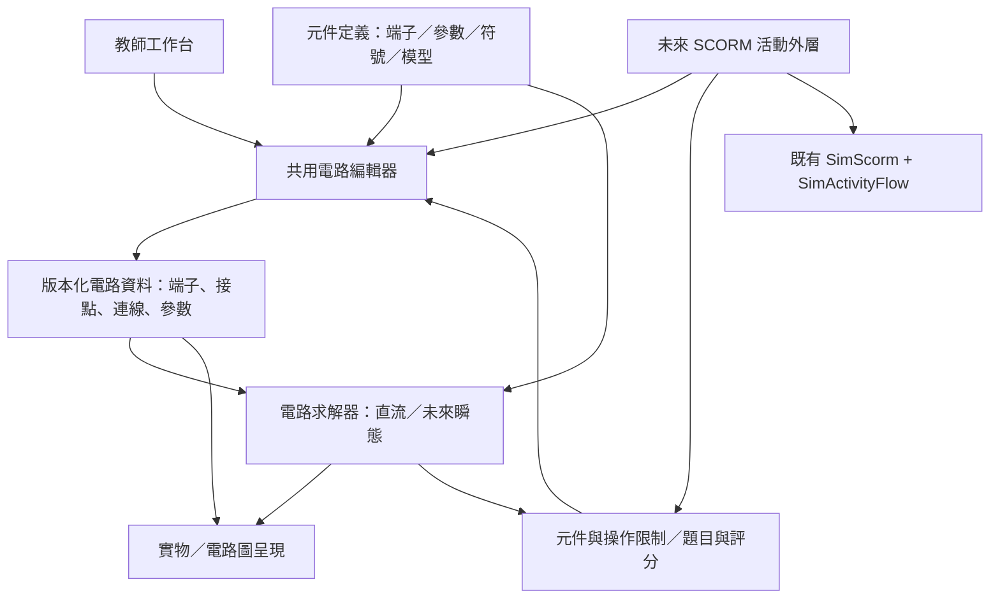

# 電路工作台：設計與開發計劃

- 日期：2026-10-02。
- 專用分支：`codex/circuit-simulator`。
- 狀態：**A–D 的直流工作台已實作；本地驗證與實際限制記錄在第 21／22 節。** E 動態元件與 F SCORM 活動是後續階段，未宣稱完成。規格清單與完成證據分開列示。
- 依據：[共用產品與樣式規範](00-shared-platform-and-style.md)、[實作與驗證契約](../docs/simulation-scorm-production-guide.md)及使用者此次指示。本文件由[新活動計劃範本](NEW-SIMULATION-PLAN-TEMPLATE.md)建立。
- 本次定位：教師課堂用的完整電路工作台，同時成為未來電路教學活動的基礎。**沒有關卡、作答流程或評分面板；畫布優先。**

## 1. 可行性與設計判斷

可以實現。串並聯、電壓／電流／功率計算，以及實物圖與電路圖切換，都能用靜態網頁完成。真正的難點在於把以下三件事同時做好：

1. **容易畫，也容易改。** 第一次使用就能接線；移動、旋轉、分支與刪除不會破壞其他部分，手機上也不需要精準拖到幾個像素的小點。
2. **物理結果可信。** 除正常串並聯外，必須正確處理短路、斷路、浮接、反接、多電源、非線性燈泡，以及理想模型無法確定答案的情況。
3. **新元件可沿用既有操作。** 電路資料、求解、繪圖、互動和活動規則分離；新增四端繼電器或有歷史狀態的電容，不應迫使整個編輯器重寫。

| 工作 | 難度判斷 | 主要風險 |
|---|---|---|
| 基本元件、旋轉、選取、外觀切換 | 中 | 縮放後的標籤與觸控目標重疊 |
| 好用的接線與自動布線 | 高 | 誤接、交叉歧義、路線跳動、導線遮擋元件 |
| 任意直流網絡、內阻與儀表 | 中至高 | 只會算預設串並聯，遇到一般網絡便失效 |
| 變阻燈泡與非線性元件 | 高 | 模型校準、迭代不收斂、顯示不合理結果 |
| 電容、電感、繼電器的動態行為 | 高 | 初始條件、時間步長、切換事件與數值穩定 |
| 跨電腦、平板、手機的可靠操作 | 高 | 手勢與捲動衝突、手指遮擋、短視窗空間不足 |

建議先完成一套可獨立用於課堂的直流工作台，再擴充動態元件；兩者共用同一套資料和操作。分期是驗證順序，不把未完成的功能宣稱為已支援。

## 2. 範圍（Scope）

### 2.1 首個完整直流版本

| 類別 | 必須具備的功能 |
|---|---|
| 搭建 | 新增、移動、旋轉、複製、刪除元件；連線、分支、接點、修改線路走向；復原／重做 |
| 元件 | 直流電源、電阻、可調電阻、開關、恆阻白熾燈、變阻白熾燈、接點 |
| 電源 | 可調電動勢及內阻；內阻可設為 0；可同時放置多個電源 |
| 負載 | 可調電阻；燈泡可選恆阻或熱效應模型，並調整額定參數 |
| 量測 | 電流表、電壓表、四端電功率表；數字式／指針式切換；端點電勢、兩點電壓與支路電流探測 |
| 呈現 | 實物式插畫／標準電路符號切換；電流方向／導線中電子方向；電勢顏色與升高方向；燈泡亮度 |
| 教學 | 自由搭建、固定元件只接線；顯示或隱藏數值；課堂範例；暫停方向動畫 |
| 文件 | 儲存／開啟電路檔、另存接線模板、匯出電路圖；無自動跨重新整理保存 |
| 操作環境 | 大畫布、窄且可收起的工具欄、縮放／平移／適合畫面、共用全螢幕、鍵盤替代操作 |

「可調電阻」首版是二端變阻器，可直接拖動滑塊改變阻值；三端電位器屬後續擴充，避免混淆兩者接法。

### 2.2 後續擴充，架構現在便預留

- 二極管、LED：方向、非線性導通與反向截止。
- 電容：充放電、初始電壓、時間演變。
- 電感：電流建立、初始電流、切斷後的能量與電壓。
- 電磁繼電器：線圈與接點電氣隔離、吸合／釋放門檻、磁滯及常開／常閉接點。
- 視教學需求加入交流源、時間圖、示波器等；不列為首個直流版本的必要條件。
- SCORM 活動：沿用工作台的畫圖、元件與計算，在外層加入題目、限制、答案及評分。

### 2.3 與既有專案規則的關係

本工具屬形成性教學與教師演示，不是評量。使用者明確要求沒有關卡，因此目前的評分規準、最終檢查／提交、已評分鎖定與 Moodle attempt 流程均 **N/A**。保留既有共用樣式、全螢幕、手機手勢、測試與資產管理規範。

首版以獨立靜態網頁交付，不初始化 LMS、不寫入成績。未來 SCORM 活動另外接入 `SimScorm` 與 `SimActivityFlow`，並完整遵守原有生命週期契約。教師檔案的匯入匯出不能取代 Moodle 作答恢復。

## 3. 最重要的設計：接線與編輯

### 3.1 主要操作：從端子畫一條導線

2026-10-02 使用者試用後修訂；原先以點兩端、自動直角布線為主的設計是歷史版本，已被以下要求取代。

1. 按住端子，沿自己想要的路徑畫線；線跟隨滑鼠／手指，接近終點才顯示吸附。
2. 放手時只有終點端子或明確選中的既有導線接點會提交接線；途經其他端子、交叉與回圈不會暗中導通。
3. 預設「自動修整」去除小抖動，近乎直的筆劃整理成直線，彎曲筆劃整理成順滑曲線，保留有意的繞路。「保留筆跡」只做有限簡化；「直角布線」是另外可選的工具。
4. 未接上的筆劃保留可見預覽，可從空白處續畫或點終點完成；畫布上的「取消接線」一直可見，Escape 亦取消。取消不增加歷史或改變電路。
5. 點兩端與 Tab／Enter／Space 保留作精準及鍵盤替代；沒有手畫路徑時使用避開元件的路線，再依修整選項呈現。
6. 選線後直接拖線身改形狀，也可拖局部把手或重畫整條線；畫布上直接提供「刪除導線」及重畫。一次完整手勢只提交一步復原。

線形只是呈現資料，電氣連接仍由端點 ID 決定。重畫保持原端點、分支及電流計算；無效／取消的重畫保留原線。

### 3.2 分支、交叉與接點

- 從端子或既有接點接出新線，直接形成分支。
- 要接到某條導線，可選該線並用「在這裏分支」，或在接線中選中該線；提交時明確新增實心接點。
- 兩條線只是在畫面上相交，**不會自動導通**；用跨線橋或斷開的小視覺間隙區分。
- 相交處附近選線時，預覽清楚指出被選的是哪一條；不能無提示地接到另一條。
- 同一端子可有多條導線；端子仍是一個電氣節點，不因畫法改變電位。
- 不允許重複建立完全相同的連線；存在迴路不等於重複線，合法電路迴路必須保留。

### 3.3 修改時保持可預期

| 操作 | 預期行為 |
|---|---|
| 移動元件 | 連線端點跟隨，仍連到原本的端子；附近其他元件不跟著移動 |
| 旋轉元件 | 一鍵轉 90°；連線跟隨各自端子，不交換端子身分 |
| 電源反接 | 是獨立且清楚的操作；單純改變圖形朝向不會暗中改變電動勢符號 |
| 修改導線 | 選線後顯示轉折把手，可加／移／刪轉折；可恢復自動路線 |
| 刪除導線 | 刪除兩個明確端點之間的該條連線；不刪除元件或其他分支 |
| 刪除元件 | 一併移除其相連導線，選取時提示影響範圍；一次復原可全部還原 |
| 刪除接點 | 清楚標示受影響分支，整體操作可復原；不偷偷把其他線接在一起 |
| 複製元件 | 複製參數與外觀，不複製接線，避免出現看不見的額外連接 |
| 自動整理 | 明確由使用者觸發；不因每次計算而重新排列整幅電路 |
| 復原／重做 | 一次完整手勢算一步；清空、套用範例及匯入也可復原 |

### 3.4 接線原型先驗收

先用電源、開關及兩個燈泡做可操作原型，驗證「點兩端」、「拖接」、「導線分支」及「移動後保持連接」。觀察串聯改成並聯時的操作次數、誤接及需要撤銷的次數，再決定吸附距離及自動布線細節。不能只憑截圖認定比 PhET 易用。

## 4. 畫面與美術（Responsive layout contract）

### 4.1 桌面及課室投影

```text
┌───────────────────────────────────────────────────────────┐
│ 電路工作台   範例／檔案   復原／重做   顯示方式        全螢幕 │
├───────────────────────────────────────────────┬───────────┤
│                                               │ 元件工具箱 │
│                                               │           │
│              可縮放的大畫布                    │ 選取元件   │
│                                               │ 的屬性     │
│                                               │           │
│                                               │ 顯示選項   │
│ 接線提示／診斷                    縮放／平移     │           │
└───────────────────────────────────────────────┴───────────┘
```

- 桌面工具欄採 252 CSS px，可整個收起，畫布佔剩餘空間；短橫向視窗採 230 px。
- 側欄只呈現目前選取物件的屬性，沒有題目說明、評分或步驟卡。
- 常用的旋轉、刪除、複製與開關操作不埋在多層選單。
- 「顯示選項」可收合；數值、電子與電勢等疊加層可各自開關，避免同時顯示所有資訊。
- 課堂投影模式放大標籤、儀表及提示，保留電路畫布。
- 共用全螢幕包含標題、畫布和工具欄，保持同一份電路及操作歷史。

### 4.2 手機與平板

- 窄直向畫面改為「標題 → 畫布 → 下方工具面板」；畫布保持可見，面板獨立捲動。
- 面板至少保留 112 CSS px 可見空間；短橫向視窗改用左右佈局，避免最下方控制被裁掉。
- 不把整幅電路無限縮小來塞入手機；提供縮放、平移、定位所選及適合畫面。
- 控制按鈕與端子命中區至少 44 CSS px；主要控制 16 px、次要文字約 14 px。圖面文字按實際顯示大小驗證。
- 畫布兩側預留至少 32 CSS px 的直向捲動帶。一般空白區保持原生捲動；開始接線後，中央區域明示為續畫區，在下一次 pointerdown 前配置 `touch-action:none`。端子開始的首筆本來就是模擬器擁有的捕獲手勢。取消後恢復空白原生捲動，兩側捲動帶在所有模式保持可達。
- 斷點採 760 CSS px；窄直向面板佔下方約 31%，保留至少 112 px。初始畫布倍率至少 65% 保持可讀，可用「全圖」縮至 25% 概覽，再定位元件或放大接線。

### 4.3 美術方向

乾淨、明亮、適合中學生與課室投影：白／淺灰背景、淡格點、清楚的深色導線、藍色操作提示、暖色燈光。實物元件用原創簡化 SVG 插畫，有清楚形狀及端子，不追求寫實照片，也不使用密集的工程儀表介面。

實物與電路圖共用位置、端子、連線與選取狀態。切換外觀不重建電路，已接好的線不會重新分佈。標準符號預設採中學常見畫法，地區性的電阻符號差異可日後做顯示選項。

## 5. 物理模型（Physics or subject model）

### 5.1 求解方式

用**改良節點分析法（MNA）**處理任意電路網絡，支援串聯、並聯、橋式、多個電源及多個互不相連的電路。不能只辨認預設電路再套串並聯公式。

- 電氣拓撲由明確的端子與接點關係決定，與畫面座標分離。
- 理想導線連接的端點組成等電位節點；整條線不因長短或彎折產生額外電阻。
- 線性電阻與電源先精確求解；變阻燈泡等用非線性迭代。
- 求解器回傳電勢、元件電壓／電流／功率及診斷，不操作畫面或評分。
- 判斷收斂必須看電路殘差；達到迭代次數上限不能直接當成正確答案。
- 計算與動畫更新分開；直流參數／接線未變時不每幀重新解矩陣。

### 5.2 電源、負載與功率

- 電源具有電動勢 `E` 與內阻 `r`，`r=0` 是理想電源。
- 以流入元件正端的電流為正；電源關係為 `Va − Vb = E + r I`。供電時此 `I` 為負，可另外顯示向外供出的正電流。
- 被動元件使用 `P=UI`；電源端口輸出、內阻發熱 `I²r`、電源提供的總功率分開標示，避免全電路歐姆定律的教學混淆。
- 一般電阻及二端變阻器可調；滑塊和數字輸入並存，明列單位與合法範圍。
- 內阻、儀表電阻及理想導線不可被隱藏的「很小電阻」替代，造成使用者以為理想條件成立。

### 5.3 兩種白熾燈

| 模型 | 行為 | 教學呈現 |
|---|---|---|
| 恆阻燈 | 電阻固定，`I=U/R` | 亮度依消耗功率變化，適合初學串並聯 |
| 熱效應燈 | 電流加熱燈絲，溫度升高令電阻增加 | 顯示即時等效電阻、額定參數與功率，說明其不服從恆定電阻模型 |

熱效應燈先採**穩態教學近似**：用溫度相關電阻及散熱平衡求出工作點，額定電壓時應回到設定的額定功率／熱態電阻。冷熱電阻比例、溫度係數及散熱係數屬模型參數，需選定參考或校準後記錄，不能把一組任意常數當作所有白熾燈的精確模型。

首版已定案：`R_cold=R_rated/10`，`T_ambient=293 K`，`T_rated=2600 K`，`α=9/(2600−293)`；`R(T)=R_cold[1+α(T−293)]`。散熱採 `k(T⁴−293⁴)`，以 `U_rated²/R_rated` 校準 k，穩態解滿足 `U²/R(T)=k(T⁴−293⁴)`。局部溫度用二分求解，電路用附解析微分電導的阻尼 Newton 迭代；這是明示教學模型，不是鎢絲實測擬合。全網絡最多 100 次迭代，收斂殘差要求 ≤1e−9；失敗顯示診斷而非沿用舊解。

首版不宣稱具備真實預熱時間、燒毀或精確光譜。亮度有合理上限；超過額定狀態可提示，但不突然刪除燈泡。動態階段再加入熱容量及時間演變。

### 5.4 量測工具

| 工具 | 接法及計算 | 必要呈現 |
|---|---|---|
| 電流表 | 串聯；預設理想 0 Ω，非零內阻可選 | 正負端、量程、反向讀值、超量程 |
| 電壓表 | 並聯；預設理想無限輸入電阻，有限輸入電阻可選 | 測量兩端的電勢差，不強行替浮接部分定出電勢 |
| 電功率表 | 四端：電流線圈串聯，電壓線圈跨接負載；`P=(Vc−Vd)Iab` | I+/I−、V+/V− 明確標示，反接時保留功率正負號 |
| 快速探測 | 點端子看相對電勢；選兩點看電壓；選線看可確定的支路電流 | 可標明是非侵入式觀察，與實際接入的儀表區分 |

- 所有儀表都可切換數字式／指針式；切換只改外觀，不改接法或計算。
- 指針式支援合適的量程、刻度和反向／超量程提示；不把超量程值默默截斷為滿刻度。
- 四端功率表需另附短接線圖。另提供「顯示所選元件功率」方便演示，但不能以此冒充功率表接線。

### 5.5 必須處理的特殊情況

| 情況 | 結果政策 |
|---|---|
| 斷路 | 可確定的電流為 0；斷口兩端電壓仍按其所屬電路計算 |
| 浮接／互不相連的電路 | 分開求解，每區可選自己的參考點；跨區差值不能憑任意參考電勢算出一個假數字 |
| 理想電源被短路 | 明確說明理想模型沒有有限解，不顯示一個任意大的電流 |
| 有內阻電源短路 | 算出有限短路電流及內部耗散；以適當的教學提示呈現 |
| 不相容的理想電源 | 顯示條件矛盾；可解的其他獨立電路仍可顯示 |
| 理想支路形成不唯一電流 | 說明電流不能唯一確定，與「沒有解」區分 |
| 理想導線環路 | 若某些線段電流不唯一，不畫假方向；仍顯示可確定的節點電勢與其他支路讀值 |
| 儀表反接／超量程 | 保留符號、明確提示，不自動修正接法 |
| 非線性未收斂 | 顯示暫無可靠結果；停止相關方向動畫，不保留看似有效的舊讀值 |

## 6. 電流、電子及電勢（Diagrams, notation and assistance）

- **電流方向：** 用清楚的箭頭標示計算得到的常規電流方向；大小與方向分開呈現。
- **電子方向：** 用帶負號的小點顯示金屬導線中電子漂移，方向與常規電流相反；不把電池內的電化學運作畫成自由電子直接穿過電解質。
- **動畫速度：** 只表達示意方向或相對強弱，不宣稱是真實電子速度；可暫停，不改變直流解。
- **電勢顏色：** 同一理想導線保持同一顏色。藍／中性／暖色對應相對低／中／高電勢，附數值與圖例；可切換顏色顯示。
- **參考點：** 預設在各獨立電路的一個電源負端，可明確改選 0 V 參考；改選參考不改變任何兩點電壓或電流。
- **電勢增加方向：** 在有電勢差的元件附近顯示「低 → 高」箭頭，從計算的兩端電勢決定；不能簡化為永遠沿電流方向或永遠指向電源正極。
- **不靠顏色單獨解釋：** 數值、正負端及方向箭頭仍可獨立使用，並檢查灰階與投影可讀性。
- 端子吸附起點暫定 24 CSS px；元件位置使用可見格點，旋轉採 90°。參數在操作原型後定案，螢幕像素吸附與物理容差分開。

## 7. 教師使用模式（Navigation, submission and reset）

### 7.1 自由搭建

可新增或刪除元件、調整參數及接線。提供空白電路、串聯、並聯、混聯、全電路歐姆定律與儀表接線範例。範例是可編輯示範，不是必須完成的關卡。

### 7.2 固定元件，只讓使用者接線

教師先擺放及設定元件，再切換「固定元件接線」。其限制需要分開配置：

| 限制 | 建議預設 |
|---|---|
| 增刪／移動元件 | 鎖定 |
| 元件方向 | 鎖定，可由教師開放旋轉 |
| 元件數值 | 鎖定，可依教學目的開放某些滑塊 |
| 接線增刪與改道 | 開放 |
| 開關開合 | 開放，除非教師特別限制 |
| 儀表、方向及電勢顯示 | 由教師決定可見／可切換 |

可把已完成的電路「另存為只保留元件的接線模板」。教師示範答案與模板分開儲存；本版不建立題目答案庫或自動評分器。

這些限制是教學操作規則，不是防作弊或伺服器安全邊界。日後學生活動由外層策略控制，不能靠隱藏按鈕判定評分可信。

### 7.3 重設及文件操作

沒有提交或已評分狀態。清空、套用範例及匯入均是一個可復原操作；「清空全部」與「只移除導線」清楚區分。重新整理回到新工作階段；使用者明確匯出／匯入電路檔來保存課件。

## 8. 可重用架構



### 8.1 分工與介面

| 模組 | 責任 | 不應包含 |
|---|---|---|
| 電路資料與命令 | 元件／端子／連線、結構驗證、增刪及復原操作 | DOM、LMS、題目答案 |
| 元件定義表 | 型別、任意數量端子、參數規格、符號及求解模型 | 把所有元件硬編成兩端電阻 |
| 求解器 | 建網絡、組矩陣、求解、診斷、穩態／日後瞬態 | 畫布座標、顏色、分數 |
| 路由與繪圖 | 自動／手動線路、元件圖形、數值及動畫 | 以座標碰撞推測電氣導通 |
| 互動控制 | 選取、吸附、拖拉、旋轉、鍵盤、手勢取消 | 個別題目的正確答案 |
| 教學策略 | 允許的元件／操作、固定元件、可見資訊 | 取代求解器或修改物理規則 |
| 活動外層 | 未來題目、評分、快照與 Moodle 回報 | 重寫共用接線及 SCORM commit 邏輯 |

首版使用原生 HTML/CSS/JavaScript 與 SVG，可直接在 Live Server 執行。先把可重用核心放在電路工作台內清楚分模組；待第二個活動實際使用時再整理共用路徑，不把電路物理塞進全站通用 helper。

對外需有版本化的「取得電路／載入已驗證電路／套用操作策略／取得計算結果／監聽變更」介面。未來評分可比較電氣拓撲及物理條件，而非要求學生的畫法、位置或元件 ID 與範例一模一樣。

### 8.2 為動態元件預留的邊界

- 元件模型區分靜態參數與動態狀態，例如電容電壓、電感電流、線圈狀態及燈絲溫度。
- 求解器需有初始化、直流工作點、時間步進與重設介面；不把所有元件壓縮成一個 `resistance` 欄位。
- 元件顯示依模型狀態更新，但動畫時間不能直接當成物理時間步。
- 繼電器的線圈與接點是同一個多端元件的不同子系統，具有吸合／釋放狀態；不能簡化成受電流控制、瞬間抖動的普通開關。
- 真正加入電容／電感時，另訂初始條件、積分法、誤差、切換事件與能量守恆驗收；直流工作台的通過不代表瞬態已通過。

## 9. 電路資料與保存（Persistence contract）

### 9.1 v2 權威資料（v1 遷移見第 22 節）

| 欄位 | 內容及驗證 |
|---|---|
| `kind`, `version` | 電路檔類型與格式版本；不支援的版本需明確拒絕或經測試遷移 |
| `components` | 唯一 ID、型別、名稱、位置、方向、各項參數；端子規格由元件定義表提供 |
| `junctions` | 明確接點的唯一 ID 與位置 |
| `wires` | 唯一 ID、`from/to` 合法端點引用、`shape` 線形及 `via` 路徑點；`auto` 的空陣列表示自動直角路由 |
| `policy` | `mode/allowRotate/allowParams/allowSwitch`；元件另存 `locked/editable` |
| `display` | 實物／符號、電流／電子／關閉、儀表外觀、電勢與數值顯示、參考點 |

所有引用必須存在且對應有效端子。數值有限、有單位、有合法範圍；ID 不重複；名稱當純文字處理。匯入先完整驗證，成功後才一次替換當前電路；壞檔不能留下半份電路。

節點合併結果、電壓／電流／功率、亮度、布線快取與 DOM 都是衍生資料，載入時重新計算，不信任檔案內的現成答案。選取、指標、未完成導線、放大預覽、復原歷史與動畫時間是暫態，不作為已完成的電路內容保存。

### 9.2 儲存與限制

- 首版使用明確的 JSON 檔案匯入匯出，不新增伺服器或自動瀏覽器儲存。
- 可另匯出純圖像供講義／投影片使用；圖像不是可繼續編輯的電路檔。
- 首版容量上限為 80 元件、120 接點、240 導線、直角線每線 24 個轉折／手畫線 96 個路徑點、檔案 256 KiB；座標限制 ±10000，復原歷史保留 80 步。
- 若限制觸發，清楚說明且保留原圖；不能截斷匯入或默默遺失元件。
- SCORM 日後另有 ≤4000 bytes 的作答快照設計。教師完整電路檔不直接塞進 `suspend_data`。

## 10. 階段與操作狀態（Phase/state matrix）

這裏的「狀態」是編輯器狀態，不是學生關卡。

| 狀態／變體 | 可保存內容 | 暫態或計算結果 | 合法下一步 |
|---|---|---|---|
| 空白 | 空元件／接點／導線集合 | 無 | 新增元件 |
| 未接完整 | 合法但可能不導通的拓撲 | 已知讀值及未確定提示 | 接線、改參數 |
| 可解電路 | 完整拓撲與參數 | 重新求解的讀值 | 移動、旋轉、量測、修改 |
| 固定元件接線 | 拓撲、參數及明確操作策略 | 顯示設定 | 按策略增刪導線、操作開關 |
| 部分元件鎖定 | 各元件的限制 | 選取狀態 | 編輯其他部分或由教師解除限制 |
| 無解／不唯一 | 結構合法的原始電路 | 診斷；不捏造電流 | 移除短路、改內阻等 |
| 正在接線 | 原電路尚未改變 | 起點、預覽、未提交轉折 | 接上合法端點或取消 |
| 正在拖動 | 保存以完成的命令為界 | 原位置、預覽位置、穩定捕獲目標 | 放開提交；中斷回復 |

實物／符號、數字／指針、電流／電子／關閉、電勢／數值及操作限制都是需要驗證的顯示或策略變體。每種可保存狀態都要測試實際匯出 → 驗證載入 → 重算 → 執行一個合法操作。

## 11. 手勢契約（Touch gesture ownership contract）

| 起始區域／操作 | 手勢擁有者 | 技術要求及替代操作 |
|---|---|---|
| 元件本體拖動 | 模擬器 | 局部且穩定的命中區，預先設 `touch-action:none`；方向鍵可移動，R／按鈕旋轉 |
| 端子／接點拖接 | 模擬器 | 44 px 目標、24 px 初始吸附門檻；Tab／Enter 可逐端子接線 |
| 導線轉折把手 | 模擬器 | 只在所選線顯示局部把手；可用控制按鈕修改／移除轉折 |
| 導線線身選取／拉動 | 模擬器 | 旋轉的局部窄矩形命中區（18 px 寬度）；不以斜線的外接矩形覆蓋空白；另有鍵盤連線清單 |
| 接線中的中央續畫區 | 模擬器 | 以可見提示宣告續畫；在下一次 down 前設 none，取消後恢復 pan-y；兩側捲動帶始終可達 |
| 普通空白畫布 | 外層頁面／宿主 | `pan-y`；點擊和垂直滑動必須區分，滑動不新增轉折或改選取 |
| 明確啟用的中央平移區 | 模擬器 | 只平移視野，不移動電路；有方向及縮放按鈕替代 |
| 左右 32 px 捲動帶 | 同一外層頁面／宿主 | 不能開始接線、拖曳或平移，不能被透明圖層覆蓋 |
| 下方／側邊獨立面板 | 面板本身 | 原生 overflow 及邊界 containment，不改寫父頁面樣式 |

- 精準拖接和轉折編輯在手指遮擋時顯示局部放大預覽；包含實際場景、吸附後端點及待接線，不攔截操作。
- 粗略搬動大型元件不強制放大，但端子附近調整仍需驗證遮擋。
- 拖動中保持相機不變；放開的結果必須與最後預覽一致。
- Escape、取消、第二根手指、失去捕獲、視窗失焦、縮放／尺寸改變及模式切換均清理暫態；不留下半條線或半個歷史步驟。
- 測試需使用真實手機或瀏覽器層級可信觸控，不用合成 DOM 事件冒充手勢驗收。

## 12. 評分與容差（Scoring and tolerance）

目前沒有評分、及格線或題目答案，均 N/A。未來活動獨立決定答案與規準；不能將工作台顯示值直接等同於學生已完成答案。

物理測試按量綱分開設定：線性正常尺度案例以約 `1e−7` 絕對或 `1e−6` 相對誤差作起始目標，非線性另驗證節點 KCL、迴路 KVL、功率平衡與收斂殘差。實際容差須隨量程、模型和條件數記錄，不能靠四捨五入後一致就判通過。幾何吸附距離不作為物理或評分容差。

## 13. SCORM 邊界（Shared SCORM lifecycle）

教師工作台本身不初始化／提交／結束 Moodle attempt，也沒有 review、pending 或已評分狀態。因此本版不為了符合活動外觀而建立假提交流程。

日後的 SCORM 電路活動必須：

1. 以此核心呈現和編輯電路，活動自行擁有題目、規準及限制。
2. 用 `SimScorm.loadAttempt()` 配合 `SimActivityFlow.startup()` 處理載入。
3. 按既有規範處理 success／committed／frozen／retry、空白與部分答案、結果鎖定及重新整理／續做。
4. 定義活動自己的小型權威快照與每種 phase／variant 的恢復測試。
5. 高風險評量另外配置可信伺服器驗證；前端限制不是安全邊界。

不修改既有 SCORM 共用執行層來遷就教師工具。

## 14. 目錄與交付（Catalogue metadata）

slug：`circuit-workbench`，標題「電路工作台」，分類 `Electricity`，標籤 `physics / electricity / circuits / teacher / sandbox`。描述：「自由搭建與量測電路，探索內阻、燈泡、電勢及電功率。」

已登記 `active`，入口及 standalone ZIP 均存在。這個目錄狀態表示教師工具可直接開啟，不是 Moodle-ready 或 SCORM 認證。

實作目錄：

```text
sim/circuit-workbench/
  index.html
  styles.css
  main.js                 教師工作台與互動整合
  circuit-model.js        結構、命令、驗證
  component-registry.js   多端元件及參數定義
  circuit-solver.js       直流求解；預留瞬態邊界
  circuit-routing.js      自動及手動導線路由
  circuit-renderer.js     SVG 元件、兩種外觀及疊加資訊
  circuit-document.js     版本化匯入匯出
  presets.js              課堂範例／固定元件模板
  core.test.js            物理、文件、命令與擴充介面驗證
  assets.json             standalone 發布資產清單
```

使用 `sim/shared/styles.css` 與 `sim/shared/fullscreen.js`。若新增其他執行依賴，全部本地化並列入發布資產清單。首版交付靜態網頁與可離線部署的 ZIP；教師工作台的 ZIP 明確標示為 standalone，不建立假 SCO manifest。未來活動才提供 `imsmanifest.xml` 並宣告核心及所有相依資產。

新增測試一律登記在 `tools/run-tests.js`；需要瀏覽器測試時沿用專案工具及輸出路徑。具體檔案拆分可在實作時調整，模組責任與相依方向不變。

## 15. 分期開發與每期出口

| 階段 | 可審閱成果 | 進入下一階段的條件 |
|---|---|---|
| A：操作原型 | 大畫布、窄面板、電源／開關／兩燈；點接、拖接、分支、旋轉與復原 | 教師能順暢完成串聯→並聯改接；無誤接、斷線或明顯手機操作障礙 |
| B：可信直流核心 | 任意網絡求解、電源內阻、電阻／變阻器、恆阻燈、開關與基本測量 | 解析案例、KCL／KVL／功率平衡、浮接／短路／多電源等通過 |
| C：完整直流教學呈現 | 熱效應燈、A/V/W 表兩種外觀、探測、實物／符號、電子／電流／電勢 | 儀表接法、符號、非線性模型、參考點與顯示一致性通過 |
| D：教師工作台完成 | 固定元件策略、範例、模板、檔案／圖像匯出、投影模式與整體操作 | 桌面／手機／靜態 ZIP 實測通過，可在課堂自由搭建與演示 |
| E：擴充元件 | 先二極管，再時間引擎與電容／電感，最後繼電器 | 每種元件新增自己的解析／數值基準，沿用同一套接線與文件 |
| F：SCORM 活動外層 | 串並聯等獨立活動、題目與評分 | 完整共用生命週期、package-ready 與真實 Moodle-ready 分別通過 |

A–D 合起來才稱為「首個完整直流工作台」。A 只是互動原型，不能宣稱已完成模擬器。E 是使用者提出的後續元件路線，F 與核心維護分開；未來可按教學優先次序安排。

## 16. 測試計劃（Test plan）

### 16.1 物理與數值

- [x] 空電路、單一負載、串聯、並聯、混聯、惠斯登電橋及多個獨立子電路。
- [x] 電源內阻為 0／非零、負載變化、多電源供電與吸收功率。
- [x] 開關前後、斷路、浮接、理想短路、有內阻短路、理想環路的不唯一解。
- [x] A/V 表正反接、有限／理想儀表負載、跨浮接區量測、超量程。
- [x] 四端 W 表正確接法、電流／電壓線圈分別反接、與 `UI` 及能量平衡一致。
- [x] 恆阻燈、熱效應燈的額定工作點、冷熱工作電阻、正微分電導及一般網絡收斂；短路／矛盾條件有失敗診斷。
- [x] 以沒有有限直流平衡點的本地測試模型 `I=exp(U)+1` 觸發迭代上限；顯示未知值，其他獨立電路仍可解，恢復後可移除問題元件繼續操作。這不是聲稱已提供新教學元件。
- [x] 理想導線環路中只呈現可確定的線段電流，不以任意分流動畫掩蓋不唯一性。
- [ ] 後續 RC／RL 的解析時間常數、能量與初始條件；繼電器吸合／釋放，另期驗收。

### 16.2 編輯、檔案與恢復

- [x] 範例及獨立顯示枚舉變體的生產匯出→匯入→求解→合法操作；無解恢復後可修復。
- [x] 無效型別、重複 ID、壞引用、非有限／越界參數、未知版本、過大檔案及惡意名稱。
- [x] 點接／拖接、分支、幾何不決定導通、轉折、移動保留接線、旋轉不換端子。
- [x] 元件／導線刪除、復原／重做、範例載入及實際檔案匯入；失敗匯入保留原文件。
- [x] 複製參數／方向但不複製接線；清空導線、清空畫布、空白下一步及各自復原；固定模式拒絕清空元件，允許清空導線。
- [x] 固定元件策略確實限制操作，同時保留被允許的接線、開關及顯示。
- [x] 實物／符號與數字／指針切換前後，拓撲、物理結果及端子身分不變。
- [x] 重新整理開始新工作階段；瀏覽器儲存 getter 被拒絕時仍可使用，工具不讀取儲存。

### 16.3 瀏覽器、觸控與全螢幕

- [x] 原始頁面及解壓後靜態 ZIP 均可開啟，沒有缺少資產或外部網絡依賴。
- [x] 320×500、390×500／600／844、844×390、640×450／360、1024×768、1280×720 及 390×500 iframe。
- [ ] 人工操作瀏覽器 200% 縮放；640×360 小 CSS 視窗只提供重排證據。
- [x] 桌面／電話模擬全螢幕進出、外部退出、真實 iframe policy 阻擋與 API 不支援提示；電路保留。
- [x] 可信觸控逐項測試本體／端子／接點／轉折／變阻滑塊／平移、兩側捲動帶及面板邊界。
- [x] 六類操作各測試可信 touchCancel、第二觸點、失去捕獲及實際尺寸變化，另測合成 blur 訊號的處理；取消不增加歷史，可繼續合法操作。
- [ ] 以實際視窗切換引起的可信 blur 驗證，不能以合成 blur 冒充。
- [x] 模擬器操作、兩側捲動帶與面板的固定區域／實際擁有者，皆記錄移動、放開及放開後樣本。
- [x] 可信 Tab／Enter／Space 接線、方向鍵／R／Delete 編輯；原生按鈕有名稱與 focus-visible 樣式，量程／單位有顯示。
- [ ] 真實讀屏、投影／灰階及人工焦點視覺驗證。

| 宿主 | 要驗證的實際捲動擁有者 | 執行狀態 |
|---|---|---|
| T0 獨立頁面 | 有界根頁面；宿主捲動範圍 N/A，面板可捲動 | 原始／ZIP、9 視窗、接線／編輯／檔案／全螢幕／中斷通過 |
| T1 直接 iframe | 外層可捲動文件 | 兩側／雙方向／兩外觀、六類操作、空白／固定元件及面板邊界通過 |
| T2 巢狀播放器 | 外層可捲動文件，中間 iframe 保持不動 | 同 T1，記錄中間 window 不動；原始／ZIP 均通過 |
| T3 元素型宿主 | 指定的 overflow 元素，所有 window 保持不動 | 同 T1，僅元素擁有者捲動；原始／ZIP 均通過 |
| T4 真實 Moodle／手機 | 真實播放器鏈與實際擁有者 | 留待 SCORM 活動；不得以本地模擬取代 |

實物／符號等完全相同命中幾何可在記錄理由後合併案例；自由／鎖定、轉折編輯、正在接線及平移模式不能因初始頁面通過而省略。

## 17. 交付門檻（Package-ready checklist）

- [x] A–D 直流功能已實作；計劃更新為實際模型與參數，限制及未驗證案例列明。
- [x] 電路單元測試、範例／顯示變體 round-trip、實際編輯流程及已執行的 T0–T3 本地矩陣通過。
- [ ] 尚未執行的獨立案例及人工可用性確認；不得把功能存在當成每個操作均已驗證。
- [ ] `npm run check`、`npm test`、`npm run package:all`、`git diff --check` 通過；既有 SCORM 活動不受影響。
- [x] standalone ZIP 的檔案與資產清單一致，解壓可執行並完成操作驗證。
- [x] 記錄瀏覽器／版本、視窗、原始與發布來源、測試指令、截圖與失敗／未驗證項目。

這是教師工具的 standalone 交付門檻；**不是 SCORM package-ready 認證**。未來 SCO 要另跑正式 manifest、快照、提交與鎖定測試。

## 18. Moodle 驗收（Moodle-ready checklist）

目前範圍 N/A。未來活動需在真實學生帳號確認成績／狀態、同一次 attempt 的續做、pending 重試及已提交唯讀；並在實際 iOS／Android 裝置和提供的播放器模式完成 T4。這些尚未執行。

## 19. 已定案及後續設計決策

首版採以下決策；教師使用回饋可再調整操作，不更改電氣端子身分：

1. 自動路線採有界 A* 避障，手動轉折採直角連接。導線白色底線在交叉處形成視覺間隙，只有實心接點導通；無法避障時保留可編輯的直角路線，不猜測新連接。
2. 電阻採矩形符號；實物採原創 SVG。指針表採中央 0 的正負量程，反接可讀負值；超量程有提示，仍保留實際數字。
3. 變阻燈模型已在第 5.3 節定義；額定點、微分電導、任意網絡的 KCL／功率平衡均有執行測試。
4. 吸附半徑為 24 CSS px，端子 44 px，格點 20 單位，旋轉 90°。桌面側欄 252 px，投影主標籤 18 px，一般標籤 14 px。真實手機及課堂易用性比較尚待教師試用，不能只憑自動測試聲稱優於 PhET。
5. 後續二極管／電容／電感／繼電器的實作次序，可隨課程需要調整，不更換接線方法。

## 20. 參考與目前證據

- [PhET Circuit Construction Kit: DC](https://phet.colorado.edu/en/simulations/circuit-construction-kit-dc)：作為同類教學工具與互動需求的參考；不預設其內部實作，也不直接沿用其美術或程式。
- [ngspice 官方文件](https://ngspice.sourceforge.io/docs.html)：參考網表、矩陣、模擬與資料處理的分離。選擇 MNA 及前述產品操作屬本專案的工程建議，不是聲稱採用 ngspice 引擎。
- 已完成：建立專用分支、A–D 直流功能、物理與文件測試、靜態資產打包；實際本地瀏覽器證據見下節。
- 待完成的後續範圍：二極管／時間引擎／電容／電感／繼電器、SCORM 活動外層、真實手機及 Moodle T4、教師課堂易用性評估。

## 21. 實作及驗證紀錄（2026-10-02）

使用說明、核心 API、模型限制及新增元件介面見 [circuit-workbench-core.md](../docs/circuit-workbench-core.md)。入口為 `sim/circuit-workbench/index.html`；包為 `output/circuit-workbench-standalone.zip`，包含 `assets.json` 列出的 13 個本地檔案，沒有 CDN 或 LMS 初始化。

### 21.1 已執行的物理與文件證據

`node sim/circuit-workbench/core.test.js` 通過：解析串並聯、混聯／橋式、內阻、開關／斷路／短路／浮接、不相容及一致的理想電源環路、可唯一識別的支路／導線電流、參考點不變性、儀表反接與超量程、有限 V/W 表負載、多源供電與吸收功率、熱效應燈校準與微分電導。

另外執行 50 組一般網絡（包含非線性燈），獨立檢查接點 KCL、總吸收功率與殘差；四端 W 表自身功率分別包含兩線圈，不能拿讀值當自身耗電。透過註冊表新增四端非線性雙負載，驗證不改求解器或文件模組即可求解及守恆。另用沒有直流平衡點的測試模型觸發不收斂，驗證未知值、其他獨立電路及修復；無解的熱效應燈不顯示猜測的工作電阻。

生產 JSON encode/decode 的範例／顯示變體 round-trip 後都有合法下一步，包括無解電路恢復後以內阻修復。執行壞版本／型別／ID／端點／參數／容量拒絕、失敗交易原子性、復原／重做、固定策略、分支拓撲及所有範例 SVG XML 檢查。

### 21.2 本地瀏覽器證據

`node tools/circuit-workbench-browser-regression.js` 已通過，最後於 2026-10-02 09:38:25 UTC 產生 `evidence.json`。使用專案現有 Chrome/CDP 工具，在原始頁面及 ZIP 解壓內容分別執行；Chrome 155.0.8059.27。共有 186 筆證據（兩來源各 93），其中 60 筆為六類操作各五種中斷／繼續案例。圖片及逐樣本捲動／事件紀錄位於 `output/playwright/circuit-workbench/`。

桌面實際操作包含串聯改接並聯、點接／拖動／轉折／分支／旋轉／複製、清空及空白續編、復原／重做、負參數拒絕、可信鍵盤接線及接點替代操作、兩點探測、固定策略、JSON 真實檔案匯入／原子失敗、錯誤元件型別拒絕、宿主變更訂閱、指針／電勢切換及重新整理。另驗證熱效應燈所在電路無解時工作電阻顯示未知、方向動畫停止；可信觸控測直接變阻滑塊、兩點接線及平移。

兩種外觀共用 `renderHits()` 的相同 HTML 端子、本體與轉折命中幾何及 touch-action，因此六類機構操作每個宿主合併測一次；實物／符號各自執行左右捲動帶兩方向案例。空白及固定元件另測原生捲動且不改選取／文件，面板測中間、上界、下界 containment。宿主 fixture 使用獨立瀏覽器頁面隔離先前取消多點觸控的 CDP 輸入序列；沒有以 DOM 假觸控代替命中結果。

### 21.3 全專案檢查與既有失敗

`npm run check` 通過；`npm run package:all` 已成功重建既有 21 個 SCORM 包；新舊檔案 whitespace 檢查通過。首次 `npm test` 在既有 `tools/scorm-fullscreen-browser-regression.js` 中止；其 headed 檢查首輪為圖示可見性斷言，最終隔離重跑則在進入全螢幕條件逾時，headless 重跑曾在面板捲動斷言中止。此測試在起始版本的 headed 獨立重跑通過，因此記錄為尚未解決的環境／時序差異，不能宣稱此項或全套在本分支通過。

為避免其餘檢查被前項遮蔽，另執行剩餘 147 項：140 項通過，以下 7 項失敗。全部 7 項已在未修改的起始提交 `40ec778d4fa2775ed0b77986c5c1e4d0208158f3` 重現；本次沒有修改這些活動、測試或共用執行層。

- `tools/newtons-third-law-fullscreen-activity-regression.js`：舞台最小高度。
- `tools/motion-composition-browser-regression.js`：縮放後控制區下緣。
- `tools/newtons-second-law-browser-regression.js`：320×400 控制可達性。
- `sim/position-time-graph-motion-lab/production-wiring.test.js`：舊版 HTML 標頭／上方捲動區正規表達式。
- `sim/kinematics-qualitative-graph-sketching/accessibility.test.js`：HTML 標頭正規表達式。
- `sim/kinematics-quantitative-graph-builder/accessibility.test.js`：HTML 標頭正規表達式。
- `tools/kinematics-quantitative-graph-browser-regression.js`：160 px 縮放視窗的可用高度。

原始診斷保存在 `remaining-tests.json` 與 `baseline-verification.json`。全專案 `npm test` 門檻保持未勾選，不能把新工具自身通過寫成所有活動已驗收。

最後 ZIP 共 13 個檔案，逐一與執行時來源比對。此輪包 SHA-256：`1fc94a44f22addea63eb53484f6901e61ffbf032e3ff05d76ca6eb2726e05aa3`。

### 21.4 未驗證項目與物理限制

沒有真實 iOS／Android 觸控或讀屏軟件驗證，也沒有實際 Moodle T4。教師工具不初始化 LMS、不評分，Moodle-ready 為 N/A。200% 瀏覽器實際縮放、灰階投影與課堂使用需另外人工確認；小 CSS 視窗的自動測試不能替代這些證據。熱效應燈只算穩態；E／F 後續階段尚未開發。

## 22. 試用回饋修訂：手畫導線與元件外觀

本節記錄試用後的修訂及驗證；第 21 節是修訂前的歷史驗證。

- 風險／評分／SCORM：維持教師獨立工作台，無評量；求解器及元件電氣模型沿用，線形不能改變電流／電壓／功率。
- 新依賴：無；沿用原生 Pointer Events、SVG、既有路由／文件模組及 HTML 命中區。
- 權威快照：升級電路文件至 v2，每線必須有 `shape: auto|free|smooth` 及 `via`。`auto` 沿用舊版直角轉折／避障路由（最多 24 點），`free/smooth` 最多 96 個內部路徑點。v1 嚴格驗證後遷移為 `auto`，不改變舊檔路線或電氣拓撲；未知版本、形狀、非法座標或超限拒絕並保留原文件。
- 線形：筆劃按距離採樣，Ramer–Douglas–Peucker 簡化；直線判斷同時檢查偏離與長度，避免把迴圈抹平。順滑曲線經有限切線的插值採樣；顯示、命中、分支切割、方向動畫及 SVG 匯出共用同一條實際路徑。
- 外觀：原創 SVG。儀表讀數保持正向；燈泡清楚區分玻璃、燈絲、金屬側接點、底部接點及絕緣燈座；兩端引線連續接到不同接點。電源、電阻、開關、二端變阻器共用金屬導線與端子風格。電路圖使用連續引線及正確的長／短電池極板、矩形電阻、斷開／閉合接點、變阻箭頭、圓圈交叉燈泡。

| 互動／階段 | 手勢擁有者及提交 | 恢復與合法續操作 |
|---|---|---|
| 端子開始畫線 | 端子本地 44 px HTML 目標預設 none；捕獲後保留沿途樣本 | 未提交筆劃不入文件；取消後可重新畫 |
| 未接好／續畫 | 以可見提示宣布中央續畫區，下一筆開始前 none；兩側保持 pan-y | 可續畫、點終點或明顯取消，只有成功終點提交 |
| 線身／把手改形 | 本地窄線段目標或 44 px 把手 none；不能以斜線外接矩形覆蓋空白 | 放手一步提交；五種中斷回滾後仍可改線 |
| 重畫既有線 | 先保留原線，從其起點畫到原終點才替換形狀 | 取消／錯終點不刪原線；可再重畫 |
| 一般空白／固定元件 | 既有原生 pan-y | 不選取、不變文件；宿主原生捲動 |
| 左／右捲動帶 | 既有原生 pan-y，最小 32 px | 在畫線前、途中、取消後皆可捲動宿主 |
| 面板／平移 | 維持原契約 | 面板原生獨立捲動；平移不改文件 |

測試決策：解析核心驗證線形與物理解耦、v1 遷移／v2 各線形 round-trip、非法檔原子拒絕、曲線分支保形及電流、元件引線連續的圖面檢查；瀏覽器在原始碼及 ZIP 解壓頁實際畫直線／曲線／迴圈、切換修整、拖線改形、重畫、取消／刪線／復原及觸控中斷。T0–T3 分別量測中央畫線、續畫、線身改形及兩側原生捲動，保留手機畫面、穩定捕獲及全螢幕檢查。未執行真機／Moodle 驗收不能宣稱通過。

### 22.1 本次完成證據

- 參考 [PhET 官方實驗室](https://phet.colorado.edu/sims/html/circuit-construction-kit-dc/latest/circuit-construction-kit-dc_en.html?screens=2) 的燈泡金屬側面／底部接點，完成原創燈泡及燈座 SVG；電源、電阻、開關、二端變阻器、工具箱圖示及電路符號已重畫。非極性元件端子改為 a／b；四端 W 表引線亦接回圖形；儀表數字／指針與字母保持正向。
- 手畫導線、自動修整／保留筆跡／直角選項、未完成續畫、直接拉動線身、局部把手、重畫原線及畫布下方的取消／刪除／旋轉已實作。預設串聯範例用自然曲線呈現。手機底部操作槽保持固定高度，短橫向將方向按鈕收起並保留平移／縮放，以增加畫布空間。
- `node sim/circuit-workbench/core.test.js` 通過：原有任意網絡、熱效應、儀表、KCL／能量／無解案例，以及新增直線修整、筆跡／回圈保留、路徑點容量、端點固定的拉線、曲線切割、v1 遷移、v2 線形往返及合法續操作。
- `npm run check`、`git diff --check` 通過；沒有新增執行依賴，仍由原有 13 個本地檔案構成獨立包。
- 最終瀏覽器 runner 完成於 **2026-10-02T10:50:55.495Z**，Chrome **155.0.8059.27**，240 筆證據（原始頁面 120、ZIP 解壓頁面 120）。滑鼠實際畫彎路、抖動直線、回圈及接到既有線形成分支；重畫、取消、直接拉線、刪線／復原及文件往返通過。
- 可信 CDP 觸控在 T0 畫曲線、直接拉線、分筆續畫與可見取消；8 種擁有者（本體、端子、接點、把手、滑塊、線身、續畫區、平移）× 5 種中斷 × 2 份版本，共 **80** 組回滾及合法續操作通過。blur 一項仍是明確記錄的 handler signal，不當成原生 OS 失焦證據；touchCancel、多觸點及實際捕獲／視窗變更分開測試。
- T1／T2／T3 各自測得真正的 window／overflow element owner，畫線／續畫／線身操作期間 owner、內層 frame、活動與面板位置固定。原生左右捲動帶在實物／電路圖的兩個方向、以及接線未完成時皆可用；6 組跨兩筆曲線接通的宿主案例完成。空白、固定元件、面板中間及上下界的捲動契約亦通過。
- 9 個既定視窗尺寸、鍵盤替代、檔案匯入、非法檔原子拒絕、獨立重新整理、無儲存權限及全螢幕原有驗證通過。桌面及手機／短橫向圖片已實際檢視；圖片及資料位於 `output/playwright/circuit-workbench/`，新增外觀圖片為 `source-redesigned.png`／`package-redesigned.png`。
- 最終獨立 ZIP 為 45,794 bytes，13 檔案；SHA-256：`dec6e849c1e02f630b247afc107adc95e02323a7ab46371ea6275a1211fccf37`。
- 本次未重跑全專案 `npm test`，不能把上述工作台的通過當成全站全綠；第 21 節既有失敗記錄維持。真實手機、跨來源 T4 及真實 Moodle 仍未驗收；本版是教師獨立工作台，不是新的 SCORM 評量包。
