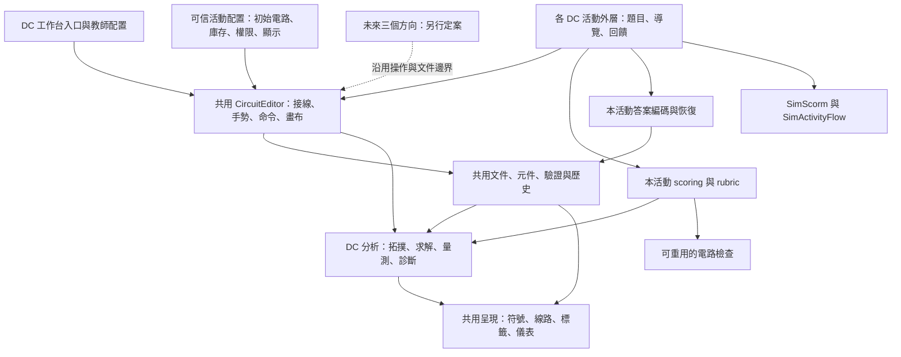

# 電路共用架構與 DC／SCORM 實作計劃

- 日期：2026-10-07；D3–D5 實作紀錄更新：2026-10-08。
- 狀態：**D1–D5 的本地實作及驗證已完成，兩個正式 DC 活動已通過 package-ready；三包同源重建通過。** 真 Moodle／實體手機驗收獨立待辦。歷史全站失敗見第 17.2 節，最新執行見第 18 節；不以歷史核心驗證替代本輪活動驗收。
- 本輪範圍：詳細規劃現有直流（DC）模擬如何成為共用電路核心，同時支援獨立工作台及多個功能各異的 SCORM 1.2 活動。
- 家庭電路、交流、高壓輸電：只記錄共用邊界與待討論事項，具體元件、物理近似、教學任務及介面留待後續逐項討論。先前對話中的功能建議屬候選方案，並非本計劃已批准的開發清單。
- 文件定位：本文件擁有電路平台的後續架構、DC 整理與 SCORM 接入路線；[原工作台計劃](28-circuit-workbench.md)保留工作台功能決策及歷史驗證；[架構審視](../docs/circuit-workbench-architecture-review.md)與[作者指南](../docs/circuit-activity-authoring.md)說明目前已實作的介面。
- 共用契約：遵循[產品與樣式基線](00-shared-platform-and-style.md)、[production guide](../docs/simulation-scorm-production-guide.md)。本文件是平台級計劃；每個正式評量活動仍須使用[活動計劃範本](NEW-SIMULATION-PLAN-TEMPLATE.md)完成自己的題目、rubric、精確快照及驗收矩陣，不在此重複制定全站規則。

## 1. 目標與交付範圍

核心目標是：**通用功能維護一份原始碼；工作台及不同 SCORM 活動以配置和自己的活動外層使用它。** 直流工作台也是核心的使用者，不把它複製成其他版本的起始程式。

| 交付物 | 定位 | 本輪計劃深度 |
|---|---|---|
| 共用電路核心 | 文件、元件、接線、編輯、呈現、DC 分析及受控 API | 詳細規劃 |
| DC 工作台 | 保留現有自由搭建、教師示範、文件操作 | 詳細規劃；維持非評量定位 |
| DC SCORM 活動 | 每個活動按需要取用元件、數量、參數、工具和顯示，再加入題目／評分／恢復 | 詳細規劃共同架構、接入方式與交付門檻；各題內容另用活動計劃定案 |
| 家庭電路／交流／高壓輸電 | 未來使用同一核心的教學入口及相關活動 | 僅邊界與待討論清單 |

可裁剪的 SCORM 活動能力是整個系列的確定要求，不能等另外三版完成後才加上；本輪先以 DC 落實這條路徑。教師工作台本身的分數、rubric 與 attempt lifecycle 為 N/A，原因是它用於自由示範；每個正式 SCORM 活動則必須有自己的評量與恢復設計。

架構分開兩個維度：

- **學科模型與教學情境**：目前只有已實作的 DC；未來分析模式與教學情境不必一一對應，也不預設每個情境都需要獨立求解器。
- **使用方式**：自由工作台，或有題目、限制及成績的學生活動。同一物理模型可以服務兩種方式；`teacher/student` 是配置角色，不等同於「是否在 Moodle 啟動」。

DC 階段不新增通用插件市場、動態下載模型、視覺化出題平台、npm 核心套件或新的前端框架。沿用原生 HTML/CSS/JavaScript、SVG、現有本地依賴及 Live Server 工作方式。

## 2. 現有基礎與尚未完成的部分

以下是核心實作前閱讀原始碼得到的現況；本輪核心改動及重新執行的驗收證據見第 17 節。

| 項目 | 已有基礎 | 後續工作／限制 |
|---|---|---|
| 共用入口 | [main.js](../sim/circuit-workbench/main.js) 呼叫 `CircuitEditor.mount(host, config)` | 保留此入口，不另建 DC 學生專用編輯器 |
| 操作與多 instance | [circuit-editor.js](../sim/circuit-workbench/circuit-editor.js) 管理命令、手勢、取消、只讀、訂閱、卸載 | 活動外層只用 controller；新嵌入方式仍須驗證隔離及卸載 |
| 活動限制 | [circuit-profile.js](../sim/circuit-workbench/circuit-profile.js) 已有工具箱白名單、每款庫存、按類型／ID 的權限與載入驗證 | 整理作者契約；檢查所有輸入路徑及款式歧義，不能只隱藏按鈕 |
| 技術示例 | [activity-profiles.js](../sim/circuit-workbench/activity-profiles.js) 的兩燈、工具箱、固定接線、滑片示例 | 沒有正式分數、提交或 SCORM；不得直接標記為完成的評量活動 |
| 物理 | [circuit-solver.js](../sim/circuit-workbench/circuit-solver.js) 與 [component-registry.js](../sim/circuit-workbench/component-registry.js) | 目前是 DC 模型；registry 要求 `dc()`，editor、部分 checks 與 renderer 仍有 DC 依賴 |
| 文件 | [circuit-model.js](../sim/circuit-workbench/circuit-model.js) 的 v6 文件與 [circuit-document.js](../sim/circuit-workbench/circuit-document.js) 的嚴格匯入 | 教師 JSON 上限 256 KiB；未提供可直接通用於所有題目的 SCORM 小型答案格式 |
| 動態繼電器 | instance 內的機械狀態與 DC 拓撲切換 | 文件只保存參數及接線；載入後重新演進，不是同一瞬間的評量恢復 |
| 全螢幕 | editor 目前為自己的宿主掛載全螢幕 | 正式活動須涵蓋外層題目、導覽、提交與技術訊息，不能只放大電路區 |
| 發布 | [assets.json](../sim/circuit-workbench/assets.json) 與現有工作台／SCORM 打包工具 | 教師套件和活動 manifest 分別管理；沒有自動更新已上傳 ZIP 的能力 |

## 3. 目標架構與責任分工



| 層 | 負責 | 不承擔 |
|---|---|---|
| 活動／工作台入口 | 選用模型與配置；活動題目、進度、回饋、分數、生命週期 | 接線算法、求解器複製品、直接 LMS commit |
| Profile | 將可信配置轉為可執行的供應／權限規則；驗證變更與恢復 | 根據學生匯入檔開放功能；內建某題正確答案 |
| CircuitEditor | 操作、命令、復原、相機、預覽、讀值呈現與訂閱 | 題目分數、SCORM 欄位、某一課程的流程 |
| 文件與元件 | 端子身分、參數、明確連接、幾何、模型驗證 | 由畫面交叉推斷導通；信任保存的求解結果 |
| DC 分析 | 有號電流／電壓、功率、未知結果、物理診斷 | 判定學生是否合格、依動畫位置評分 |
| 呈現 | 將文件與分析結果畫成實物／電路圖 | 自行另算一套物理答案、決定保護元件的真實狀態 |
| 活動 persistence | 儲存本題必要答案與續作狀態，重建合法電路 | 整份教師 JSON 當 SCORM 答案；保存權限或 DOM |
| 既有 SCORM runtime | Moodle 通訊、草稿、pending、commit／finish／retry | 代替題目評分或驗證電路答案 |

一次正式編輯完成後，資料流程為：

```text
操作／execute
  → 同一份 profile 與文件驗證
  → 提交到電路 history
  → 重新分析及呈現
  → onChange 通知活動外層
  → 更新本題權威答案與草稿

最終檢查／提交
  → 取消未完成手勢，取得已提交的電路文件
  → 本活動檢查與 scorer
  → 本活動 review snapshot
  → 既有 SimScorm／SimActivityFlow
```

只移動畫布、縮放、指針擺動、播放和拖動預覽不成為答案變更。檢查、保存和提交不能讀到尚未放手的預覽文件。`onChange` 是文件通知，不代表學生已作答：外層須比較本題的權威答案欄位，純外觀切換等顯示變更不能把未答的 `null` 轉成已答或產生分數。

## 4. 原始碼位置與依賴

DC 階段先保持現有核心檔案位置。新活動以 `../circuit-workbench/` 引用；同一檔案只有一個人工維護來源。日後若要搬到 `sim/shared/circuit/`，應獨立完成路徑、資產及消費者遷移，不與第一次 SCORM 接入混成一次大改。

```text
sim/circuit-workbench/       現有共用電路模組及 DC 工作台入口
  main.js                   DC 教師入口
  circuit-editor*.js/css     共用操作與呈現外殼
  circuit-profile.js        活動限制
  circuit-model.js           電路文件與編輯模型
  component-registry.js      元件規格與 DC 模型
  circuit-solver.js          DC 分析
  circuit-checks.js          電路檢查工具
  ...                       原有 routing、snapping、renderer 等模組
sim/<dc-activity-slug>/      每個正式活動各自建立；本次不建立空資料夾
  index.html / styles.css / main.js
  scoring.js / persistence.js
  對應的必要測試
sim/shared/                 沿用 scorm、activity-flow、fullscreen、styles
sim/manifests/               每個正式活動的獨立 manifest
plans/                      每個正式活動自己的計劃
```

共用程式不 import 任何具體活動的題目、rubric 或 manifest。活動可以依賴核心，核心不能反向依賴活動。

同一題組的配置可以先留在該活動內；第二個活動確實需要相同的答案編碼或界面接合時，再提取小型共用函數。不要先建立包攬所有題型的電路課程框架。

## 5. DC 核心的物理範圍與分析邊界

### 5.1 保留既有功能

| 功能 | DC 階段處理 |
|---|---|
| 電源、電阻、滑動變阻器、開關 | 沿用既有 DC 模型、多端子及合法參數 |
| 恆阻／熱效應白熾燈 | 保留現有穩態模型與明示近似，不因重構改動額定點或熱模型 |
| A／V／G／W 儀表 | 保留量程、負載效應、符號、未知值及接法診斷 |
| 理想／有阻導線 | 保留明確端點、線阻、壓降、耗散功率及不唯一支路電流處理 |
| 繼電器 | 工作台繼續支援；涉及時間的正式評量另通過第 5.3 節門檻 |
| 電流／電子、電勢、指針 | 保留教學呈現；不將動畫速度、粒子位置或指針慣性視為權威答案 |

DC 的 `voltage/current/power` 維持現有語義、單位與被動符號約定，`null` 仍表示未知或無可靠解。視覺／控制重構不能讓未知值變成 0，不能把開路的相同零電流當作正確串聯證據。模型細節以[現有核心說明](../docs/circuit-workbench-core.md)為準。

### 5.2 先整理責任，再引入第二個分析後端

DC 階段要列清並處理 `CircuitEditor`、`CircuitChecks`、`CircuitRenderer.visualState()` 對 `CircuitSolver.solve()`／`CircuitRegistry.dc()` 的依賴，不能只改 editor 的一個呼叫。

1. 讓取得分析、兩點電壓與題目檢查使用一致的 DC 模型及取樣條件。
2. 把物理診斷與視覺效果分清：求解／DC 診斷產生可信結果，renderer 負責顏色、符號與發熱示意。現有固定閾值的教學提示不升格為真實保護器模型。
3. 保留可獨立於 DOM 執行的 DC 求解及檢查，讓正式 scorer 可在 Node 重算權威答案。
4. 拖動預覽的分析不得推進已提交電路的動態狀態；多 instance 不共享選取、時間、相機或模型運行狀態。
5. 在第二種物理模型定案前，不新增空的 AC／transient 實作，不改成每幀求解所有電路，也不急於抽出只有一個實作的插件管理器。

未來新增分析器時，從這個邊界加入可信配置的選擇；屆時才定有效值、瞬時值、相位、頻率、步進及結果格式。選擇必須按 editor instance 生效，不能以改寫全域 `window.CircuitSolver` 影響同頁其他活動。資料檔只含經驗證的資料，不能指定執行程式或下載模型。

### 5.3 繼電器與動態題目的獨立門檻

目前 `setReadOnly(true)` 鎖定編輯，但不代表物理時間停止；教師 JSON 亦不保存繼電器機械狀態。因此首批正式 DC SCORM 驗收先用無動態依賴的題型，工作台保留繼電器功能。

需要評核繼電器的活動，必須先決定：檢查接法還是時間過程、初始狀態、取樣時間、是否容許自振、提交時凍結哪個狀態，以及恢復後如何合法續作。動態狀態若影響答案便須版本化保存或以經驗證的確定性規則重建；不能從當次瀏覽器已跑多久、畫面幀率或重載後的隨機時刻給分。這是該 DC 活動的額外設計，不能宣稱現有只讀 API 已解決。

## 6. SCORM 必須具備的配置能力

### 6.1 以現有 Profile 為基礎

| 要控制的內容 | 現有接口／資料 | DC 活動的契約 |
|---|---|---|
| 可新增元件類型 | `palette[].type` | 只提供本題允許的元件；未提供種類不能透過命令、複製或恢復新增 |
| 元件款式與初值 | `key/params/label` | 型別、款式、按鈕文字及參數有明確用途，不以顯示名稱識別答案 |
| 每款可用數量 | `palette[].limit` | 預置同款也計入；達上限不能再取用；允許刪除後歸還庫存 |
| 完全固定元件 | `initialDocument` 與 `palette:[]` | 畫面只放指定元件；不出現新增工具箱 |
| 搬動／旋轉／刪除／改名／開關 | `components.default/byType/byId` | 按 default → type → ID 覆蓋，並受文件鎖定及只讀限制 |
| 可改的參數 | `params:false/true/['position', …]` | 學生活動通常用白名單，只有指定參數可改，其他入口亦不得越權 |
| 導線供應 | `initialDocument.cables` | 明確指定數量、畫布長度及新線預設電阻；部分懸空接線合法 |
| 能否接線 | `wires` | 同時約束接上、拔開、彎線、取線及元件本體吸附等路徑 |
| 能否改線阻 | `wireResistance` | 與接線權限分開；不能藉恢復或改全局預設繞過 |
| 工具與面板 | `ui` | 按題需要顯示工具箱、inspector、探測、快捷參數等；關閉功能不留可聚焦的隱藏按鈕 |
| 畫布顯示 | `initialDocument.display` | 決定數值、名稱、電流示意、電勢色彩及外觀；作者列明哪些物理回饋可在提交前出現 |
| 復原／重做 | `undo`、controller | 編輯時按題開放；已記錄或 pending 時不可透過歷史返回可編輯答案 |
| 本題檢查 | `check(answer, analysis)` | 回傳檢查證據，不把布林值直接當整份活動分數 |

類型與數量規則同樣適用於 SCORM 的草稿、review 和 pending 恢復。配置是套件中的可信作者程式，不能隨答案匯入；角色也不能由答案改成 teacher。正式評量使用 student 配置，教師試做該活動時亦採相同限制。

功能裁剪不等於把參與求解的元件藏起來。目前沒有「不可見但仍能吸附／導電」的隱藏元件模式；本題初始文件只放明確需要的元件。若將來需要隱藏物理子模型，須獨立定義可見端子與作用，不能只用 CSS 隱藏圖形。

### 6.2 數量的精確語義

- `limit` 是畫布上同款元件的**上限**。題目要求「恰好兩盞燈」屬 rubric；不能用必須取滿庫存阻止空白／部分提交。
- `limit:0` 目前不是合法值；不提供某種類型時移除其工具箱項目。`palette:[]` 表示沒有可新增元件。
- 工具箱是「可新增清單」，預置文件是另一個明確來源；作者可以放入不可新增的固定電源。預置元件不能因不在 palette 就被錯誤刪除。
- 一個類型只有一個款式時，`limit` 就是該類型的供應上限。有多款燈泡／電阻時，現有上限按款式計；款式須由不可變的參數區分。
- DC 配置驗證要拒絕無法唯一區分的重疊款式，或清楚限制不支援的組合。不能依陣列先後決定某個元件耗用哪個庫存；開放參數後也不能讓它脫離計數。
- 「不同款式合計最多 N 件」、每題特有的數值上下限、只准某些端子接線等不是目前 API 已有能力。若正式 DC 題目需要，先在該題計劃定義，再加入同一 profile 驗證路徑；不能用 CSS 或只在按鈕事件補限制。
- 接錯線是合法作答的一種。一般接線題容許物理上可操作但不正確的接法，再由檢查／rubric 判斷；吸附本身不透露答案。

### 6.3 使用現有 API 的配置範例

以下僅示範「一個電源、一個開關、最多兩燈、六條線」的供應與權限，可由現有 `CircuitProfile.compile()` 驗證；不是已完成的 SCORM 活動，也沒有指定正式題目的分數。

```js
const doc = CircuitModel.empty();
doc.cables = { count: 6, length: 600, resistance: 0 };
doc.display.flow = 'off';
doc.display.values = false;

const dcToolboxConfig = {
  role: 'student',
  title: '直流接線活動',
  initialDocument: doc,
  palette: [
    { type: 'battery', limit: 1, params: { voltage: 6 } },
    { type: 'switch', limit: 1 },
    { type: 'lamp', limit: 2, params: { model: 'ideal', resistance: 12 } }
  ],
  components: {
    default: { move: true, rotate: true, remove: true, params: false },
    byType: { switch: { switch: true } }
  },
  wires: true,
  wireResistance: false,
  ui: {
    palette: true,
    inspector: false,
    quickParameters: false,
    readings: false,
    probe: false,
    viewToggle: true
  }
};
```

同一核心至少要用以下配置差異驗證，沿用現有示例作技術起點：

| 配置案例 | 可用內容 | 預期確認 |
|---|---|---|
| 兩盞固定燈 | 沒有工具箱，只可接線 | 極小功能集合可工作，不依賴電源或完整教師面板 |
| 有限工具箱 | 指定類型及數量，可搬動／旋轉／刪除 | 新增、複製、刪除歸還、匯入與恢復的庫存一致 |
| 固定電路接線 | 指定位置與參數，只開放接線及指定開關 | 固定規則涵蓋滑鼠、觸控、鍵盤、execute 及載入 |
| 滑片調參 | 只開放指定元件的 `position` | 關閉 inspector 後仍可按配置使用快捷參數；其他參數不變 |
| 量測／觀察 | 已建電路，按題開放儀表或探測 | 探測值與學生記錄的答案分開；預設示範不自動得分 |

## 7. 編輯器對外 API 與宿主責任

保留現有 `getDocument/exportDocument/loadDocument/getAnalysis/voltage/execute/onChange/setReadOnly/fit/cancel/destroy`。具體行為仍由[作者指南](../docs/circuit-activity-authoring.md)擁有，活動不得靠修改 editor 私有 DOM、history 或全域變數來控制答案。

DC 整理的要求：

1. UI、鍵盤、觸控、公開命令、複製、undo／redo、JSON 載入和 SCORM 恢復遵守同一套限制。無效變更原子拒絕，保留舊答案。
2. 將新配置、未知欄位、非法參數及無法滿足的初始配置在掛載前檢出；保持現有 fail-closed 行為。
3. 切題前先取消手勢、取得已提交文件、更新外層答案，再卸載舊 editor；未作答仍保留 `null`，不能把離開題目時讀到的模板當成答案。載入新題的配置及答案後才恢復操作。
4. 規則不同的題目使用 `destroy/mount` 切換，避免原地修改 profile 留下前題權限。外層保存各題答案，不能依賴每個 editor 永久留在 DOM。現有 `loadDocument()` 會發出 `onChange`；程序恢復期間先不訂閱或暫停答案回寫，載入完成後才接上綁定本題 key 的訂閱，切題時解除舊訂閱。模板／恢復事件不得標記學生作答或覆寫其他題。
5. 已提交／pending 的活動在 mount／restore 完成後立即按生命週期鎖定；不顯示示例頁的「只讀預覽」解除開關。
6. 新增嵌入外殼能力，讓活動外層擁有完整頂欄與全螢幕；見第 11 節。這是 DC／SCORM 的實際需要，不能當成已經完成。

所有元件、儀表和檢查能力不必在每個活動都顯示。功能的開放由 profile 決定；本題的答案、回饋與分數由活動決定。相同核心檔案載入後有多餘但不可使用的能力，不等於活動有權使用它。

## 8. DC SCORM 活動外層

### 8.1 每個正式活動擁有自己的規格

| 活動必填項 | 決策內容 |
|---|---|
| 身分與版本 | 唯一 slug／activity ID、題目版本、作答 schema 版本、所用模型規格版本 |
| 學習目標及任務 | 接線、調參、量測、判讀或其明確組合 |
| 初始條件 | 模板電路、工具箱、元件／線數量、權限、可見資訊 |
| 導覽及依賴 | 獨立題直接切換並保留草稿；依賴題只清除真正失效的下游答案 |
| Rubric | 各項分數、部分分、必需依賴、額外連線處理、容差及通過線 |
| 保存 | 每個合法階段、權威答案、恢復續作、最大 byte 預算 |
| 顯示與風險 | 提交前物理回饋、提交後解釋；formative／low-risk 或需要可信服務端驗證 |

本平台計劃不規定所有電路題用同一個分數表。正式 DC 活動預設以形成性／低風險評量設計；高風險用途依 production guide 另做可信驗證。核心前端權限提供操作一致性，不能被描述成防作弊邊界。

### 8.2 檢查與評分

- `CircuitChecks` 提供拓撲、參數、效果等可重用證據；`scoring.js` 將本題證據轉成獨立 rubric 項目，最後產生 shared runtime 所需的 result。
- 不能直接用 `editor.check().passed ? 100 : 0` 取代所有題目的部分分設計。
- 接法按實際拓撲及物理條件判斷。作者指定元件身分可有語義；學生自由新增元件則不能因 ID 或畫法不同而錯判。
- `connected` 只證明必要接通，不排除多餘旁路；`series` 和三點滑片效果亦有適用範圍。每個 rubric 要對自己的錯誤接法與有效替代接法提供正反例。
- 以最終提交狀態評分。若要評過程或記錄某刻量測，活動須另存學生明確記錄的權威答案，不能用目前即時求解值覆蓋舊觀察。
- 從未作答的題目保持 `null` 並得零分；僅移動相機不算作答。即使模板本來已經正確，作者提供的元件／數值也不能自動變成學生取得的分數。
- 空白、懸空接線、部分調參及只完成部分題目都能進入最終檢查與明確提交。缺答項得零分，其他獨立有效答案按 rubric 保留分數。

### 8.3 共用生命週期接入

活動使用 `SimScorm.loadAttempt(ACTIVITY)` → `SimActivityFlow.startup()`；草稿由 `setDraftProvider()` 及既有保存接口處理，提交用 `submitWithCallbacks()` → `SimActivityFlow.submission()`。不另寫 raw LMS 欄位、commit／finish 或頁面生命週期。

完整規則依 [mandatory shared lifecycle flow](../docs/simulation-scorm-production-guide.md#mandatory-shared-lifecycle-flow)。活動必須實際實作並測試 startup 的 `editable/review/frozen/load-error` 與提交的 `success/committed/frozen/retry`，包括 retryable 與不可重試情況。

最終檢查頁只列本次將計分的內容與未作答項目，保留返回編輯及明確提交。已記錄答案只讀；pending 保存同一份最終 payload 供安全重試；技術失敗不宣稱已提交、已合格或已確定分數。

## 9. 權威答案與保存設計

### 9.1 三種資料分開

| 資料 | 擁有者 | 保存方式 |
|---|---|---|
| 教師完整電路文件 | 共用 document | 沿用版本化 JSON 匯入／匯出、嚴格驗證及原子載入 |
| 學生的本題答案 | 本活動 | 只存重算、重畫及續作所需內容，經本題精簡編碼後進 shared snapshot |
| 元件供應、固定模板、權限、rubric | 本活動可信程式 | 不從學生答案恢復，不放進 suspend_data 當可覆寫設定 |

DC 核心整理若沒有新增文件語義，就保持現有 v6，不為搬程式或改介面而無故升版。活動的 schema／題目版本與教師文件版本分開管理；相容遷移必須有測試，否則明確拒絕，不能默默用新規則重解舊答案。

### 9.2 活動答案的邏輯 schema

第一個正式活動須把下列邏輯契約具體化為其 production encoder／decoder；以下是平台設計，不是現已存在的通用 codec：

| 欄位 | 語義與驗證 |
|---|---|
| `schemaVersion` | 精簡答案格式版本；只接受已支援的版本 |
| `definitionVersion` | 指定題目／配置／rubric 版本；版本不能指向別題 |
| `modelRevision` | 該活動所依賴的物理語義版本；與單純 UI 版本分開 |
| `phase` | 活動可實際呈現的 `edit/check/review`；draft envelope 只接受 edit/check，review envelope（包括 pending 內嵌的 review）只接受 review；pending 與技術鎖定由 shared outcome 管理 |
| `activeTask` | 合法題目 key；視圖切換不創造答案 |
| `returnToCheck` | 只有從檢查頁返回編輯的變體可為 true；其餘依活動狀態矩陣驗證 |
| `answers[taskKey]` | 每題 `null`，或本題電路答案、明確作答欄位與必要觀察；不保存派生分數作為事實來源 |
| 題目變體 | 只有活動有隨機／變體需求才保存受驗證的變體身分及必要參數；載入後不能重新抽題 |

每題的電路答案要明確涵蓋：

- 需要保存的學生新增元件、其供應來源／款式、允許改動的參數，以及允許移除的初始元件狀態。
- 端子連接、共接點、懸空端點、逐線電阻及為繼續操作所需的線長／線形／幾何；初始導線的來源 key、刪除狀態與學生新取的導線須能區分。
- 可搬元件的位置、方向、允許的儀表換孔方向，以及真正影響下次操作的其他狀態。
- 若同一元件被量測答案引用，用穩定的答案語義 key 連接；DOM ID、臨時索引及 SVG ID 由 decoder 重建。

固定模板、名稱及不可調參數能由版本化本地配置重建時便不重複保存。初始元件、導線及仍存在的初始共接點，其語義 key 要映射回本題原有 ID：元件保留 `byId` 權限，導線保留 profile 按初始 ID 判定的固定線阻與特許線長。新元件／新線不得冒用已刪除初始物件的身分，重建時須預留初始 ID，並驗證所有關係 key 的唯一性及引用完整性。

`wires:false` 目前以完整陣列比較導線與共接點；這類題目由可信模板原樣重建固定拓撲，包括 ID、順序和幾何，不能在 codec 內自行重新編號或排序。開放接線的題目則保存合法刪除、懸空及改接狀態。驗收須包含初始異阻／長線恢復後續作、刪除初始線再取新線，以及固定拓撲的 round-trip；不能只用全空白模板測 codec。

`null` 答案在檢視時可以顯示初始模板，但 scorer 仍知道它未作答；不能因 decoder 補出模板而變成已完成答案。

### 9.3 4000 bytes 必須在設計階段解決

教師允許的大畫布、最多 80 元件及大量自由線形，不代表任何配置都能放入 SCORM 1.2。每個正式活動先決定題數、元件／線數、可保存線形及答案文字長度上限，再量度最壞情況。

1. 使用共享 `makeSnapshot()` envelope，採標準 JSON；必要時在活動層用穩定欄位表／短 key／陣列減少重複。
2. 同時量度 **draft、review，以及實際 pending-final 封裝**的 UTF-8 bytes；pending 內嵌 review JSON 有額外轉義及 metadata，不能只驗證 review 小於 4000。
3. 多題共用一個 SCO 時，預算是整個 attempt，不是每題各有 4000 bytes。
4. 縮減資料不能改接線、電阻、評分精度、有限線長或合法下一步。保留必要幾何；若使用線形簡化／量化，必須成為明確的 production 表示並驗證等價，不能只在保存時偷改答案。
5. 若最壞情況仍超限，先縮小該活動的供應／題數或拆成獨立活動，再發布。不能截斷導線、丟掉未完成題、只存總分或等學生提交時才發現必然放不下。
6. 正常保存失敗要保留當前作答並依 shared runtime 呈現可恢復狀態；不把失敗顯示成成功。

### 9.4 恢復順序

先用 `SimActivityFlow.startup(attempt)` 分流，再在對應分支驗證答案。以下是有可驗證快照時的內容恢復流程；任何一步失敗，都按原本 attempt outcome 決定呈現方式，不能一律改成 load-error。

```text
檢查活動、schema、題目與模型版本
  → 驗證答案形狀、關係及該 phase 的不變條件
  → 從可信本地模板重建完整電路
  → CircuitModel.validate + 本題 profile.assertSnapshot
  → 以相同 DC 模型重新分析／評分
  → 掛載／載入，恢復合法導覽與明確觀察
  → 按 outcome 允許編輯、只讀檢視或技術鎖定
```

finished review 使用 `SimActivityFlow.reviewResult()` 比較重算結果、保存 metadata 與 Moodle 記錄；不是只讀保存的總分。若快照缺失、損壞、種類／版本不符，或重算後 trust mismatch，仍保留 finished／review 分支，只顯示可信 Moodle 摘要，不顯示未驗證的逐題分數或回饋，不重送、不開放編輯，也不降為一般 load-error。無法重算時可用 `reviewResult(null, null, attempt)` 取得記錄摘要；未知分數顯示 `--`，未知合格狀態使用 `completionLabel()`，不能猜成零分或不合格。

pending 除分數外亦比較 canonical 權威答案；結構已被 runtime 接受但深層驗證不通過時，先 `SimScorm.quarantinePending()` 再呈現技術鎖定，阻止手動及生命週期重試寫回壞資料。shared runtime 已拒絕的 pending 亦只呈現技術狀態。其餘由 shared startup 判為 load-error 的情況，包括讀取／初始化失敗及 `inconsistent` 資料，均技術鎖定；這些狀態不宣稱成績已確認，不自行清除答案或變成新作答。

若 shared startup 允許 editable，但活動自己的 draft decoder／恢復驗證失敗，預設同樣技術鎖定，不能用空白模板覆寫。只有確證 attempt 尚未提交，且個別活動計劃已定義安全清除／覆寫流程，才可依該流程恢復；未知、pending 或 finished attempt 不適用這項例外。

standalone 重新整理開始新練習；同一次 Moodle attempt 恢復原答案。兩者遵循[既有 refresh/resume 契約](../docs/simulation-scorm-production-guide.md#standalone-refresh-and-moodle-resume)，不另加活動自己的跨刷新答案儲存。

## 10. 活動階段與續作驗收矩陣

此表是 DC 活動必須覆蓋的基本情況。實際活動有多題依賴、量測記錄或動態元件時，須在自己的計劃擴充，不能直接以本表取代所有 phase／variant 決策。

| 狀態／變體 | 權威內容 | 編輯器／允許操作 | 恢復後必須執行的驗證 |
|---|---|---|---|
| edit／全未答 | 題目版本、導航、各題 null | 本題允許的編輯；可直接進 check | 進 check 後提交零分 |
| edit／部分接線 | 有效電路，包括懸空端點；未答題仍 null | 繼續接線／拔線／調參 | 恢復後接好一端並再次保存 |
| edit／已有完整答案 | 當前最終答案 | 繼續編輯或進 check | 修改允許參數後按新答案重算 |
| edit／從 check 返回 | 同一份答案及 returnToCheck 語義 | 修改後可再回 check | 保留其他題答案，不偽造 visited 狀態 |
| edit／獨立題切換 | 每題各自草稿、activeTask | 載入另一題的配置及答案 | 回到原題繼續原本部分接線 |
| check／空白或部分 | 所有題當前答案，不補造結果 | 電路不在檢查頁直接改；可返回編輯或明確提交 | 提交後未答零分，獨立有效項仍得分 |
| check／完整 | 完整答案，尚未記錄成績 | 返回編輯或明確提交 | 提交後鎖定，沒有自動提交 |
| submitted／success | validated review，runtime 確認完成 | 只讀；保留移圖、讀錶、全螢幕 | 重新載入仍只讀 |
| submitted／committed | 已確認 commit 的同一結果 | 鎖定答案，可依 shared flow 重試 finish | 不重算成另一 payload、不開放編輯 |
| pending／frozen | shared runtime 的同一最終 payload | 凍結；驗證後只重試同一提交 | 恢復後不顯示未確認的成績結論 |
| submit／retry | 無 durable final；依 retryable 處理 | 可重試時保留編輯，否則技術狀態 | 不誤標為 submitted |
| finished review／無有效 review 或 trust mismatch | 保留可信 Moodle 記錄摘要；不信任壞快照與逐題結果 | 維持 review 只讀，不重送、不清結果 | 缺失／損壞／舊 draft 或 pending／版本不符／信任不符仍顯示記錄摘要；未知值不猜測，無結果寫入 |
| invalid pending／結構或深層驗證失敗 | 保留 runtime 的 checkpoint 及技術錯誤 | 技術鎖定；深層失敗先 quarantine，不提供壞 payload 重試 | 無已提交／合格或不合格結論；手動與生命週期均不重送壞資料 |
| load-error／其餘 shared startup 拒絕的狀態 | 包括讀取／初始化失敗、inconsistent 資料 | 鎖定不安全操作，呈現技術錯誤 | 活動 ID 不符、損壞的未完成快照、未完成 attempt 帶 review 等均不清結果、不變成新作答、不寫入未確認狀態 |
| editable draft／活動深層恢復失敗 | 保留原草稿與錯誤，不補造答案 | 預設技術鎖定；僅確證未提交且另有已定義的安全恢復流程才例外 | 不以空白模板覆寫；如活動提供恢復，另測其證據、清除／覆寫及後續合法操作 |

每個 saveable 變體要走 production encode → decode → restore，確認分數相同並真正執行一次合法續作。非法狀態另測；空白／部分作答不能被歸類成資料損壞。

## 11. 版面、全螢幕與行動裝置

各入口沿用[三區版面與手勢所有權](00-shared-platform-and-style.md)，但活動外層須納入題目、題目導覽及提交區，不能只嵌入一個固定高度的工作台後宣稱手機完成。

DC／SCORM 接入要解決的具體外殼差異：

- 工作台保持目前完整 editor 頂欄及內部全螢幕。
- 正式活動以外層 `<main data-sim-fullscreen-target>` 包含題目、電路、控制、檢查／結果及技術訊息，外層 header 使用 shared fullscreen。
- **D2 已實作 `ui.header`，預設 true 以維持現有入口；嵌入活動設 false。** false 時不建立內層 header，也不建立內層全螢幕 target／button／attach。外層負責唯一完整頂欄；復原／重做移至 stage 工具列，面板開關保留，沒有入口的 presets／files／settings／help 須關閉，不留下不可達操作。
- profile 白名單、UI build、editor 的 shared fullscreen 接合、作者文件與精準測試已同步。作者可在第 6.3 節配置的 ui 加 `header:false`，並由外層提供 shared 標記；宿主缺少所需外層標記時應在開發驗證中失敗。這項核心能力不能代替正式活動的完整版面及 SCORM 驗收。
- 檢查、pending、review 和技術狀態仍可使用外層全螢幕；全螢幕不造成 remount、答案重設或 SCORM 重新初始化。
- 元件、線端、彎線、滑片、儀表預覽及雙指導覽沿用共用手勢；外層驗證題目／面板捲動和兩側捲頁區，不改 Moodle 父頁 DOM 來湊出效果。
- 有長控制面板的活動採 bounded split-panel；只有短按鈕的題型可按基線選自然流。每個活動記錄斷點、stage 尺寸、可讀標籤及實測捲頁區，不在核心固定一套課程高度。

手機／短 iframe／橫向／200% zoom 的實際驗收、T0–T3 source／解壓包與 T4 真 Moodle 仍依 [production guide 的 gesture contract](../docs/simulation-scorm-production-guide.md#selective-touch-gesture-ownership)。桌面截圖不能替代可信觸控及真手機證據。

## 12. 資產、版本與發布

共用來源與部署套件是兩個不同層次：來源修正可以同時被各入口引用；每份部署 ZIP 都是發布時的快照。

1. 保留現有工作台 `assets.json` 及 `package:circuit`，保留每個 SCORM 活動的獨立入口與 root `imsmanifest.xml`。
2. 第一個正式 DC SCORM 消費者落地時，整理一份共用 runtime 資產來源清單，與各入口自己的檔案合併產生／核對完整資產宣告。可用現有 Node 打包工具擴展，不引入新 build framework。
3. 此清單只解決依賴重用；實際 SCORM manifest 仍明確列出所有共用 CSS／scripts、MathJax、fullscreen、scorm、activity-flow 等所需資產。教師 `assets.json` 不能被視為 SCORM 自動依賴解析器。
4. 按實際依賴找出受影響入口，統一重建它們的工作台／SCORM 包；不靠逐份複製修正的 JS。未修改模型的 UI 更新不改題目／模型語義版本。
5. 發布記錄包括來源 commit／實際 runtime 指紋、題目／schema／模型版本、打包時間及執行過的驗證。存在未提交 runtime 改動時，不能只用 commit 宣稱成品身分。
6. 更改物理或 rubric 可能改變既有答案分數，須先定相容策略。已發布評量保留可追溯版本；不把新語義無聲覆蓋仍在進行的 attempt。若要以新版替換 Moodle 內容，先在測試課程驗證同 attempt 的 draft／pending／review 行為。
7. 已上傳 Moodle 的包需重建、測試及重新部署才會更新；不從 CDN 或另一活動的部署目錄即時載入最新核心。

每個正式活動還要在 [sim/config.js](../sim/config.js) 登記 `title/folder/categories/description/tags/status`，folder 與 slug／manifest 一致；只有可部署時才設為 active。新測試登記至 [tools/run-tests.js](../tools/run-tests.js)，不能只存在於臨時驗證腳本。

現有命令：工作台 `npm run package:circuit`；單活動 `npm run package -- <activity-slug>`；`npm run package:all` 只處理 SCORM manifests。本次沒有新增一鍵系列發布命令；於實際有多個 DC 成品時再用既有工具組合。

## 13. 實作順序與每階段出口

| 階段 | 工作 | 完成條件 |
|---|---|---|
| D0：計劃 | 本文件、既有文件交叉連結、區分現況／提案／未定範圍 | 文件與鏈結核對；不宣稱 runtime 完成 |
| D1：DC 基線 | 整理 API、依賴／呼叫路徑、配置能力與既有回歸；列出待補缺口 | 教師原功能、四種技術配置、v6／舊文件、只讀／多 instance 的相關測試有可追溯基線 |
| D2：核心整理 | 收斂 DC 分析／檢查／診斷責任，處理庫存歧義與活動嵌入外殼；保持 controller 相容 | 同一批 DC fixtures 的拓撲、數值、診斷與權限不回退；新增功能有精準測試 |
| D3：第一個正式 DC SCORM | 從既有接線／調參範例選一個實際教學任務，先完成自己的活動計劃，再實作 scoring、persistence、生命週期和 manifest | 該活動通過完整 package-ready；另完成真 Moodle 驗收才稱 Moodle-ready |
| D4：第二個差異化 DC 活動 | 選用不同元件／數量／操作集合，驗證按配置重用；只在確有重複時提取小型接合／codec | 不複製 editor／solver；兩個活動各自保存、評分、發布，互不洩漏權限 |
| D5：維護閉環 | 從一個共用修正出發，更新教師與兩個活動成品，核對同源及各自驗收 | 實證「改一次核心，多入口重建」，來源與套件一致，Moodle／實機證據單獨列明 |
| 後續討論 | 家庭、交流、高壓輸電逐個制定學習目標與物理模型 | 只在相應計劃具體化後進入該方向的實作 |

第一、第二個正式 DC 活動的題目、分值與容差不在此代為定案。D3／D4 開始編碼前，必須依活動範本完成其專屬決策；本計劃已確定它們需要的共用能力與交付要求。

## 14. 驗證計劃

### 14.1 按責任層驗證

| 層 | 必須證明的行為 | 既有起點／新增責任 |
|---|---|---|
| DC 求解 | 串並聯、開路、短路、浮接／不唯一、有限儀表、熱燈、線阻；既有數值與診斷不回退 | `core.test.js`、`wire-resistance.test.js`、`textbook.test.js` 等；新增數學分支才補相應案例 |
| 元件與權限 | 白名單、款式、預置計數、上限、刪除歸還、複製、固定參數、byId 保留、非法配置原子拒絕 | `activity-core.test.js` 及受影響的命令／瀏覽器案例 |
| 操作與隔離 | 所有編輯路徑遵守限制；預覽取消、切題、卸載、多 instance、只讀時無資料變更；程序載入不標記作答、不覆寫錯題 | 現有 `--activity-core-smoke` 及受影響的手勢／介面案例 |
| 題目檢查／scoring | 有效替代接法、錯誤旁路、額外線、空白零分、部分分、容差邊界、模板不自動得分 | 各活動的 production scorer 測試 |
| 持久化 | 各 phase／variant round-trip、相同分數、合法續作；初始元件／異阻長線／共接點身分、刪線再取線、固定拓撲、phase/kind 不符、版本與三種 byte 上限 | 各活動 persistence 測試；新增者登記至 `tools/run-tests.js` |
| SCORM 流程 | 全部 startup／submission outcome、重試、信任比較；壞 finished 保留可信摘要、壞 pending quarantine、一般 load-error 的不同呈現／寫入行為；submitted 不重開 | shared runtime 測試加活動實際 outcome／render 測試，不能只查程式字串 |
| 嵌入與手機 | 外層唯一全螢幕、題目／控制可達、捲動所有權、兩側區域及每種手勢 | source／解壓包、可信滑鼠／觸控、規定 viewport／host／phase 矩陣 |
| 發布 | 依賴完整、root manifest、無開發檔案、實際解壓入口可運作、同源指紋一致 | 現有 check／package 工具及實際成品 smoke |

共用 API 改動驗證所有實際消費者；後續局部修正選最小重現及相鄰回歸，不每次重跑無關全站瀏覽器矩陣。新正式活動仍要完整走 [package-ready 與 Moodle-ready](../docs/simulation-scorm-production-guide.md#verification-checklists)，不可用工作台歷史紀錄代替。

### 14.2 發布驗收清單

- [ ] DC 工作台保持原有功能，核心修改沒有複製到其他入口。
- [ ] 類型、數量、參數、接線、面板／顯示限制已覆蓋所有輸入及恢復路徑。
- [ ] 至少兩個功能配置明顯不同的正式 DC 活動，分別有自己的計劃、rubric、schema、manifest 和目錄項目。
- [ ] 空白／部分答案可檢查及提交，預設示範不自動得分，已記錄／pending 不可重做。
- [ ] 所有 saveable 變體完成 encode／decode／restore／合法續作，draft／review／pending 最壞 UTF-8 bytes 均不超 4000。
- [ ] 完整活動的全螢幕、手機操作及 source／解壓包的適用矩陣通過。
- [ ] runtime 變更執行所需語法、`npm run check`、`npm test`、實際打包及 diff 檢查，證據與版本相符。
- [ ] 真 Moodle 學生帳號的記分、草稿恢復、pending retry、不可變 review、新 attempt 與實機手機另有證據。
- [ ] 共用修正可一次修改來源並重建所有受影響成品；已部署套件的更新有明確發布紀錄。

## 15. 三個未定方向的討論清單

以下各項只用來避免 DC 架構封死必要邊界，**不代表功能已獲選定或必須在 DC 階段實作**。

| 方向 | 後續需要討論的問題 |
|---|---|
| 家庭電路 | 要教哪些接法／故障？用電器如何近似？是否包含插座、接地、保護元件或其他部件？哪些錯誤要可操作、哪些只作提示？是否需要時間狀態？對應哪些 SCORM 題型？ |
| 交流 | 教學年級及範圍？有效值／瞬時值、頻率、相位要呈現到哪裡？需要哪些元件、波形或量測？用穩態還是瞬態分析？不同量測的答案與恢復語義是甚麼？ |
| 高壓輸電 | 比較時固定哪些量？哪些設備與損耗要建模？物理距離與畫布幾何如何區分？要自由接線或固定系統調參？SCORM 評核哪些操作／解釋？ |

共同邊界：接地不能等同任意顯示零點；畫布線長不能自動當實際距離；各模式的讀值必須有明確語義；不支援的元件／分析組合要明確拒絕。是否共用同一 AC 分析器、何時加入相量或時間步進，待實際範圍討論後決定。

## 16. 本次文件交付紀錄

本節記錄實作前的文件交付；後續實作以第 17 節為準。

- 本次新增平台計劃，並從原 DC 工作台計劃與架構審視加入入口。
- 本次不修改 runtime、SCORM manifest、目錄登記或部署 ZIP；D1–D5 尚未執行。
- 已用 Node 執行第 6.3 節的原文配置範例：profile 接受；各款取滿後不可再新增；超量與未提供類型被拒絕；含懸空導線的文件可 encode／decode 並通過同一 profile 驗證。這只證明範例與目前 API 一致，不代表 SCORM 或瀏覽器流程已通過。
- 2026-10-07 完成獨立 subagent 三輪審核：首輪修正壞 finished 快照的呈現與初始導線身分兩項 P2；第二輪修正 load-error 範圍一項 P2；第三輪確認沒有未解決的實質問題。同步補清固定拓撲重建、程序載入通知隔離、phase／kind 配對及壞草稿恢復條件。
- 以 Node 復核初始異阻／長線 ID、固定拓撲陣列比較，以及 finished 摘要／未知成績／各 startup 錯誤分支；24 個本計劃連結與 anchor、2 個反向入口及 diff 檢查通過。這些是現有 API 及文件的一致性核對，不代表尚未實作的活動 codec 已通過驗收。
- 本次只執行文件連結／格式／diff、上述配置與 API 核對；未執行全站 runtime、瀏覽器、真手機或 Moodle 驗收。

## 17. DC 共用核心實作（2026-10-07 至 2026-10-08）

### 17.1 本輪已授權範圍及實作決策

使用者批准按計劃實作，並明確選擇「先完成核心，活動題目稍後討論」。本輪完成 D1／D2；D3／D4 的題目、rubric、精簡 codec、SCORM 生命週期和正式套件，以及依賴它們的 D5 多活動發布閉環，留待後續。教師工作台維持非評量用途，assessment／rubric／attempt schema 為 N/A。

- 庫存：學生配置的同類款式必須以不可調參數區分；按新增元件的 default／byType 權限及各初始元件 byId 權限，拒絕可能同時符合多款的配置。保留教師既有自由工具箱。
- 嵌入：新增 `ui.header`，預設 true。false 時移除 editor 頂欄、內部 fullscreen 標記及 controller；復原／重做與面板開關移至 stage 工具列。沒有其他入口的文件／範例／設定／說明功能須明確關閉，配置不符合便拒絕，避免藏起可用能力。外層按 shared contract 擁有完整全螢幕。
- DC 診斷：把現有短路路徑及過載判斷移到 `CircuitSolver.hazards()`；renderer 的 `visualState()` 保留相容入口，只取用同一診斷。閾值、讀值及 v6 文件語義不改；不新增分析器框架。Checks 的拓撲與三點滑片取樣仍明確只適用於現有 DC／靜態檢查。
- 動態隔離：editor 求解預覽時只同步已提交文件的 relay 狀態；預覽不得清除、建立或推進另一份已提交機械狀態。正式動態評量仍依第 5.3 節另定。
- 驗證：原工作台及四種配置示例作為基準；增加款式歧義／原子拒絕、外層唯一 fullscreen、無頂欄時控制可達、只讀／卸載／多 instance 的精準案例。用 source 和實際解壓教師 ZIP 驗證，手機採可信協定觸控；核心內容不因本輪加入新的評量階段。

### 17.2 基準及驗證紀錄

- 修改前基準 commit：`f37bf02`。既有 `--activity-core-smoke` 在 source／解壓 ZIP、1280／390 px 通過 46 個 observations，包含四種配置及教師工作台保留；原始紀錄先保存在 `output/circuit-platform-baseline-browser.log`。
- 修改前 `npm test` 的 circuit 單元群組已通過；其內含 browser runner 首次因 Windows 沙盒阻止 Chrome crash server 啟動而退出，不能把該次全套執行記為通過。後續完整驗證已在可啟動 Chrome 的環境重跑，結果如下。
- 核心實作後 `platform-core.test.js` 通過 6 個精準群組；檢查款式重疊、default／type／ID 覆蓋、庫存刪除／恢復續作、無頂欄配置及純 DC 警示。新增單元／browser runner 已登記至 `tools/run-tests.js`。
- 14 個課堂預設的分析與 hazards 逐一對照實作前 Git 快照，數值、警示及完整 SVG 圖形結果完全一致；`solve()` 方程函數內容亦一致。v6 文件及模型規格不升版。
- 實作後 `--activity-core-smoke` 通過原有 46 個 observations；`--relay-smoke` 通過 38 個 observations，均含 source／解壓 ZIP。
- 新增 `node tools/circuit-platform-browser-regression.js` 通過 60 個 observations：source／解壓 ZIP 的 1280×800、768×1024、390×844、320×500、844×390；可信點擊／接線、明確放大後的短畫面操作、庫存、復原／重做、恢復續作、只讀、多 instance／卸載、外層唯一 fullscreen／外部退出／unsupported，以及 T1／T2／T3 原生捲動及 denied fullscreen。證據：`output/playwright/circuit-workbench/platform-core.json` 與對應 PNG。測試外層採緊湊頂欄並保留可用畫布；正式活動仍須驗證自己的實際版面／phase 矩陣。
- 原 `npm test` 中另有舊測試契約及定位問題。零讀值標籤、元件中心被導線命中層覆蓋、儀表接線另一端固定及低倍率導線本體取點的失敗，在原 runtime 的 Git 快照亦重現；另按未改動的儀表幾何及動畫行為修正舊假設。修正測試的標籤 selector，只在實際 click／drag 選元件時找可見命中點，按目前接孔位置取點，必要時用實際縮放露出導線本體，並等待預覽指針停定。幾何及相機測試保留原本座標語義，物理／動作 assertions 依既定的另一端固定、現有儀表尺寸及可見指針契約維持嚴格核對。320×500 的極短畫布明確驗證總覽提示，詳細方向標示另於 320×700 驗證。
- 最終完整 circuit browser runner 在 source／實際解壓 ZIP 通過 4692 個 observations；新增 platform runner 通過 60 個 observations。紀錄分別為 `output/playwright/circuit-workbench/evidence.json` 及 `platform-core.json`。`npm run check`、`npm run package:all`、`npm run package:circuit`、changed-file syntax、文件連結及 diff 檢查通過。
- **全站 `npm test` 結果為失敗（exit 1）**：電路單元及上述兩個完整電路 browser runner 通過，全站 fullscreen source／package 檢查亦通過；之後在未修改的 `tools/newtons-third-law-fullscreen-activity-regression.js:132`，因 `r.stage >= 195` 版面斷言失敗而停止，後續測試未執行。以修改前 `f37bf02` 快照執行該 runner 的 `--smoke`，亦於同一斷言失敗（`output/circuit-platform-baseline-third-law.log`）；本輪沒有修改牛頓活動來消除這項既有問題。完整執行紀錄：`output/circuit-platform-tests.log`。因此不宣稱全站測試全綠或整個系列 package-ready。
- 教師 ZIP 的 29 個 runtime 檔案逐一與來源 byte 比較一致；指紋（檔名及內容依排序 SHA-256）為 `a20689817a42e804ea16a908cfb14e2e6870836c26a2caf8a2a644198bb9dae2`，紀錄在 `output/circuit-platform-core-verification.json`。
- 真手機及真 Moodle 未在本輪執行；未建立正式 SCORM 活動或宣稱 D3–D5 已通過。

### 17.3 使用者要求的完整獨立審核

2026-10-08 以 base `5851d91`／head `3d64620` 執行兩位完整獨立 reviewer，再由第三位整理結果。找到取消後首次 touch 被吞及固定 switch 款式錯拒兩項新增 P2，另有同根因的既有非法 snapshot 恢復缺口；共用修正 runtime `88be7c2` 已完成兩位對整個分支的第二輪完整獨立複核，三項均已解決，兩位無新或未解決 finding，第三位最終核對亦確認結案。主審 palette148／platform66 source＋ZIP，以及各 reviewer 的實際獨立證據與最終29檔／runtime／ZIP身分，見[獨立審核跟進](../docs/circuit-platform-dc-review.md)。此後只更新完成紀錄，不把文件提交冒稱新 browser 執行；D3–D5／真硬件／Moodle 與另外三版邊界保持。

## 18. D3／D4／D5 實作（2026-10-08）

使用者要求完成這三階段。題型選擇以先前提議的工具箱搭建及固定滑片調參落實；各自題目、rubric、容差及 schema 已在編碼前寫入[兩燈串聯計劃](30-circuit-dc-series-build.md)及[變阻器調參計劃](31-circuit-dc-rheostat-adjust.md)，後續補上精確模式／gesture 矩陣。家庭、AC、高壓輸電仍保留待討論，不新增對應物理模型。

| 階段 | 已實作的交付 |
|---|---|
| D3 | `circuit-dc-series-build`：1 電源、1 開關、2 恆阻燈、4 導線，自由取物、搬動、旋轉與接線；獨立 scorer、無損座標／接線 codec、SCORM lifecycle、manifest、目錄登記。接線部分分保留；未亮燈的開路即使接線得 80 分，亦未完成任務。 |
| D4 | `circuit-dc-rheostat-adjust`：5 固定元件、6 固定導線，只調滑片；兩題獨立 position/reason/view，量測及概念分獨立累計。相同 editor／solver／外層 lifecycle，不複製核心。換題、restore 或 view 不能把未答 null 改成已答。 |
| D5 | 解決接線活動的 SCORM 容量需求：共用 `wirePointLimit` 在 preview／commit 內裁剪線形，保存無損、拓撲與 DC 物理不變；教師仍用原有 96 點。新增中央 runtime 清單與單一三包重建指令，逐檔核對原始碼及引用依賴。 |

只有兩個真實 consumer 共同使用的 lifecycle／頁面才提取為 `circuit-activity-runtime.js`／`circuit-activity-page.js`；`circuit-activity-data.js` 提供 Float64 base64、封套與 bytes 驗證。評分、題目與語義 epoch 仍在各活動。revision 1 一併代表 schema／題目模型／rubric；任一語義變更須更新 epoch 並決定舊 attempt 兼容政策，不能默默重算不同題目。全流程沒有活動自訂 LMS commit／finish／pagehide，也不啟用 standalone 持久保存。

### 18.1 本輪活動證據

- `assessed-activities.test.js` 使用真正的 `shared/scorm.js` VM，驗證 blank／partial／full、每題及 edit/check round-trip 和合法續作、四個 submission outcome、save retry、pending restore／原 payload retry、損壞資料 quarantine、finished 信任摘要、standalone fresh。invalid draft 的 pagehide 亦不寫入原資料。
- D3 以 4 元件、8 接點、4 條各 8 中間點的最長小數座標壓力案例保存：draft edit **1306**／check **1307**、review **1333**、真實 pending-final **1514 UTF-8 bytes**。沒有保存時量化、刪除未接線導線或捨棄部分答案；真實 pending checkpoint 已執行 reload／retry。另證明限點前後電流／功率一致、線長不增加及教師 96 點未改。
- 最終 `circuit-assessed-browser-regression.js` 的 source／實際解包 ZIP **842 項**通過；兩活動、1280/768/390/320/844 px、blank submit、中立摘要、滿分、profile 拒絕操作、滑片未放手保持 preview、每題 edit/check 恢復再提交、pending 恢復／重試／recorded reload、T0–T3 左右捲頁把手各模式及正確 owner、巢狀全螢幕允許／拒絕／不支援、短 iframe 操作。無 runtime exception；手機截圖已檢視。
- 全部 **23** 個 circuit Node 檔通過；`npm run check` 的 JS 及 SCORM manifest profile 通過。原工作台完整 source／ZIP **4986** 個 observations，以及嵌入核心 **66** 個 observations 通過。本輪全站 `npm test` 在共享 fullscreen runner 的 Chrome `DevToolsActivePort` 暫時鎖定（EBUSY）停下；單項重試 native／iframe／policy／SCORM fullscreen，以及全站 fullscreen rollout source／package（包括兩個新入口）均已通過。接續牛頓第三定律活動仍重現既有 `assert.ok(r.stage>=195)` 失敗，相關活動及 shared styles 均未修改；此前修改前重現證據見第 17.2 節。不宣稱全站綠燈。
- 可重跑 `npm run test:circuit-activities`；本地診斷在 `output/playwright/circuit-assessed/evidence.json` 和截圖，重建證據在 `output/circuit-platform-build.json`。這些是 ignored 輸出，本節保存可追溯結論。

### 18.2 同源維護閉環

從 base `6813eed` 更新一次共用的 model／profile／editor，處理正式接線活動的線形容量；不是製造一個假 bug 作展示。solver、registry 及 v6 文件 schema 沒有變動。21 個核心 runtime 文件只有一份來源，由 `runtime-assets.json` 指定。

`npm run package:circuit-platform` 自動合併各入口依賴、更新教師 assets 及兩份明列 manifest、用既有 packager 建 ZIP、驗證 HTML／CSS 依賴及所有檔案與來源 byte 相同。教師包 **29** 檔、兩個 SCORM 包各 **34** 檔（含根目錄 `imsmanifest.xml`），每包的 **21** 個核心檔與來源相同。模型 source SHA-256 從 `e5a5e1f8bf7d2bd37d6ca99c8c286c7d895f53c7f85faab15b375171c7e16e46` 更新為 `53534cb79b12781aa1d8c8007e7449095f175fad477fd0e9e757a61466d6979b`，三包均含後者；其餘完整檔案 hash 由 build report 保存。

兩個新 ZIP 上載為 Moodle **SCORM 1.2 活動**；教師 `circuit-workbench-standalone.zip` 仍用 **File resource**，解壓後主檔 `circuit-workbench/index.html`，沒有發明分數／attempt lifecycle。部署中的舊包不會自動更新，需逐活動／資源上載新包。

### 18.3 分離的外部驗收

本輪交付 package-ready，尚未取得指定 Moodle 測試課程或實體手機，**不標記 Moodle-ready**。真 Moodle 的離開／重新開啟、斷線保存及提交 retry、完成只讀、實際 player fullscreen／捲頁和真手機觸控仍為 T4 驗收清單。這不是借用本地 iframe 或模擬 LMS 宣稱已通過；當測試環境提供後沿用同一份成品再驗收。
